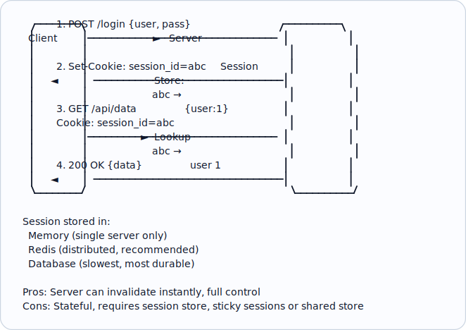
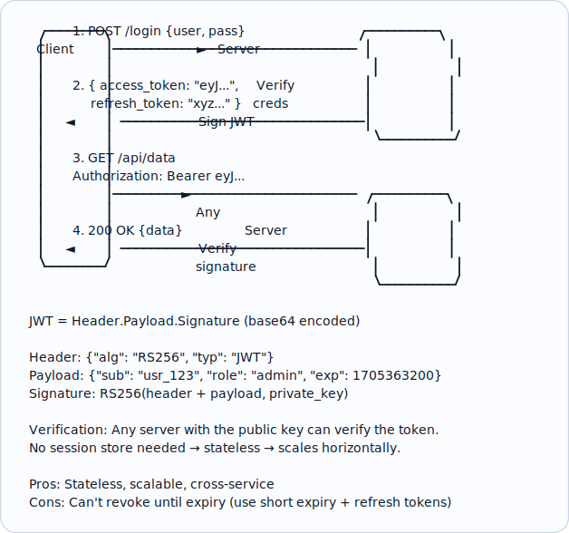
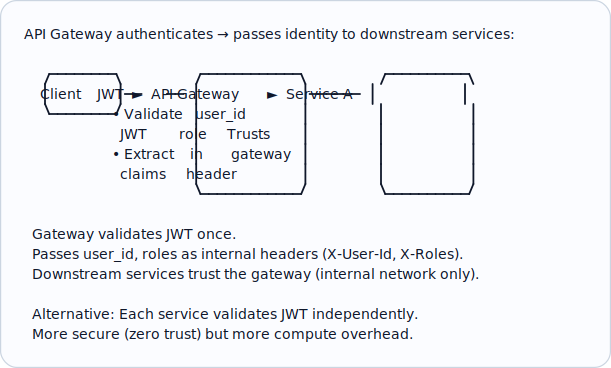
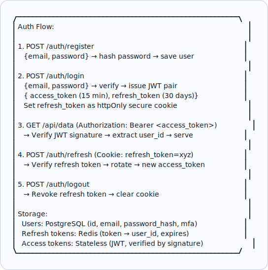
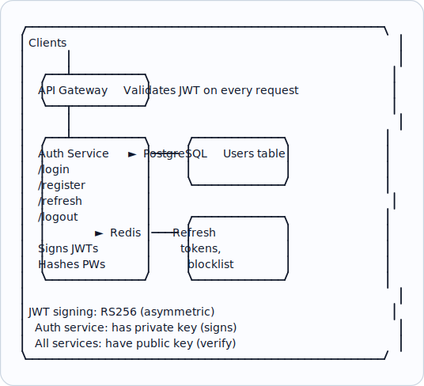

# Topic 39: Authentication (AuthN)

> **Track**: Core Concepts — Fundamentals
> **Difficulty**: Intermediate
> **Prerequisites**: Topics 1–38 (especially Security Fundamentals)

---

## Table of Contents

- [A. Concept Explanation](#a-concept-explanation)
- [B. Interview View](#b-interview-view)
- [C. Practical Engineering View](#c-practical-engineering-view)
- [D. Example](#d-example)
- [E. HLD and LLD](#e-hld-and-lld)
- [F. Summary & Practice](#f-summary--practice)

---

## A. Concept Explanation

### What is Authentication?

**Authentication (AuthN)** verifies **who you are**. It confirms identity before granting access.

```
AuthN vs AuthZ:
  Authentication (AuthN): "WHO are you?"  → Prove your identity
  Authorization  (AuthZ): "WHAT can you do?" → Check your permissions

  Flow:
  1. User provides credentials (AuthN)
  2. System verifies identity → issues token
  3. User makes request with token
  4. System checks permissions (AuthZ) → allow/deny
```

### Authentication Methods

| Method | How | Pros | Cons |
|--------|-----|------|------|
| **Username + Password** | User provides credentials | Simple, familiar | Weak if passwords reused/simple |
| **Multi-Factor (MFA)** | Password + OTP/biometric | Much more secure | Friction for users |
| **API Keys** | Static key in header | Simple for APIs | No user identity, hard to rotate |
| **Session-Based** | Server stores session state | Full server control | Stateful, doesn't scale easily |
| **Token-Based (JWT)** | Signed token, stateless | Scalable, no server state | Token can't be revoked easily |
| **OAuth 2.0** | Delegated auth via provider | SSO, third-party login | Complex flow |
| **SSO (SAML/OIDC)** | Single Sign-On | One login for many apps | Complex setup |
| **mTLS** | Mutual TLS certificates | Strong service-to-service auth | Certificate management overhead |
| **Passkeys/WebAuthn** | Cryptographic key pair | Phishing-resistant, no passwords | Newer, device-dependent |

### Session-Based Authentication



### Token-Based Authentication (JWT)



### Access Token + Refresh Token Pattern

```
  Access Token:  Short-lived (15 min). Used for API calls.
  Refresh Token: Long-lived (7-30 days). Used to get new access tokens.

  Flow:
  1. Login → get access_token (15 min) + refresh_token (30 days)
  2. Use access_token for API calls
  3. Access token expires → POST /token/refresh { refresh_token }
  4. Server validates refresh token → issues new access_token
  5. If refresh token is revoked/expired → user must re-login

  Why two tokens?
  • Access token: short-lived, low risk if stolen (expires soon)
  • Refresh token: stored securely (httpOnly cookie), used rarely
  • Revocation: revoke refresh token → user loses access on next refresh
  
  Refresh token rotation:
  • Each refresh issues a new refresh token + invalidates the old one
  • If old refresh token is reused → token theft detected → revoke all
```

### Password Security

```
NEVER store passwords in plain text!

  BAD:  passwords table: user_id=1, password="hunter2"
  
  GOOD: Hash + Salt

  bcrypt("hunter2") → "$2b$12$LJ3m4ys3pQz.kR7Xz5bQPO..."
  
  Salt: Random data added before hashing → same password → different hash
  Bcrypt: Built-in salt, intentionally slow (10-100ms) → hard to brute-force
  
  Verification:
    User enters "hunter2"
    bcrypt.verify("hunter2", stored_hash) → true/false

  Algorithms (ranked):
    1. Argon2id (best, winner of Password Hashing Competition)
    2. bcrypt (widely used, good)
    3. scrypt (memory-hard, good)
    ✗ SHA-256 alone: TOO FAST → brute-forceable
    ✗ MD5: broken, never use
```

---

## B. Interview View

### What Interviewers Expect

| Level | Expectation |
|-------|------------|
| **Junior** | Knows password hashing, session vs token auth |
| **Mid** | JWT structure, access/refresh token pattern, MFA |
| **Senior** | OAuth flows, SSO architecture, token revocation strategies |
| **Staff+** | Zero-trust auth, passkeys, federated identity, auth at scale |

### Red Flags

- Storing passwords in plain text
- Using MD5/SHA-256 without salt for passwords
- Not knowing the difference between AuthN and AuthZ
- Long-lived tokens with no revocation strategy
- Not mentioning MFA for sensitive operations

### Common Questions

1. Compare session-based vs token-based authentication.
2. How does JWT work? What are access and refresh tokens?
3. How do you securely store passwords?
4. How do you handle token revocation?
5. What is MFA and when should you use it?

---

## C. Practical Engineering View

### Token Revocation Strategies

```
Problem: JWT is stateless. Once issued, it's valid until expiry.
  User changes password → old JWT still works for 15 min!

Solutions:
  1. SHORT EXPIRY: 5-15 min access token. Acceptable stale window.
  2. BLOCKLIST: Store revoked token IDs in Redis. Check on each request.
     Fast (Redis lookup) but adds state.
  3. TOKEN VERSIONING: Store user's token_version in DB.
     JWT includes version. If mismatch → rejected.
     Change version on password change / logout.
  4. REFRESH TOKEN REVOCATION: Revoke refresh token in DB.
     Access token works for remaining TTL, but can't be refreshed.
```

### Authentication in Microservices



---

## D. Example: Auth System for SaaS App



---

## E. HLD and LLD

### E.1 HLD — Authentication Service



### E.2 LLD — Authentication Service

```java
// Dependencies in the original example:
// import bcrypt
// import jwt
// import uuid
// import time

public class AuthService {
    private Object db;
    private Object redis;
    private Object privateKey;
    private Object publicKey;
    private int accessTtl;
    private int refreshTtl;

    public AuthService(Object db, Object redis, Object privateKey, Object publicKey) {
        this.db = db;
        this.redis = redis;
        this.privateKey = privateKey;
        this.publicKey = publicKey;
        this.accessTtl = 900;
        this.refreshTtl = 2592000;
    }

    public Map<String, Object> register(String email, String password) {
        // Validate
        // if len(password) < 8
        // raise ValueError("Password must be at least 8 characters")
        // Hash password
        // password_hash = bcrypt.hashpw(password.encode(), bcrypt.gensalt(12))
        // Save user
        // user_id = str(uuid.uuid4())
        // db.execute(
        // ...
        return null;
    }

    public Map<String, Object> login(String email, String password) {
        // user = db.get("SELECT * FROM users WHERE email = %s", (email,))
        // if not user
        // raise AuthError("Invalid credentials")
        // if not bcrypt.checkpw(password.encode(), user["password_hash"].encode())
        // raise AuthError("Invalid credentials")
        // return _issue_tokens(user["id"], user.get("role", "user"))
        return null;
    }

    public Map<String, Object> refresh(String refreshToken) {
        // Validate refresh token in Redis
        // token_data = redis.get(f"refresh:{refresh_token}")
        // if not token_data
        // raise AuthError("Invalid refresh token")
        // user_id, role = token_data.split(":")
        // Rotate: delete old, issue new
        // redis.delete(f"refresh:{refresh_token}")
        // return _issue_tokens(user_id, role)
        return null;
    }

    public Object logout(String refreshToken) {
        // redis.delete(f"refresh:{refresh_token}")
        return null;
    }

    public Map<String, Object> verifyAccessToken(String token) {
        // try
        // payload = jwt.decode(token, public_key, algorithms=["RS256"])
        // return {"user_id": payload["sub"], "role": payload["role"]}
        // except jwt.ExpiredSignatureError
        // raise AuthError("Token expired")
        // except jwt.InvalidTokenError
        // raise AuthError("Invalid token")
        return null;
    }

    public Map<String, Object> issueTokens(String userId, String role) {
        // now = int(time.time())
        // access_token = jwt.encode({
        // "sub": user_id,
        // "role": role,
        // "iat": now,
        // "exp": now + access_ttl,
        // }, private_key, algorithm="RS256")
        // refresh_token = str(uuid.uuid4())
        // ...
        return null;
    }
}
```

---

## F. Summary & Practice

### Key Takeaways

1. **AuthN** = who you are; **AuthZ** = what you can do
2. **Session-based**: stateful (Redis), server controls revocation; harder to scale
3. **Token-based (JWT)**: stateless, scalable; harder to revoke
4. **Access + refresh token** pattern: short-lived access (15 min) + long-lived refresh (30 days)
5. **Password hashing**: use bcrypt/Argon2id with salt; never plain text or MD5
6. **MFA** for sensitive operations (login, payments, admin actions)
7. **Token revocation**: short expiry, blocklist, refresh token rotation
8. **Microservices**: gateway validates JWT → passes identity to downstream services
9. Use **RS256** (asymmetric) so any service can verify without the signing key

### Interview Questions

1. Compare session-based vs token-based authentication.
2. How does JWT work? What's in the header, payload, signature?
3. What is the access token + refresh token pattern?
4. How do you securely store passwords?
5. How do you handle token revocation?
6. How does authentication work in a microservices architecture?
7. What is MFA and when should it be required?

### Practice Exercises

1. **Exercise 1**: Design the authentication system for a banking app. Include MFA, session management, and account lockout.
2. **Exercise 2**: Implement JWT authentication with refresh token rotation and revocation on password change.
3. **Exercise 3**: Your system has 50 microservices. Design how authentication works: where is the JWT validated, how are user claims propagated, and how do you handle service-to-service auth?

---

> **Previous**: [38 — Security Fundamentals](38-security-fundamentals.md)
> **Next**: [40 — Authorization](40-authorization.md)
