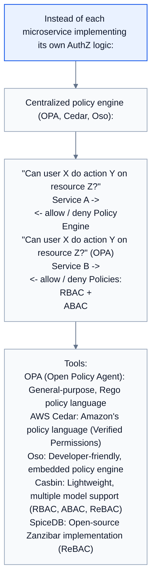
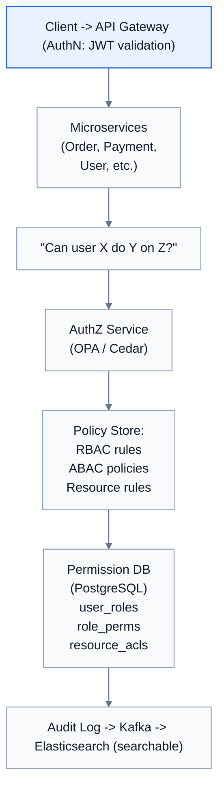

# Topic 40: Authorization (AuthZ)

> **Track**: Core Concepts — Fundamentals
> **Difficulty**: Intermediate
> **Prerequisites**: Topics 1–39 (especially Authentication)

---

## Table of Contents

- [A. Concept Explanation](#a-concept-explanation)
- [B. Interview View](#b-interview-view)
- [C. Practical Engineering View](#c-practical-engineering-view)
- [D. Example](#d-example)
- [E. HLD and LLD](#e-hld-and-lld)
- [F. Summary & Practice](#f-summary--practice)

---

## A. Concept Explanation

### What is Authorization?

**Authorization (AuthZ)** determines **what an authenticated user is allowed to do**. After verifying identity (AuthN), the system checks permissions (AuthZ).

```
AuthN: "You are Alice" (identity verified)
AuthZ: "Alice can read documents but cannot delete them" (permissions checked)

Every API request goes through:
  1. AuthN → Who is this? (JWT validation, session lookup)
  2. AuthZ → Can they do this? (permission check)
  3. Execute → Perform the action if authorized
```

### Authorization Models

#### Role-Based Access Control (RBAC)

```
Users are assigned ROLES. Roles have PERMISSIONS.

  Roles:
    admin:  [create, read, update, delete, manage_users]
    editor: [create, read, update]
    viewer: [read]

  Users → Roles:
    Alice → admin
    Bob   → editor
    Carol → viewer

  Check: Can Bob delete a document?
    Bob → editor → [create, read, update] → "delete" not present → DENIED

  Hierarchy (optional):
    admin > editor > viewer
    admin inherits all editor and viewer permissions.

  Pros: Simple, widely understood, easy to audit
  Cons: Role explosion (too many fine-grained roles), no context awareness
```

#### Attribute-Based Access Control (ABAC)

```
Decisions based on ATTRIBUTES of user, resource, and environment.

  Policy: "Allow if user.department == resource.department 
           AND user.clearance >= resource.classification
           AND time.hour BETWEEN 9 AND 17"

  User attributes: department, clearance, location
  Resource attributes: owner, department, classification
  Environment attributes: time, IP address, device type

  Example:
    User: {dept: "engineering", clearance: 3}
    Resource: {dept: "engineering", classification: 2}
    Time: 10:00 AM
    → dept match ✓, clearance >= classification ✓, business hours ✓ → ALLOWED

  Pros: Very flexible, context-aware, fewer policies needed
  Cons: Complex to implement, harder to audit, policy debugging is difficult
```

#### Relationship-Based Access Control (ReBAC)

```
Permissions based on RELATIONSHIPS between users and resources.
  Used by Google Zanzibar (Google Drive, YouTube, etc.)

  Relationships:
    doc:budget → owner → Alice
    doc:budget → editor → Bob
    doc:budget → viewer → team:engineering
    team:engineering → member → Carol

  Check: Can Carol view doc:budget?
    Carol → member of team:engineering → viewer of doc:budget → ALLOWED

  Check: Can Carol edit doc:budget?
    Carol → member of team:engineering → only viewer → DENIED

  Graph traversal: Follow relationships to determine access.
  
  Pros: Natural for collaborative systems (docs, folders, teams)
  Cons: Complex graph queries, requires specialized infrastructure
```

### Comparison

| Model | Decision Based On | Best For | Complexity |
|-------|-------------------|----------|-----------|
| **RBAC** | User's role | Enterprise apps, APIs, admin panels | Low |
| **ABAC** | Attributes of user + resource + context | Healthcare, government, complex policies | High |
| **ReBAC** | Relationships between entities | Collaborative apps (Drive, Slack) | Medium-High |
| **ACL** | Per-resource permission list | File systems, simple apps | Low |

### Principle of Least Privilege

```
Every user/service should have the MINIMUM permissions needed.

  BAD:  Give all developers admin access to production database
  GOOD: Developers get read-only access; only CI/CD pipeline has write access

  BAD:  Microservice has access to all S3 buckets
  GOOD: Microservice only accesses its own bucket via scoped IAM role

  BAD:  API key with full access, shared across all services
  GOOD: Per-service API keys with specific permissions
```

---

## B. Interview View

### What Interviewers Expect

| Level | Expectation |
|-------|------------|
| **Junior** | Knows AuthZ checks permissions; can describe basic role check |
| **Mid** | Knows RBAC vs ABAC; can design role system for an app |
| **Senior** | ReBAC, Zanzibar model, centralized policy engine, audit logging |
| **Staff+** | Cross-service authorization, policy-as-code, compliance integration |

### Red Flags

- Confusing authentication with authorization
- Not checking authorization on the server (relying on UI hiding buttons)
- Over-privileged services/users
- No audit trail for access decisions

### Common Questions

1. What is authorization? How does it differ from authentication?
2. Compare RBAC and ABAC.
3. How would you design the permission system for a multi-tenant SaaS app?
4. What is the principle of least privilege?
5. How does Google Zanzibar work?

---

## C. Practical Engineering View

### Centralized Authorization Service



### Audit Logging

```
Every authorization decision should be logged:

  {
    "timestamp": "2024-01-15T10:30:00Z",
    "user_id": "usr_123",
    "action": "delete",
    "resource": "document:doc_456",
    "decision": "denied",
    "reason": "insufficient_role",
    "user_role": "viewer",
    "required_role": "admin",
    "ip": "192.168.1.100",
    "trace_id": "tr_abc"
  }

  Critical for:
  • Compliance (SOC2, GDPR, HIPAA)
  • Security incident investigation
  • Access pattern analysis
  • Debugging permission issues
```

---

## D. Example: Multi-Tenant SaaS Authorization

```
SaaS project management tool (like Jira):

  Entities: Organizations → Projects → Tasks
  
  Roles (per organization):
    org_admin:    Manage org, billing, members
    project_lead: Create projects, manage project members
    member:       Create/edit tasks in assigned projects
    guest:        Read-only access to specific projects

  Permission check:
    User: Bob (role: member, projects: [proj_A, proj_B])
    Request: DELETE /projects/proj_A/tasks/task_123

    1. AuthN: Verify JWT → Bob
    2. AuthZ:
       a. Is Bob a member of proj_A? → YES
       b. Does "member" role have "delete_task" permission? → NO
       c. Is Bob the task creator? → YES → allow self-delete
       → ALLOWED (owner can delete own tasks)

  Multi-tenancy:
    CRITICAL: Org A users must NEVER access Org B resources.
    Every query: WHERE organization_id = user.org_id
    AuthZ check: resource.org_id == user.org_id (always first check)
```

---

## E. HLD and LLD

### E.1 HLD — Authorization Architecture



### E.2 LLD — Authorization Service

```java
// Dependencies in the original example:
// from enum import Enum

public enum Permission {
    READ,
    CREATE,
    UPDATE,
    DELETE,
    MANAGE_USERS,
    MANAGE_BILLING
}

public class AuthorizationService {
    private Object db;
    private Object audit;

    public AuthorizationService(Object db, Object auditLogger) {
        this.db = db;
        this.audit = auditLogger;
    }

    public boolean checkPermission(String userId, String action, String resourceType, String resourceId, String orgId) {
        // Central authorization check
        // 1. Get user's role in the organization
        // user_role = db.get(
        // "SELECT role FROM user_org_roles WHERE user_id = %s AND org_id = %s",
        // (user_id, org_id)
        // )
        // if not user_role
        // _log_decision(user_id, action, resource_id, false, "not_in_org")
        // ...
        return false;
    }

    public boolean isResourceOwner(Object userId, Object resourceType, Object resourceId) {
        // owner = db.get(
        // f"SELECT created_by FROM {resource_type}s WHERE id = %s", (resource_id,)
        // )
        // return owner == user_id
        return false;
    }

    public Object logDecision(Object userId, Object action, Object resourceId, boolean allowed, Object reason) {
        // audit.log({
        // "user_id": user_id,
        // "action": action,
        // "resource": resource_id,
        // "decision": "allowed" if allowed else "denied",
        // "reason": reason,
        // })
        return null;
    }
}
```

---

## F. Summary & Practice

### Key Takeaways

1. **AuthZ** determines what authenticated users can do (permissions)
2. **RBAC**: role-based, simple, widely used; best for enterprise apps
3. **ABAC**: attribute-based, flexible, context-aware; best for complex policies
4. **ReBAC**: relationship-based (Zanzibar); best for collaborative apps
5. **Principle of least privilege**: minimum permissions needed
6. **Centralize AuthZ** with a policy engine (OPA, Cedar, Casbin)
7. **Tenant isolation** is the #1 security check in multi-tenant systems
8. **Audit every decision** for compliance and debugging
9. AuthZ on **server-side only** — never trust the client
10. UI can hide elements, but the **API must enforce** permissions

### Interview Questions

1. What is authorization? How does it differ from authentication?
2. Compare RBAC, ABAC, and ReBAC.
3. How would you design permissions for a multi-tenant SaaS app?
4. What is the principle of least privilege?
5. How do you handle authorization in a microservices architecture?
6. What is Google Zanzibar?
7. How do you audit authorization decisions?

### Practice Exercises

1. **Exercise 1**: Design the RBAC system for a hospital application with roles: doctor, nurse, admin, patient. Define permissions for patient records, prescriptions, and billing.
2. **Exercise 2**: Convert an RBAC system to ABAC for a financial platform where access depends on user clearance level, data classification, and business hours.
3. **Exercise 3**: Design a Google Drive-like permission system using ReBAC. Handle: file sharing, folder inheritance, link sharing, and team access.

---

> **Previous**: [39 — Authentication](39-authentication.md)
> **Next**: [41 — OAuth 2.0 and JWT](41-oauth-jwt.md)
