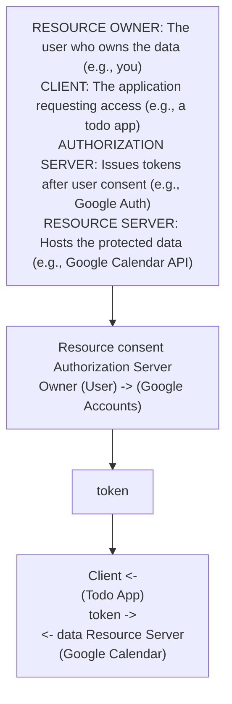
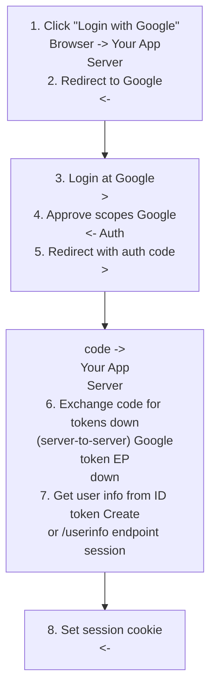
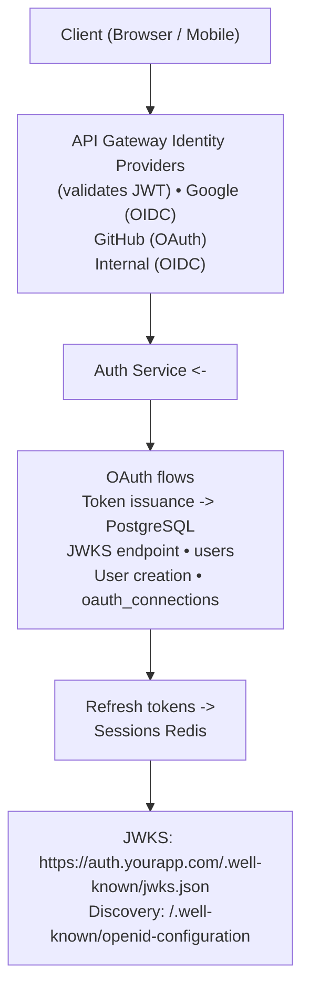

# Topic 41: OAuth 2.0 and JWT

> **Track**: Core Concepts — Fundamentals
> **Difficulty**: Intermediate → Advanced
> **Prerequisites**: Topics 1–40 (especially Authentication, Authorization)

---

## Table of Contents

- [A. Concept Explanation](#a-concept-explanation)
- [B. Interview View](#b-interview-view)
- [C. Practical Engineering View](#c-practical-engineering-view)
- [D. Example](#d-example)
- [E. HLD and LLD](#e-hld-and-lld)
- [F. Summary & Practice](#f-summary--practice)

---

## A. Concept Explanation

### What is OAuth 2.0?

**OAuth 2.0** is an authorization framework that allows a third-party application to access a user's resources without knowing their credentials. It delegates authentication to the identity provider.

```
WITHOUT OAuth:
  App asks user for their Google password → stores it → calls Google APIs
  Terrible! App has the user's password. No scoped access. No revocation.

WITH OAuth:
  App redirects user to Google → user logs in at Google → Google gives app a TOKEN
  App uses token to access ONLY what the user approved (e.g., read email, not delete)
  User can revoke app's access anytime. App never sees the password.
```

### OAuth 2.0 Roles



### OAuth 2.0 Grant Types

#### Authorization Code Flow (Most Common, Most Secure)

```
For server-side web apps (confidential clients):

  1. User clicks "Login with Google" on your app
  
  2. App redirects to Google:
     GET https://accounts.google.com/authorize?
       response_type=code&
       client_id=YOUR_CLIENT_ID&
       redirect_uri=https://yourapp.com/callback&
       scope=email profile&
       state=random_csrf_token

  3. User logs in at Google, approves requested scopes
  
  4. Google redirects back to your app with authorization CODE:
     GET https://yourapp.com/callback?code=AUTH_CODE&state=random_csrf_token

  5. Your server exchanges code for tokens (server-to-server, secret):
     POST https://oauth2.googleapis.com/token
       grant_type=authorization_code&
       code=AUTH_CODE&
       client_id=YOUR_CLIENT_ID&
       client_secret=YOUR_SECRET&
       redirect_uri=https://yourapp.com/callback

  6. Google returns:
     { access_token: "ya29...", refresh_token: "1//0e...", expires_in: 3600 }

  7. Your app calls Google API with access token:
     GET https://www.googleapis.com/calendar/v3/events
     Authorization: Bearer ya29...
```

#### Authorization Code + PKCE (For SPAs and Mobile Apps)

```
PKCE (Proof Key for Code Exchange) — prevents code interception.

  1. Client generates:
     code_verifier = random_string(43-128 chars)
     code_challenge = BASE64URL(SHA256(code_verifier))

  2. Authorization request includes code_challenge:
     GET /authorize?...&code_challenge=abc123&code_challenge_method=S256

  3. Token exchange includes code_verifier:
     POST /token { code, code_verifier }

  4. Server verifies: SHA256(code_verifier) == stored code_challenge
     → Only the original client can exchange the code

  Why? Mobile/SPA apps can't keep a client_secret (it's in the binary/JS).
  PKCE replaces client_secret with a dynamic proof.
```

#### Client Credentials (Machine-to-Machine)

```
No user involved. Service authenticates itself.

  POST /token
    grant_type=client_credentials&
    client_id=SERVICE_CLIENT_ID&
    client_secret=SERVICE_SECRET&
    scope=read:inventory

  Used for: microservice-to-microservice, cron jobs, backend integrations
```

### JWT Deep Dive

```
JWT (JSON Web Token) — a compact, URL-safe token format.

  Structure: HEADER.PAYLOAD.SIGNATURE (base64url encoded)

  Header:
    { "alg": "RS256", "typ": "JWT", "kid": "key-id-123" }

  Payload (claims):
    {
      "iss": "https://auth.yourapp.com",   // Issuer
      "sub": "usr_123",                     // Subject (user ID)
      "aud": "https://api.yourapp.com",    // Audience
      "exp": 1705363200,                    // Expiration (Unix timestamp)
      "iat": 1705359600,                    // Issued at
      "nbf": 1705359600,                    // Not before
      "jti": "unique-token-id",            // JWT ID (for revocation)
      "scope": "read:profile write:posts",  // Scopes
      "role": "admin",                      // Custom claim
      "org_id": "org_456"                  // Custom claim
    }

  Signature:
    RS256(
      base64url(header) + "." + base64url(payload),
      private_key
    )

  Verification:
    1. Decode header → get algorithm and key ID
    2. Fetch public key from JWKS endpoint (or local cache)
    3. Verify signature using public key
    4. Check exp (not expired), nbf (not before), iss (trusted issuer), aud (intended audience)
```

### Signing Algorithms

| Algorithm | Type | Key | Best For |
|-----------|------|-----|----------|
| **HS256** | Symmetric | Shared secret | Single service (both sign and verify with same key) |
| **RS256** | Asymmetric | Private/Public key pair | Microservices (auth service signs, others verify with public key) |
| **ES256** | Asymmetric | ECDSA key pair | Smaller tokens, mobile/IoT |

```
HS256: Auth service and API share the same secret.
  Risk: If any service is compromised, attacker can forge tokens.

RS256 (recommended for microservices):
  Auth service: has private key (signs JWTs)
  All other services: have public key (verify JWTs)
  Even if a service is compromised, attacker can't forge tokens.

JWKS (JSON Web Key Set):
  Public keys published at: https://auth.yourapp.com/.well-known/jwks.json
  Services fetch and cache the public keys for verification.
```

### OpenID Connect (OIDC)

```
OIDC = OAuth 2.0 + Identity Layer

  OAuth 2.0: Authorization ("what can you access?")
  OIDC: Authentication ("who are you?") built on top of OAuth

  OIDC adds:
  • ID Token (JWT): Contains user identity claims (name, email, picture)
  • UserInfo endpoint: GET /userinfo → returns user profile
  • Standard scopes: openid, profile, email, address, phone
  • Discovery: /.well-known/openid-configuration (auto-discovery of endpoints)

  Token response with OIDC:
  {
    "access_token": "ya29...",       // For API access
    "id_token": "eyJ...",           // User identity (JWT)
    "refresh_token": "1//0e...",    // For token renewal
    "token_type": "Bearer",
    "expires_in": 3600
  }

  "Login with Google" = OIDC (not just OAuth)
```

---

## B. Interview View

### What Interviewers Expect

| Level | Expectation |
|-------|------------|
| **Junior** | Knows OAuth enables "Login with Google"; JWT is a token format |
| **Mid** | Authorization Code flow; JWT structure (header, payload, signature) |
| **Senior** | PKCE, OIDC vs OAuth, RS256 vs HS256, token revocation |
| **Staff+** | Token exchange, federated identity, OAuth security pitfalls, at-scale auth |

### Red Flags

- Confusing OAuth (authorization) with OIDC (authentication)
- Using implicit flow (deprecated, insecure)
- HS256 in microservices (should use RS256)
- Storing tokens in localStorage (XSS vulnerable)

### Common Questions

1. How does OAuth 2.0 work? Explain the Authorization Code flow.
2. What is JWT? How is it structured?
3. Compare HS256 and RS256.
4. What is PKCE and why is it needed?
5. What is OpenID Connect? How does it relate to OAuth?
6. Where should tokens be stored in a web app?

---

## C. Practical Engineering View

### Token Storage

```
WEB APPS:
  ✗ localStorage: XSS-vulnerable (JavaScript can read it)
  ✗ sessionStorage: Same as localStorage
  ✓ httpOnly cookie: Not accessible via JavaScript → XSS-safe
    Set-Cookie: access_token=eyJ...; HttpOnly; Secure; SameSite=Strict; Path=/

  Cookie + CSRF protection:
    httpOnly cookie (token) + SameSite=Strict or CSRF token

MOBILE APPS:
  iOS: Keychain (encrypted, hardware-backed)
  Android: EncryptedSharedPreferences or Keystore
  ✗ Never store in plain SharedPreferences or NSUserDefaults

SPAs (Single Page Apps):
  In-memory (variable): Secure but lost on refresh
  httpOnly cookie via BFF (Backend for Frontend): Best approach
    SPA → BFF (sets cookie) → API (validates cookie)
```

### JWKS Rotation

```
Rotate signing keys periodically without downtime:

  1. Generate new key pair (kid: "key-2")
  2. Publish both keys in JWKS endpoint:
     { "keys": [
       { "kid": "key-1", "kty": "RSA", ... },  // Old key
       { "kid": "key-2", "kty": "RSA", ... }   // New key
     ]}
  3. Start signing new tokens with key-2
  4. Old tokens (signed with key-1) still verifiable
  5. After all old tokens expire → remove key-1 from JWKS

  JWT header includes "kid" → verifier knows which key to use
```

---

## D. Example: "Login with Google" for a Web App



---

## E. HLD and LLD

### E.1 HLD — OAuth/OIDC Architecture



### E.2 LLD — OAuth Client

```java
// Dependencies in the original example:
// import requests
// import jwt
// import hashlib
// import base64
// import os

public class OAuthClient {
    private String clientId;
    private String clientSecret;
    private String authUrl;
    private String tokenUrl;
    private String redirectUri;
    private String jwksUrl;
    private Object jwksCache;

    public OAuthClient(String clientId, String clientSecret, String authUrl, String tokenUrl, String redirectUri, String jwksUrl) {
        this.clientId = clientId;
        this.clientSecret = clientSecret;
        this.authUrl = authUrl;
        this.tokenUrl = tokenUrl;
        this.redirectUri = redirectUri;
        this.jwksUrl = jwksUrl;
        this.jwksCache = null;
    }

    public Map<String, Object> getAuthorizationUrl(List<Object> scopes, String state, Object usePkce) {
        // Generate the URL to redirect the user to the identity provider
        // params = {
        // "response_type": "code",
        // "client_id": client_id,
        // "redirect_uri": redirect_uri,
        // "scope": " ".join(scopes),
        // "state": state,
        // }
        // ...
        return null;
    }

    public Map<String, Object> exchangeCode(String code, String pkceVerifier) {
        // Exchange authorization code for tokens
        // data = {
        // "grant_type": "authorization_code",
        // "code": code,
        // "redirect_uri": redirect_uri,
        // "client_id": client_id,
        // }
        // if client_secret
        // ...
        return null;
    }

    public Map<String, Object> verifyIdToken(String idToken) {
        // Verify and decode the OIDC ID token
        // header = jwt.get_unverified_header(id_token)
        // public_key = _get_public_key(header["kid"])
        // claims = jwt.decode(
        // id_token,
        // public_key,
        // algorithms=["RS256"],
        // audience=client_id,
        // ...
        return null;
    }

    public Object getPublicKey(String kid) {
        // if not _jwks_cache
        // response = requests.get(jwks_url)
        // _jwks_cache = response.json()
        // for key in _jwks_cache["keys"]
        // if key["kid"] == kid
        // return jwt.algorithms.RSAAlgorithm.from_jwk(key)
        // raise ValueError(f"Key {kid} not found in JWKS")
        return null;
    }
}
```

---

## F. Summary & Practice

### Key Takeaways

1. **OAuth 2.0** = authorization framework for delegated access (third-party apps)
2. **Authorization Code flow** is the standard for web apps (code → token exchange)
3. **PKCE** secures the flow for public clients (SPAs, mobile) — replaces client_secret
4. **Client Credentials** for machine-to-machine (no user involved)
5. **JWT** = Header.Payload.Signature; stateless, verifiable
6. **RS256** for microservices (asymmetric); **HS256** for single-service (symmetric)
7. **OIDC** = OAuth 2.0 + ID Token (authentication layer on top of authorization)
8. Store tokens in **httpOnly cookies** (web) or **Keychain/Keystore** (mobile)
9. **JWKS rotation** enables key rotation without downtime
10. **Never use implicit flow** — it's deprecated and insecure

### Interview Questions

1. How does OAuth 2.0 Authorization Code flow work?
2. What is JWT? How is it verified?
3. Compare HS256 and RS256. When would you use each?
4. What is PKCE and why is it needed?
5. What is OIDC? How does it differ from OAuth?
6. Where should tokens be stored in a web app?
7. How do you rotate JWT signing keys?

### Practice Exercises

1. **Exercise 1**: Implement "Login with Google" using Authorization Code + PKCE flow. Handle: redirect, code exchange, ID token verification, session creation.
2. **Exercise 2**: Design the OAuth/OIDC infrastructure for a SaaS platform with 3 client types (web app, mobile app, CLI tool). Specify flows for each.
3. **Exercise 3**: Your JWT signing key is compromised. Design the incident response: immediate actions, key rotation, and token invalidation.

---

> **Previous**: [40 — Authorization](40-authorization.md)
> **Next**: [42 — Encryption](42-encryption.md)
