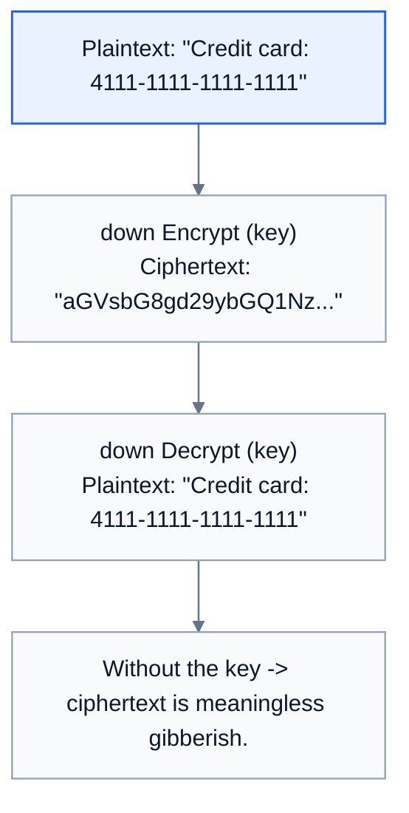
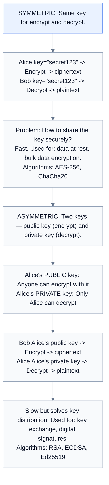
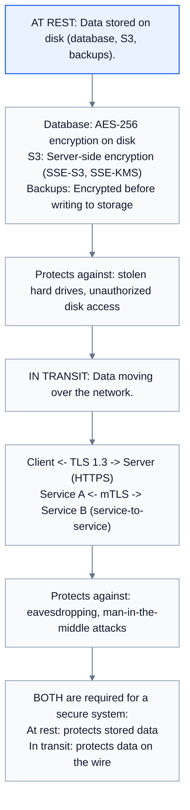
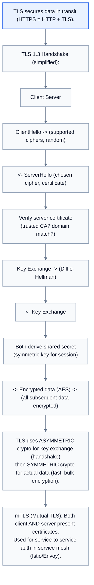
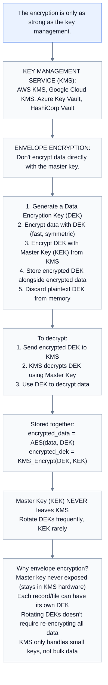
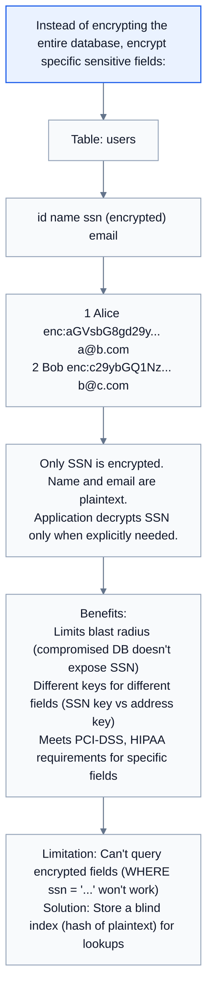
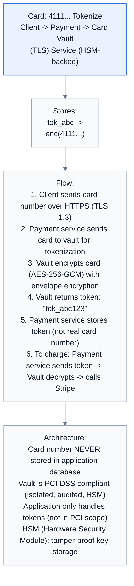
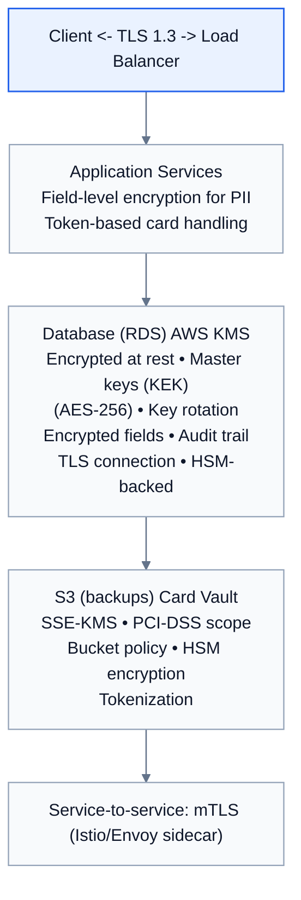

# Topic 42: Encryption

> **Track**: Core Concepts — Fundamentals
> **Difficulty**: Intermediate → Advanced
> **Prerequisites**: Topics 1–41 (especially Security, Authentication)

---

## Table of Contents

- [A. Concept Explanation](#a-concept-explanation)
- [B. Interview View](#b-interview-view)
- [C. Practical Engineering View](#c-practical-engineering-view)
- [D. Example](#d-example)
- [E. HLD and LLD](#e-hld-and-lld)
- [F. Summary & Practice](#f-summary--practice)

---

## A. Concept Explanation

### What is Encryption?

**Encryption** transforms readable data (plaintext) into unreadable data (ciphertext) using an algorithm and a key. Only someone with the correct key can reverse it (decrypt).



### Symmetric vs Asymmetric Encryption



### Comparison

| Aspect | Symmetric | Asymmetric |
|--------|-----------|-----------|
| **Keys** | 1 shared key | Public + private key pair |
| **Speed** | Fast (100-1000× faster) | Slow |
| **Key distribution** | Hard (must share securely) | Easy (public key is public) |
| **Use case** | Bulk data encryption | Key exchange, signatures, TLS handshake |
| **Algorithms** | AES-256, ChaCha20 | RSA-2048, ECDSA, Ed25519 |

### Encryption At Rest vs In Transit



### TLS (Transport Layer Security)



### Hashing vs Encryption

```
HASHING: One-way. Cannot be reversed. Same input → same output.
  Used for: passwords, data integrity, checksums.
  Algorithms: bcrypt, Argon2, SHA-256
  
  hash("password") → "5e884898da..." (cannot get "password" back from hash)

ENCRYPTION: Two-way. Can be reversed with the key.
  Used for: storing sensitive data that needs to be read later.
  
  encrypt("card_number", key) → "aGVsbG8..." → decrypt("aGVsbG8...", key) → "card_number"

When to use which:
  Passwords → HASH (never need the original back)
  Credit cards → ENCRYPT (need to charge later)
  File integrity → HASH (verify not tampered)
  API secrets → ENCRYPT (need to use later)
  Tokens/signatures → HASH (HMAC for verification)
```

### Key Management



---

## B. Interview View

### What Interviewers Expect

| Level | Expectation |
|-------|------------|
| **Junior** | Knows HTTPS, encryption at rest/transit, hashing vs encryption |
| **Mid** | Symmetric vs asymmetric; TLS handshake; AES-256 |
| **Senior** | Envelope encryption, KMS, key rotation, mTLS |
| **Staff+** | Field-level encryption, compliance (PCI-DSS), HSMs, crypto agility |

### Red Flags

- Storing sensitive data without encryption
- Not using HTTPS
- Confusing hashing with encryption
- Not knowing about key management
- Using deprecated algorithms (DES, MD5, SHA-1)

### Common Questions

1. Compare symmetric and asymmetric encryption.
2. How does TLS work?
3. What is encryption at rest vs in transit?
4. What is envelope encryption?
5. How do you manage encryption keys?
6. When do you use hashing vs encryption?

---

## C. Practical Engineering View

### Field-Level Encryption



### Key Rotation

```
Rotate encryption keys periodically without downtime:

  Strategy 1: RE-ENCRYPT (simple but slow)
    Generate new key → decrypt all data with old key → re-encrypt with new key
    Problem: Slow for large datasets. Downtime risk.

  Strategy 2: KEY VERSIONING (recommended)
    Each encrypted value includes the key version:
      "v2:enc:aGVsbG8gd29y..."
    
    Decrypt: Read version → use corresponding key
    New data: Encrypted with latest key version
    Old data: Lazily re-encrypted on read (read → decrypt with old → re-encrypt with new → save)
    
    Eventually all data migrated to new key.

  Strategy 3: ENVELOPE ENCRYPTION + KMS ROTATION
    Rotate Master Key (KEK) in KMS → old DEKs still work
    KMS handles key version mapping transparently
    AWS KMS: Automatic annual rotation with 1 click
```

### Compliance Requirements

```
PCI-DSS (credit cards):
  • Encrypt card numbers at rest (AES-256)
  • TLS 1.2+ in transit
  • Don't store CVV/CVC after authorization
  • Tokenize card numbers (replace with token, store real number in vault)

HIPAA (health data):
  • Encrypt PHI at rest and in transit
  • Access controls and audit logging
  • Business associate agreements with cloud providers

GDPR (personal data):
  • Encryption is a recommended safeguard
  • Right to erasure: must be able to delete user data
  • Pseudonymization: separate PII from usage data

SOC 2:
  • Encryption at rest and in transit
  • Key management procedures
  • Access controls for encryption keys
```

---

## D. Example: Securing Payment Data



---

## E. HLD and LLD

### E.1 HLD — Encryption Architecture



### E.2 LLD — Encryption Service

```java
// Dependencies in the original example:
// import os
// import json
// import base64
// from cryptography.hazmat.primitives.ciphers.aead import AESGCM

public class EncryptionService {
    private Object kms;
    private String masterKeyId;

    public EncryptionService(Object kmsClient, String masterKeyId) {
        this.kms = kmsClient;
        this.masterKeyId = masterKeyId;
    }

    public String encryptField(String plaintext) {
        // Encrypt a sensitive field using envelope encryption
        // 1. Generate a data encryption key (DEK)
        // dek_response = kms.generate_data_key(
        // KeyId=master_key_id,
        // KeySpec='AES_256'
        // )
        // plaintext_dek = dek_response['Plaintext']      # 32 bytes
        // encrypted_dek = dek_response['CiphertextBlob']  # KMS-encrypted DEK
        // ...
        return null;
    }

    public String decryptField(String encryptedValue) {
        // Decrypt a field encrypted with encrypt_field
        // if not encrypted_value.startswith("enc:")
        // return encrypted_value  # Not encrypted
        // 1. Parse envelope
        // envelope = json.loads(base64.b64decode(encrypted_value[4:]))
        // encrypted_dek = base64.b64decode(envelope["dek"])
        // nonce = base64.b64decode(envelope["nonce"])
        // ciphertext = base64.b64decode(envelope["data"])
        // ...
        return null;
    }

    public String rotateField(String encryptedValue) {
        // Re-encrypt with current master key (for key rotation)
        // plaintext = decrypt_field(encrypted_value)
        // return encrypt_field(plaintext)
        return null;
    }
}
```

---

## F. Summary & Practice

### Key Takeaways

1. **Symmetric** (AES-256): fast, same key; used for data encryption
2. **Asymmetric** (RSA, ECDSA): slow, key pair; used for key exchange and signatures
3. **At rest**: encrypt stored data (AES-256, SSE-KMS)
4. **In transit**: encrypt network traffic (TLS 1.3, mTLS)
5. **TLS** uses asymmetric for key exchange, then symmetric for bulk data
6. **Hashing** is one-way (passwords); **encryption** is two-way (data you need back)
7. **Envelope encryption**: DEK encrypts data, KEK encrypts DEK; master key never leaves KMS
8. **Key rotation**: key versioning + lazy re-encryption is best approach
9. **Field-level encryption** for PII (SSN, credit cards) — limits blast radius
10. **Tokenization** replaces sensitive data with tokens (PCI-DSS best practice)

### Interview Questions

1. Compare symmetric and asymmetric encryption.
2. How does TLS work?
3. What is encryption at rest vs in transit?
4. What is envelope encryption? Why use it?
5. How do you manage and rotate encryption keys?
6. When do you use hashing vs encryption?
7. How would you encrypt credit card numbers in a payment system?
8. What is field-level encryption?

### Practice Exercises

1. **Exercise 1**: Design the encryption strategy for a healthcare application storing patient records. Cover: at rest, in transit, field-level, key management, and HIPAA compliance.
2. **Exercise 2**: Implement envelope encryption with key rotation. Show how old data encrypted with key v1 is lazily migrated to key v2 on read.
3. **Exercise 3**: Your company needs to become PCI-DSS compliant. Design the card data handling architecture: tokenization, vault, HSM, and scope reduction.

---

> **Previous**: [41 — OAuth 2.0 and JWT](41-oauth-jwt.md)
> **Index**: [Fundamentals README](README.md)
