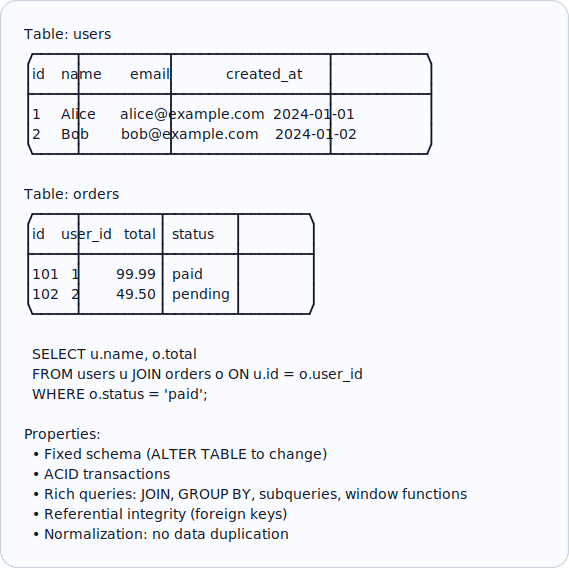
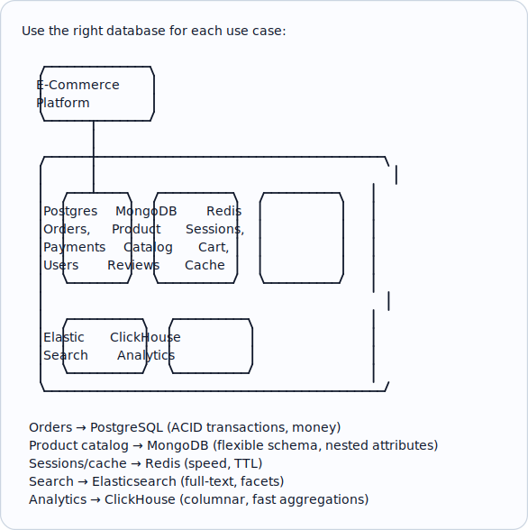
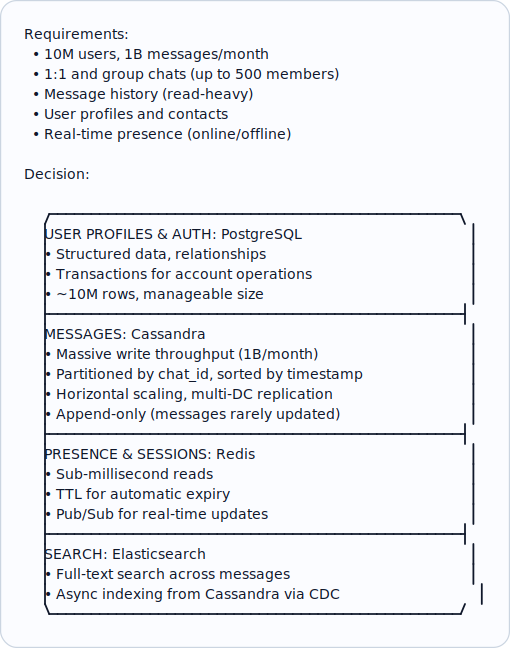
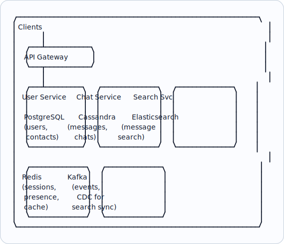

# Topic 01: SQL vs NoSQL

> **Track**: Databases and Storage
> **Difficulty**: Intermediate
> **Prerequisites**: Fundamentals (especially CAP, ACID/BASE, Consistency)

---

## Table of Contents

- [A. Concept Explanation](#a-concept-explanation)
- [B. Interview View](#b-interview-view)
- [C. Practical Engineering View](#c-practical-engineering-view)
- [D. Example](#d-example)
- [E. HLD and LLD](#e-hld-and-lld)
- [F. Summary & Practice](#f-summary--practice)

---

## A. Concept Explanation

### SQL (Relational) Databases

**SQL databases** store data in tables with rows and columns, enforce schemas, and support powerful joins and transactions via SQL (Structured Query Language).



### NoSQL Databases

**NoSQL databases** provide flexible schemas, horizontal scaling, and are optimized for specific access patterns rather than general-purpose querying.

```
NoSQL categories:

  1. KEY-VALUE:     Redis, DynamoDB
     { "user:123": { "name": "Alice", "email": "..." } }

  2. DOCUMENT:      MongoDB, CouchDB
     { "_id": "123", "name": "Alice", "orders": [{ "total": 99.99 }] }

  3. COLUMNAR:      Cassandra, HBase, ClickHouse
     Row key → columns stored together for fast column-wise reads

  4. GRAPH:         Neo4j, Amazon Neptune
     (Alice)-[:FRIENDS_WITH]->(Bob)-[:PURCHASED]->(Product)

Properties:
  • Flexible schema (schema-on-read)
  • Designed for horizontal scaling (sharding built-in)
  • Optimized for specific access patterns
  • Eventual consistency (usually, but tunable)
  • Denormalization: embed related data together
```

### Head-to-Head Comparison

| Aspect | SQL | NoSQL |
|--------|-----|-------|
| **Schema** | Fixed (schema-on-write) | Flexible (schema-on-read) |
| **Scaling** | Vertical (scale up) | Horizontal (scale out) |
| **Transactions** | Full ACID | Limited (some offer per-doc ACID) |
| **Joins** | Native, powerful | Usually not supported (denormalize) |
| **Query Language** | SQL (standardized) | Varies per database |
| **Data Model** | Tables, rows, columns | Documents, key-value, graphs, columns |
| **Consistency** | Strong (default) | Tunable (eventual to strong) |
| **Schema Changes** | ALTER TABLE (can be slow) | Add fields anytime |
| **Best For** | Complex queries, transactions | High throughput, flexible schema, scale |

### When to Use SQL

```
✓ Transactions matter (banking, e-commerce orders, inventory)
✓ Complex queries with JOINs, aggregations, reporting
✓ Data has clear relationships (users → orders → items)
✓ Data integrity is critical (foreign keys, constraints)
✓ Schema is well-defined and stable
✓ Team has SQL expertise

Examples: PostgreSQL, MySQL, Amazon Aurora, CockroachDB (distributed SQL)
```

### When to Use NoSQL

```
✓ Massive scale (millions of reads/writes per second)
✓ Schema evolves frequently (startup MVP, rapid iteration)
✓ Access patterns are simple (key lookups, single-entity reads)
✓ Data is naturally denormalized (user profiles, product catalogs)
✓ High availability > strong consistency (social media, IoT)
✓ Geographic distribution needed

Examples: MongoDB, DynamoDB, Cassandra, Redis, Neo4j
```

### The "NewSQL" Middle Ground

```
Distributed SQL databases: SQL interface + horizontal scaling

  CockroachDB: Distributed PostgreSQL-compatible, ACID, auto-sharding
  TiDB: MySQL-compatible, HTAP (transactional + analytical)
  Google Spanner: Global consistency with GPS/atomic clocks
  YugabyteDB: PostgreSQL-compatible, distributed

  Trade-off: Higher latency per query (distributed consensus)
  but get SQL + horizontal scale + ACID
```

---

## B. Interview View

### What Interviewers Expect

| Level | Expectation |
|-------|------------|
| **Junior** | Knows basic differences; can name examples |
| **Mid** | Can justify choice for a specific system design; knows trade-offs |
| **Senior** | Discusses CAP implications, mixed-database architectures, migration strategies |
| **Staff+** | Polyglot persistence, distributed SQL, cost analysis, data modeling trade-offs |

### Red Flags

- "Always use SQL" or "always use NoSQL"
- Not considering access patterns when choosing
- Not knowing that NoSQL doesn't mean "no transactions"
- Choosing NoSQL just because "it scales" without understanding the trade-offs

### Common Questions

1. When would you choose SQL vs NoSQL?
2. Can NoSQL databases do transactions?
3. How does MongoDB differ from PostgreSQL?
4. What is polyglot persistence?
5. How would you migrate from SQL to NoSQL (or vice versa)?

---

## C. Practical Engineering View

### Polyglot Persistence



### Migration Considerations

```
SQL → NoSQL migration:
  1. Denormalize: Flatten JOINed tables into single documents
  2. Duplicate data: Embed related data (accept write overhead)
  3. Lose referential integrity: Application must enforce consistency
  4. Rewrite queries: No more JOINs; design around access patterns

NoSQL → SQL migration:
  1. Normalize: Split nested documents into related tables
  2. Define schema: Create migrations for all fields
  3. Add constraints: Foreign keys, unique indexes, NOT NULL
  4. Rewrite queries: Leverage JOINs, window functions

Dual-write period: Write to both during migration → verify consistency → cut over
```

### Cost Comparison

```
PostgreSQL (RDS):
  db.r6g.xlarge: $0.38/hr = ~$277/month
  100 GB storage: $23/month
  Total: ~$300/month for moderate workload

DynamoDB (on-demand):
  Reads: $0.25 per million read units
  Writes: $1.25 per million write units
  Storage: $0.25/GB/month
  100M reads/month + 10M writes/month + 100GB:
  Total: ~$50/month (much cheaper at scale for simple access)

Key insight: DynamoDB is cheap for simple key-value access patterns.
  PostgreSQL is more cost-effective for complex queries (one query vs many).
```

---

## D. Example: Choosing a Database for a Chat Application



---

## E. HLD and LLD

### E.1 HLD — Multi-Database Architecture



### E.2 LLD — Database Abstraction Layer

```java
// Dependencies in the original example:
// from abc import ABC, abstractmethod

public interface Repository {
    Map<String, Object> get(String id);
    String save(Map<String, Object> entity);
    List<Object> query(Map<String, Object> filters, int limit);
}

public class PostgresUserRepository {
    private Object db;

    public PostgresUserRepository(Object dbPool) {
        this.db = dbPool;
    }

    public Map<String, Object> get(String id) {
        // row = db.execute(
        // "SELECT id, name, email, created_at FROM users WHERE id = %s", (id,)
        // )
        // return dict(row) if row else null
        return null;
    }

    public String save(Map<String, Object> entity) {
        // db.execute(
        // "INSERT INTO users (id, name, email) VALUES (%s, %s, %s) "
        // "ON CONFLICT (id) DO UPDATE SET name = %s, email = %s",
        // (entity["id"], entity["name"], entity["email"],
        // entity["name"], entity["email"])
        // )
        // return entity["id"]
        return null;
    }

    public List<Object> query(Map<String, Object> filters, int limit) {
        // where_clauses = []
        // params = []
        // for key, value in filters.items()
        // where_clauses.append(f"{key} = %s")
        // params.append(value)
        // where = " AND ".join(where_clauses) if where_clauses else "1=1"
        // rows = db.execute(
        // f"SELECT * FROM users WHERE {where} LIMIT %s", (*params, limit)
        // ...
        return null;
    }
}

public class CassandraMessageRepository {
    private Object session;

    public CassandraMessageRepository(Object session) {
        this.session = session;
    }

    public Map<String, Object> get(String id) {
        // row = session.execute(
        // "SELECT * FROM messages WHERE message_id = %s", (id,)
        // )
        // return dict(row.one()) if row else null
        return null;
    }

    public String save(Map<String, Object> entity) {
        // session.execute(
        // "INSERT INTO messages (chat_id, message_id, sender_id, content, created_at) "
        // "VALUES (%s, %s, %s, %s, %s)",
        // (entity["chat_id"], entity["message_id"],
        // entity["sender_id"], entity["content"], entity["created_at"])
        // )
        // return entity["message_id"]
        return null;
    }

    public List<Object> query(Map<String, Object> filters, int limit) {
        // Cassandra: Must query by partition key (chat_id)
        // chat_id = filters.get("chat_id")
        // if not chat_id
        // raise ValueError("chat_id is required for message queries")
        // rows = session.execute(
        // "SELECT * FROM messages WHERE chat_id = %s ORDER BY created_at DESC LIMIT %s",
        // (chat_id, limit)
        // )
        // ...
        return null;
    }
}
```

---

## F. Summary & Practice

### Key Takeaways

1. **SQL** (PostgreSQL, MySQL): structured data, ACID transactions, complex queries, JOINs
2. **NoSQL**: flexible schema, horizontal scaling, optimized for specific access patterns
3. **Choose based on access patterns**, not hype — "what queries will you run?"
4. **Polyglot persistence**: use multiple databases, each for what it's best at
5. **NoSQL types**: key-value, document, columnar, graph — each for different patterns
6. **NewSQL** (CockroachDB, Spanner): SQL + horizontal scaling + ACID
7. SQL for **money, transactions, relationships**; NoSQL for **scale, flexibility, speed**
8. Consider **cost**: DynamoDB cheaper for simple access; RDS cheaper for complex queries
9. **Migration** requires denormalization (SQL→NoSQL) or normalization (NoSQL→SQL)

### Interview Questions

1. When would you choose SQL vs NoSQL?
2. What are the different types of NoSQL databases?
3. Can NoSQL databases support transactions?
4. What is polyglot persistence?
5. How would you design the database layer for [specific system]?
6. What is NewSQL?
7. How do you migrate from SQL to NoSQL?

### Practice Exercises

1. **Exercise 1**: You're building Twitter. Choose databases for: user profiles, tweets, timelines, search, analytics. Justify each choice.
2. **Exercise 2**: A banking app currently uses MongoDB for everything including financial transactions. What problems might arise? Propose a better architecture.
3. **Exercise 3**: Design the database architecture for Uber: rider/driver profiles, trip data, real-time location, pricing, analytics.

---

> **Next**: [02 — Key-Value Store](02-key-value-store.md)
