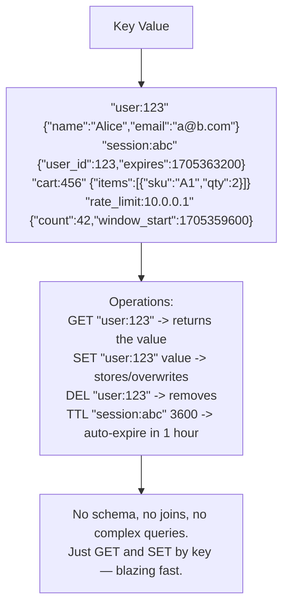
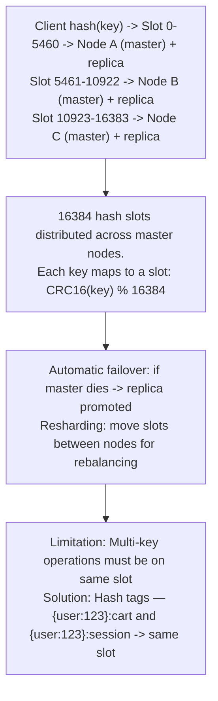
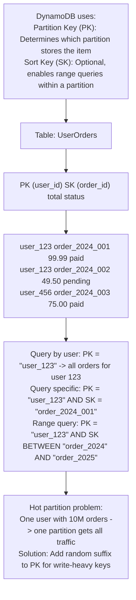
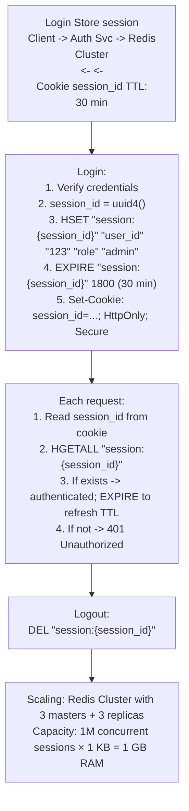
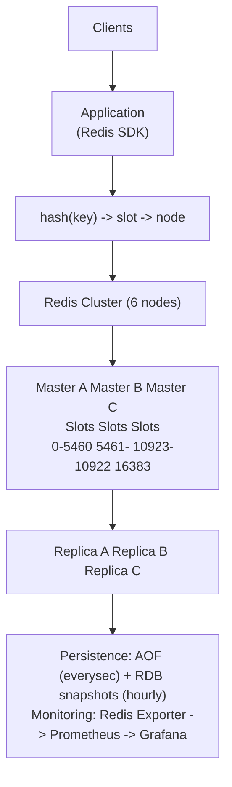

# Topic 02: Key-Value Store

> **Track**: Databases and Storage
> **Difficulty**: Intermediate
> **Prerequisites**: SQL vs NoSQL, Caching, Sharding

---

## Table of Contents

- [A. Concept Explanation](#a-concept-explanation)
- [B. Interview View](#b-interview-view)
- [C. Practical Engineering View](#c-practical-engineering-view)
- [D. Example](#d-example)
- [E. HLD and LLD](#e-hld-and-lld)
- [F. Summary & Practice](#f-summary--practice)

---

## A. Concept Explanation

### What is a Key-Value Store?

A **key-value store** is the simplest NoSQL database model. Every piece of data is stored as a **key** (unique identifier) and a **value** (the data itself — a string, JSON, binary blob, etc.). Think of it as a giant hash map / dictionary.



### Why Key-Value Stores?

```
Speed:
  In-memory stores (Redis): GET/SET in ~0.1ms (sub-millisecond)
  On-disk stores (RocksDB): GET/SET in ~1ms
  SQL query: 5-50ms (parse, plan, execute, join)

Simplicity:
  No schema migrations, no complex query planning
  Perfect when you know your key at query time

Scalability:
  Easy to shard: hash(key) → partition
  Linear horizontal scaling
  Redis Cluster: 100+ nodes, millions of ops/sec
```

### Key-Value Store Landscape

| Store | Storage | Persistence | Clustering | Best For |
|-------|---------|-------------|-----------|----------|
| **Redis** | In-memory | Optional (RDB/AOF) | Redis Cluster | Caching, sessions, real-time |
| **Memcached** | In-memory | None | Client-side sharding | Simple caching |
| **DynamoDB** | Disk (SSD) | Durable | Managed, auto-scaled | Serverless, web apps |
| **etcd** | Disk | Raft consensus | Built-in (Raft) | Config, service discovery |
| **RocksDB** | Disk (LSM) | Durable | Embedded (no cluster) | Embedded KV engine |
| **Riak KV** | Disk | Durable | Masterless | High availability |

### Data Modeling Patterns

```
KEY DESIGN is critical (it's your only "query"):

  Pattern 1: ENTITY KEYS
    "user:{user_id}"              → user profile
    "order:{order_id}"            → order data

  Pattern 2: COMPOSITE KEYS
    "user:123:orders"             → list of user's order IDs
    "chat:456:messages:latest"    → latest messages in a chat

  Pattern 3: TTL KEYS (auto-expire)
    "session:{session_id}"   TTL=3600     → session data (1 hour)
    "otp:{phone}"            TTL=300      → one-time password (5 min)
    "rate:{ip}:{minute}"     TTL=60       → rate limit counter

  Pattern 4: SORTED/SCORED (Redis sorted sets)
    ZADD "leaderboard" 1500 "player_A"
    ZADD "leaderboard" 2300 "player_B"
    ZREVRANGE "leaderboard" 0 9          → top 10 players

  Anti-pattern: Scanning all keys (no secondary indexes!)
    Never: KEYS "user:*" in production (blocks server)
```

### Redis Data Structures

```
Redis is more than just GET/SET. It has rich data structures:

  STRING:  SET key "value"              → simple key-value
  LIST:    LPUSH key "item"             → queue, recent items
  SET:     SADD key "member"            → unique collections, tags
  HASH:    HSET key field value         → object with fields
  SORTED SET: ZADD key score member     → leaderboards, rankings
  STREAM:  XADD key * field value       → event log, message queue
  BITMAP:  SETBIT key offset 1          → boolean flags, daily active users
  HYPERLOGLOG: PFADD key element        → cardinality estimation

  Example — User session as HASH:
    HSET "session:abc" "user_id" "123" "role" "admin" "login_at" "2024-01-15"
    HGET "session:abc" "user_id"   → "123"
    HGETALL "session:abc"          → all fields
    EXPIRE "session:abc" 3600      → auto-expire in 1 hour
```

---

## B. Interview View

### What Interviewers Expect

| Level | Expectation |
|-------|------------|
| **Junior** | Knows Redis is fast, used for caching |
| **Mid** | Redis data structures, TTL, key design patterns |
| **Senior** | Redis Cluster, persistence modes, DynamoDB partition keys, hot keys |
| **Staff+** | Consistent hashing, Redis vs DynamoDB trade-offs, capacity planning |

### Red Flags

- Using Redis as the primary database without persistence strategy
- Not considering memory limits for in-memory stores
- Scanning all keys instead of proper key design
- Not handling cache misses or eviction

### Common Questions

1. What is a key-value store? When would you use one?
2. Compare Redis and DynamoDB.
3. How does Redis persistence work (RDB vs AOF)?
4. How would you design the key schema for [use case]?
5. How does Redis Cluster handle sharding?

---

## C. Practical Engineering View

### Redis Persistence

```
RDB (Snapshot):
  Periodically save full dataset to disk (e.g., every 5 min)
  save 300 10  → snapshot if 10+ keys changed in 300 seconds
  Pros: Compact file, fast restart
  Cons: Can lose up to 5 min of data on crash

AOF (Append-Only File):
  Log every write operation to disk
  appendfsync always   → fsync every write (safest, slowest)
  appendfsync everysec → fsync every second (good balance)
  appendfsync no       → OS decides (fastest, least safe)
  Pros: Minimal data loss (1 second max)
  Cons: Larger file, slower restarts

Hybrid (recommended):
  Enable both RDB + AOF
  RDB for fast backup/restore
  AOF for minimal data loss
  Redis 7+: AOF rewrite uses RDB format internally
```

### Redis Cluster



### DynamoDB Key Design



---

## D. Example: Session Store with Redis



---

## E. HLD and LLD

### E.1 HLD — Distributed Key-Value Store



### E.2 LLD — Key-Value Client Wrapper

```java
// Dependencies in the original example:
// import redis
// import json
// import time

public class KeyValueStore {
    private Object redis;

    public KeyValueStore(Object redisClient) {
        this.redis = redisClient;
    }

    public Map<String, Object> get(String key) {
        // raw = redis.get(key)
        // if raw is null
        // return null
        // return json.loads(raw)
        return null;
    }

    public Object set(String key, Map<String, Object> value, int ttlSeconds) {
        // serialized = json.dumps(value)
        // if ttl_seconds
        // redis.setex(key, ttl_seconds, serialized)
        // else
        // redis.set(key, serialized)
        return null;
    }

    public Object delete(String key) {
        // redis.delete(key)
        return null;
    }

    public String createSession(String sessionId, Map<String, Object> userData, int ttl) {
        // key = f"session:{session_id}"
        // redis.hset(key, mapping=user_data)
        // redis.expire(key, ttl)
        // return session_id
        return null;
    }

    public Map<String, Object> getSession(String sessionId) {
        // key = f"session:{session_id}"
        // data = redis.hgetall(key)
        // if not data
        // return null
        // redis.expire(key, 1800)  # Refresh TTL on access
        // return {k.decode(): v.decode() for k, v in data.items()}
        return null;
    }

    public boolean checkRateLimit(String identifier, int maxRequests, int windowSeconds) {
        // key = f"rate:{identifier}:{int(time.time()) // window_seconds}"
        // pipe = redis.pipeline()
        // pipe.incr(key)
        // pipe.expire(key, window_seconds)
        // results = pipe.execute()
        // current_count = results[0]
        // return current_count <= max_requests
        return false;
    }

    public Object updateScore(String leaderboard, String member, double score) {
        // redis.zadd(leaderboard, {member: score})
        return null;
    }

    public List<Object> getTop(String leaderboard, int count) {
        // results = redis.zrevrange(leaderboard, 0, count - 1, withscores=true)
        // return [{"member": m.decode(), "score": s} for m, s in results]
        return null;
    }

    public int getRank(String leaderboard, String member) {
        // rank = redis.zrevrank(leaderboard, member)
        // return rank + 1 if rank is not null else null
        return 0;
    }
}
```

---

## F. Summary & Practice

### Key Takeaways

1. **Key-value stores** = hash map at scale; GET/SET by key, sub-millisecond
2. **Redis**: in-memory, rich data structures, persistence optional (RDB/AOF)
3. **DynamoDB**: managed, disk-based, partition key + sort key, serverless
4. **Key design** is critical — it's your only query mechanism
5. **TTL** for auto-expiry (sessions, OTPs, rate limits, cache)
6. **Redis Cluster**: 16384 hash slots across masters + replicas
7. **Hash tags** `{user:123}:*` keep related keys on same slot
8. Common patterns: caching, sessions, rate limiting, leaderboards, pub/sub
9. **Never** scan all keys in production (`KEYS *` blocks the server)
10. In-memory = fast but limited by RAM; plan capacity carefully

### Interview Questions

1. What is a key-value store? When would you use one?
2. Compare Redis and DynamoDB.
3. How does Redis persistence work?
4. How does Redis Cluster distribute data?
5. Design a rate limiter using Redis.
6. How would you handle hot keys?
7. What Redis data structures would you use for a leaderboard?

### Practice Exercises

1. **Exercise 1**: Design the key schema for a URL shortener using Redis. Handle: short URL → long URL mapping, click counters, TTL for temporary links.
2. **Exercise 2**: Your Redis instance is at 90% memory. Diagnose and propose 5 strategies to reduce memory usage without losing critical data.
3. **Exercise 3**: Design a distributed session store that handles 5M concurrent sessions across 3 data centers. Address: replication, failover, and consistency.

---

> **Previous**: [01 — SQL vs NoSQL](01-sql-vs-nosql.md)
> **Next**: [03 — Document DB](03-document-db.md)
