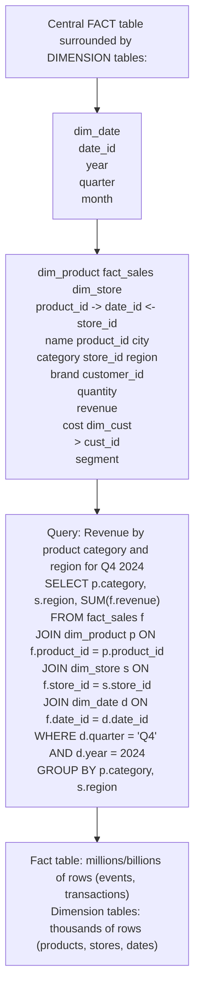
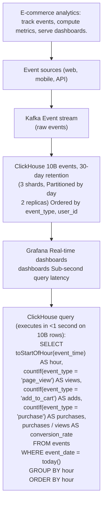
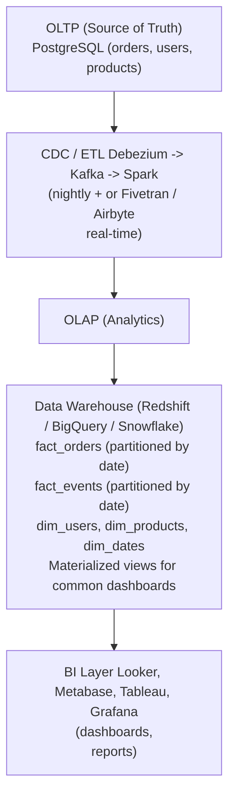

# Topic 04: Columnar Database

> **Track**: Databases and Storage
> **Difficulty**: Intermediate
> **Prerequisites**: SQL vs NoSQL, Indexing

---

## Table of Contents

- [A. Concept Explanation](#a-concept-explanation)
- [B. Interview View](#b-interview-view)
- [C. Practical Engineering View](#c-practical-engineering-view)
- [D. Example](#d-example)
- [E. HLD and LLD](#e-hld-and-lld)
- [F. Summary & Practice](#f-summary--practice)

---

## A. Concept Explanation

### What is a Columnar Database?

A **columnar (column-oriented) database** stores data by columns rather than by rows. This layout is optimized for analytical queries that aggregate over specific columns across millions of rows.

```
ROW-ORIENTED (traditional SQL — PostgreSQL, MySQL):
  Disk layout: all columns of one row stored together
  
  Row 1: [Alice, 28, SF, $50K]
  Row 2: [Bob,   35, NY, $80K]
  Row 3: [Carol, 42, LA, $65K]

  Great for: SELECT * FROM users WHERE id = 1  (fetch one full row)
  Bad for:   SELECT AVG(salary) FROM users     (must read all columns to get salary)

COLUMN-ORIENTED (ClickHouse, Redshift, BigQuery):
  Disk layout: all values of one column stored together
  
  name:   [Alice, Bob, Carol]
  age:    [28, 35, 42]
  city:   [SF, NY, LA]
  salary: [50K, 80K, 65K]

  Great for: SELECT AVG(salary) FROM users     (reads only salary column)
  Bad for:   SELECT * FROM users WHERE id = 1  (must gather from all columns)
```

### Why Columnar is Fast for Analytics

```
Query: SELECT city, AVG(salary) FROM employees GROUP BY city

Row-oriented (10M rows × 20 columns × 100 bytes each):
  Reads: 10M × 20 × 100 = 20 GB from disk
  Only needs 2 columns (city, salary) but reads all 20

Column-oriented (10M rows, 2 columns needed):
  Reads: 10M × 2 × 100 = 2 GB from disk
  10× less I/O → 10× faster

Additional advantages:
  1. COMPRESSION: Same-type values compress well
     salary: [50000, 50000, 50000, 80000] → run-length encoding
     Typical 5-10× compression ratio

  2. VECTORIZED PROCESSING: CPU operates on column arrays
     SUM(salary) → SIMD instruction on array of integers
     Much faster than row-by-row processing

  3. LATE MATERIALIZATION: Only reconstruct rows for final result
     Filter on column A, aggregate column B → never touch columns C-Z
```

### Columnar Database Landscape

| Database | Type | Best For | Scale |
|----------|------|----------|-------|
| **ClickHouse** | OLAP, open-source | Real-time analytics, logs | PB-scale |
| **Amazon Redshift** | Managed data warehouse | AWS analytics | PB-scale |
| **Google BigQuery** | Serverless warehouse | Ad-hoc analytics | EB-scale |
| **Snowflake** | Cloud-native warehouse | Multi-cloud analytics | PB-scale |
| **Apache Druid** | Real-time OLAP | Sub-second dashboards | TB-scale |
| **Apache Cassandra** | Wide-column NoSQL | Write-heavy, distributed | PB-scale |
| **Apache HBase** | Wide-column NoSQL | Hadoop ecosystem | PB-scale |
| **Apache Parquet** | File format | Data lake storage | N/A (file format) |

### OLTP vs OLAP

```
OLTP (Online Transaction Processing):
  • Row-oriented (PostgreSQL, MySQL)
  • Many small reads/writes (INSERT one order, SELECT one user)
  • Low latency per query (<10ms)
  • Normalized schema (3NF)
  • Concurrent users: thousands
  • Example: "Place order #12345"

OLAP (Online Analytical Processing):
  • Column-oriented (ClickHouse, Redshift, BigQuery)
  • Few large analytical queries (aggregate millions of rows)
  • Higher latency acceptable (seconds to minutes)
  • Denormalized schema (star/snowflake)
  • Concurrent users: dozens to hundreds
  • Example: "Revenue by region for Q4 2024"

  Most systems need BOTH:
  OLTP DB (PostgreSQL) → ETL → OLAP DB (Redshift/BigQuery) → BI dashboards
```

### Wide-Column Stores (Cassandra, HBase)

```
Note: Cassandra/HBase are "wide-column" stores — different from
analytical columnar DBs like ClickHouse/Redshift.

Wide-column: Row key → many dynamic columns
  Optimized for: distributed writes, time-series, key-based access
  NOT optimized for: full-column aggregations across all rows

  Cassandra data model:
    Partition key: user_id
    Clustering columns: timestamp (sorted within partition)

    user_123 | 2024-01-15T10:00 | {message: "hello"}
    user_123 | 2024-01-15T10:05 | {message: "world"}
    user_123 | 2024-01-15T10:10 | {message: "test"}

    Fast: SELECT * FROM messages WHERE user_id = 'user_123'
            AND timestamp > '2024-01-15T10:00'
    Slow: SELECT COUNT(*) FROM messages (scans ALL partitions)
```

---

## B. Interview View

### What Interviewers Expect

| Level | Expectation |
|-------|------------|
| **Junior** | Knows row vs column storage; knows columnar is for analytics |
| **Mid** | Can explain why columnar is faster for aggregations; knows Redshift/BigQuery |
| **Senior** | Star schema design; partitioning strategy; OLTP vs OLAP pipeline |
| **Staff+** | Cost optimization; query engine internals; materialized views; data lake architecture |

### Red Flags

- Using a columnar DB for OLTP workloads (single-row lookups)
- Not understanding why columnar is faster for aggregations
- Confusing Cassandra (wide-column) with ClickHouse (analytical columnar)

### Common Questions

1. What is a columnar database? Why is it faster for analytics?
2. Compare OLTP and OLAP databases.
3. When would you use ClickHouse vs Redshift vs BigQuery?
4. What is a star schema?
5. How does data get from OLTP to OLAP systems?

---

## C. Practical Engineering View

### Star Schema



### Partitioning and Clustering

```
ClickHouse example:

  CREATE TABLE events (
    event_date Date,
    user_id UInt64,
    event_type String,
    properties String
  )
  ENGINE = MergeTree()
  PARTITION BY toYYYYMM(event_date)    -- Monthly partitions
  ORDER BY (event_type, user_id)        -- Sort within partition
  
  Partitioning: Prunes entire partitions during query
    WHERE event_date >= '2024-01-01' → skips all partitions before Jan 2024
  
  Ordering: Enables fast range scans within partition
    WHERE event_type = 'click' → binary search on sorted data

BigQuery:
  Partitioned by date/timestamp → query only relevant partitions
  Clustered by frequently filtered columns → sorted within partitions
  Both reduce bytes scanned → reduce cost (BigQuery charges per byte scanned)
```

### Cost Optimization

```
BigQuery pricing: $5 per TB scanned

  BAD: SELECT * FROM events (scans all columns = 500 GB = $2.50 per query)
  GOOD: SELECT event_type, count(*) FROM events WHERE date = '2024-01-15'
        (scans 2 columns + 1 partition = 5 GB = $0.025 per query)

  Optimization strategies:
  1. SELECT only needed columns (never SELECT *)
  2. Partition by date → query only relevant dates
  3. Cluster by frequently filtered columns
  4. Use materialized views for repeated queries
  5. Set query byte limits to prevent accidental full scans
  6. Use approximate functions (APPROX_COUNT_DISTINCT) for estimates
```

---

## D. Example: Real-Time Analytics Dashboard



---

## E. HLD and LLD

### E.1 HLD — Analytics Data Pipeline



### E.2 LLD — Analytics Query Service

```java
public class AnalyticsService {
    private Object ch;
    private Object cache;

    public AnalyticsService(Object clickhouseClient, Object cacheClient) {
        this.ch = clickhouseClient;
        this.cache = cacheClient;
    }

    public List<Object> getRevenueByPeriod(String startDate, String endDate, String groupBy) {
        // cache_key = f"revenue:{start_date}:{end_date}:{group_by}"
        // cached = cache.get(cache_key)
        // if cached
        // return json.loads(cached)
        // time_func = {
        // "hour": "toStartOfHour(order_time)",
        // "day": "toDate(order_time)",
        // "week": "toStartOfWeek(order_time)",
        // ...
        return null;
    }

    public List<Object> getTopProducts(String date, int limit) {
        // query =
        // SELECT
        // product_id,
        // any(product_name) AS name,
        // sum(quantity) AS units_sold,
        // sum(revenue) AS total_revenue
        // FROM fact_orders
        // WHERE order_date = %(date)s
        // ...
        return null;
    }

    public Map<String, Object> getFunnel(String date) {
        // query =
        // SELECT
        // countIf(event_type = 'page_view') AS views,
        // countIf(event_type = 'add_to_cart') AS carts,
        // countIf(event_type = 'checkout_start') AS checkouts,
        // countIf(event_type = 'purchase') AS purchases
        // FROM fact_events
        // WHERE event_date = %(date)s
        // ...
        return null;
    }
}
```

---

## F. Summary & Practice

### Key Takeaways

1. **Column-oriented** stores read only needed columns → 10-100× less I/O for analytics
2. **Compression** on same-type column values → 5-10× storage reduction
3. **OLTP** (row) for transactions; **OLAP** (columnar) for analytics — use both
4. **Star schema**: fact tables (events/transactions) + dimension tables (lookups)
5. **Partition by date** → prune irrelevant data; **cluster by** filter columns
6. **Wide-column** (Cassandra) ≠ analytical columnar (ClickHouse); different use cases
7. **ClickHouse** for real-time analytics; **BigQuery/Redshift/Snowflake** for data warehousing
8. **Never SELECT \*** on columnar DBs — defeats the purpose; select only needed columns
9. **Materialized views** for repeated dashboard queries
10. Pipeline: OLTP → CDC/ETL → OLAP → BI dashboards

### Interview Questions

1. What is a columnar database? Why is it faster for analytics?
2. Compare OLTP and OLAP systems.
3. What is a star schema? Design one for [use case].
4. How does partitioning improve query performance?
5. Compare ClickHouse, Redshift, and BigQuery.
6. How does data flow from the production database to the analytics warehouse?

### Practice Exercises

1. **Exercise 1**: Design the star schema for an e-commerce data warehouse. Include fact_orders, fact_page_views, and appropriate dimension tables.
2. **Exercise 2**: Your BigQuery bill is $10K/month. Analyze the top queries and propose optimizations to reduce it by 70%.
3. **Exercise 3**: Design a real-time analytics system for a ride-sharing app: track rides, compute metrics (avg wait time, surge pricing, driver utilization) with sub-second dashboard latency.

---

> **Previous**: [03 — Document DB](03-document-db.md)
> **Next**: [05 — Graph DB](05-graph-db.md)
