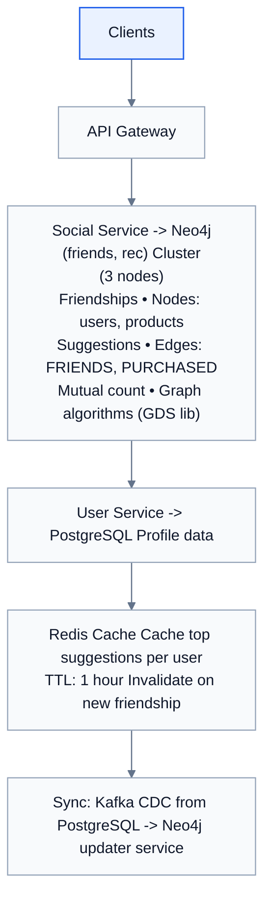

# Topic 05: Graph Database

> **Track**: Databases and Storage
> **Difficulty**: Intermediate
> **Prerequisites**: SQL vs NoSQL, Document DB

---

## Table of Contents

- [A. Concept Explanation](#a-concept-explanation)
- [B. Interview View](#b-interview-view)
- [C. Practical Engineering View](#c-practical-engineering-view)
- [D. Example](#d-example)
- [E. HLD and LLD](#e-hld-and-lld)
- [F. Summary & Practice](#f-summary--practice)

---

## A. Concept Explanation

### What is a Graph Database?

A **graph database** stores data as **nodes** (entities) and **edges** (relationships). It is optimized for traversing relationships between entities — queries like "friends of friends" or "shortest path" that would require expensive recursive JOINs in SQL become natural and fast.

```
RELATIONAL (SQL) — relationships via foreign keys + JOINs:

  users table:     friendships table:
  id | name        user_a | user_b
  1  | Alice       1      | 2
  2  | Bob         1      | 3
  3  | Carol       2      | 4
  4  | Dave

  "Friends of Alice's friends" = 2 self-joins (slow at scale)

GRAPH DB — relationships are first-class citizens:

  (Alice)--[:FRIENDS_WITH]-->(Bob)
  (Alice)--[:FRIENDS_WITH]-->(Carol)
  (Bob)--[:FRIENDS_WITH]-->(Dave)

  "Friends of Alice's friends" = 2-hop traversal (fast, O(neighbors))

  Key insight: In SQL, JOINs get slower as data grows.
  In graph DBs, traversals depend on LOCAL connectivity, not total data size.
```

### Graph Data Model

```
NODES (vertices):
  Entities with labels and properties
  (:Person {name: "Alice", age: 28})
  (:Product {id: "p1", name: "MacBook", price: 2499})
  (:Company {name: "Google"})

EDGES (relationships):
  Connections with type, direction, and properties
  (Alice)-[:FRIENDS_WITH {since: 2020}]->(Bob)
  (Alice)-[:PURCHASED {date: "2024-01-15", amount: 2499}]->(MacBook)
  (Alice)-[:WORKS_AT {role: "Engineer", since: 2022}]->(Google)

PROPERTIES:
  Key-value pairs on both nodes and edges
  Allow rich metadata on relationships (not just "connected")
```

### Graph Query Language (Cypher — Neo4j)

```cypher
-- Find Alice's friends
MATCH (a:Person {name: "Alice"})-[:FRIENDS_WITH]->(friend)
RETURN friend.name

-- Friends of friends (2 hops)
MATCH (a:Person {name: "Alice"})-[:FRIENDS_WITH*2]->(fof)
WHERE fof <> a
RETURN DISTINCT fof.name

-- Shortest path between Alice and Dave
MATCH path = shortestPath(
  (a:Person {name: "Alice"})-[:FRIENDS_WITH*]-(d:Person {name: "Dave"})
)
RETURN path

-- Product recommendations: "people who bought X also bought"
MATCH (p:Person)-[:PURCHASED]->(prod:Product {name: "MacBook"}),
      (p)-[:PURCHASED]->(other:Product)
WHERE other.name <> "MacBook"
RETURN other.name, count(p) AS buyers
ORDER BY buyers DESC LIMIT 10

-- Fraud detection: circular money transfers
MATCH (a:Account)-[:TRANSFERRED*3..6]->(a)
WHERE ALL(r IN relationships(path) WHERE r.amount > 10000)
RETURN a
```

### Graph DB Landscape

| Database | Model | Query Language | Scaling | Best For |
|----------|-------|---------------|---------|----------|
| **Neo4j** | Property graph | Cypher | Clustering, sharding (5.0+) | General graph, social networks |
| **Amazon Neptune** | Property graph + RDF | Gremlin, SPARQL | Managed, replicas | AWS-native graph |
| **TigerGraph** | Property graph | GSQL | Distributed, MPP | Large-scale analytics |
| **ArangoDB** | Multi-model (graph + doc) | AQL | Sharding | Multi-model needs |
| **JanusGraph** | Property graph | Gremlin | Distributed (Cassandra/HBase) | Large-scale, open-source |
| **Dgraph** | Graph | GraphQL, DQL | Distributed | GraphQL-native |

### When to Use (and Not Use) Graph DBs

```
USE graph DB when:
  ✓ Data has many-to-many relationships
  ✓ Queries involve traversals (friends, paths, recommendations)
  ✓ Relationship patterns are complex and variable
  ✓ You need real-time traversal (not batch)
  
  Examples:
  • Social networks (friends, followers, mutual connections)
  • Recommendation engines (collaborative filtering)
  • Fraud detection (circular transactions, identity networks)
  • Knowledge graphs (entities + relationships)
  • Network/IT infrastructure (dependencies, impact analysis)
  • Access control (ReBAC — who can access what)

DON'T use graph DB when:
  ✗ Simple key-value lookups (use Redis/DynamoDB)
  ✗ Tabular data with few relationships (use SQL)
  ✗ Heavy aggregations on properties (use columnar DB)
  ✗ Document-centric access (use MongoDB)
  ✗ Time-series data (use InfluxDB/TimescaleDB)
```

---

## B. Interview View

### What Interviewers Expect

| Level | Expectation |
|-------|------------|
| **Junior** | Knows graph DBs store nodes and edges; mentions social networks |
| **Mid** | Can write basic Cypher/Gremlin; knows when graph DB beats SQL |
| **Senior** | Graph modeling, scaling challenges, fraud detection patterns |
| **Staff+** | Graph algorithms (PageRank, community detection), distributed graphs |

### Red Flags

- Using a graph DB for simple CRUD operations
- Not knowing when SQL joins are sufficient
- Not considering graph DB scaling limitations

### Common Questions

1. When would you use a graph database over SQL?
2. How does a graph DB handle "friends of friends" faster than SQL?
3. How would you model a social network in a graph DB?
4. What graph algorithms are commonly used?
5. How do graph databases scale?

---

## C. Practical Engineering View

### Graph Algorithms

```
1. SHORTEST PATH: Minimum hops between two nodes
   Use: Navigation, network routing, social distance

2. PAGERANK: Node importance based on incoming connections
   Use: Search ranking, influence scoring

3. COMMUNITY DETECTION (Louvain, Label Propagation):
   Find clusters of densely connected nodes
   Use: Market segmentation, fraud rings

4. CENTRALITY (Betweenness, Closeness, Degree):
   Which nodes are most influential/connected?
   Use: Key person identification, network bottlenecks

5. SIMILARITY (Node Similarity, Jaccard):
   Which nodes are structurally similar?
   Use: Recommendations, duplicate detection

6. PATH FINDING (All Shortest Paths, A*):
   Find routes between nodes
   Use: Supply chain, dependency analysis
```

### Scaling Graph Databases

```
Challenge: Graphs are hard to partition (dense connections cross partitions).

Strategies:
  1. READ REPLICAS: Scale reads across replicas (Neo4j Causal Cluster)
  2. GRAPH PARTITIONING: Split subgraphs across machines
     Hard: edges crossing partitions require network hops
  3. MATERIALIZED SUBGRAPHS: Pre-compute frequent traversals
  4. CACHING: Cache popular traversal results in Redis
  5. HYBRID: Store graph in Neo4j, properties in PostgreSQL
     Neo4j for traversals, SQL for filtering/aggregation

Neo4j performance:
  Single node: Millions of nodes, billions of edges
  Cluster: Tens of billions of edges
  Beyond: Consider TigerGraph or JanusGraph (distributed)
```

---

## D. Example: Social Network Recommendations

```
"People You May Know" feature:

  (Alice)--[:FRIENDS_WITH]-->(Bob)
  (Alice)--[:FRIENDS_WITH]-->(Carol)
  (Bob)--[:FRIENDS_WITH]-->(Dave)
  (Carol)--[:FRIENDS_WITH]-->(Dave)
  (Carol)--[:FRIENDS_WITH]-->(Eve)

  Query: Suggest friends for Alice (friends of friends, not already friends):
  
  MATCH (alice:Person {name: "Alice"})-[:FRIENDS_WITH]->(friend)
        -[:FRIENDS_WITH]->(suggestion)
  WHERE suggestion <> alice
    AND NOT (alice)-[:FRIENDS_WITH]->(suggestion)
  RETURN suggestion.name, count(friend) AS mutual_friends
  ORDER BY mutual_friends DESC

  Result:
    Dave: 2 mutual friends (Bob, Carol) → top suggestion
    Eve:  1 mutual friend (Carol)

  SQL equivalent would require:
    2 self-joins on friendship table + NOT EXISTS subquery
    At 100M users with 500 avg friends each: extremely slow
    Graph DB: milliseconds (only traverses Alice's local neighborhood)
```

---

## E. HLD and LLD

### E.1 HLD — Graph-Powered Recommendation Engine



### E.2 LLD — Graph Query Service

```java
// Dependencies in the original example:
// from neo4j import GraphDatabase

public class SocialGraphService {
    private Object driver;
    private Object cache;

    public SocialGraphService(Object neo4jDriver, Object cacheClient) {
        this.driver = neo4jDriver;
        this.cache = cacheClient;
    }

    public List<Object> getFriends(String userId, int limit) {
        // with driver.session() as session
        // result = session.run(
        // "MATCH (u:User {id: $uid})-[:FRIENDS_WITH]->(f:User) "
        // "RETURN f.id AS id, f.name AS name "
        // "LIMIT $limit",
        // uid=user_id, limit=limit
        // )
        // return [dict(record) for record in result]
        return null;
    }

    public List<Object> getFriendSuggestions(String userId, int limit) {
        // cache_key = f"suggestions:{user_id}"
        // cached = cache.get(cache_key)
        // if cached
        // return json.loads(cached)
        // with driver.session() as session
        // result = session.run(
        // MATCH (u:User {id: $uid})-[:FRIENDS_WITH]->(friend)
        // -[:FRIENDS_WITH]->(suggestion:User)
        // ...
        return null;
    }

    public Object addFriendship(String userA, String userB) {
        // with driver.session() as session
        // session.run(
        // "MATCH (a:User {id: $a}), (b:User {id: $b}) "
        // "MERGE (a)-[:FRIENDS_WITH]->(b) "
        // "MERGE (b)-[:FRIENDS_WITH]->(a)",
        // a=user_a, b=user_b
        // )
        // Invalidate suggestion caches
        // ...
        return null;
    }

    public List<Object> getMutualFriends(String userA, String userB) {
        // with driver.session() as session
        // result = session.run(
        // MATCH (a:User {id: $a})-[:FRIENDS_WITH]->(mutual:User)
        // <-[:FRIENDS_WITH]-(b:User {id: $b})
        // RETURN mutual.id AS id, mutual.name AS name
        // , a=user_a, b=user_b)
        // return [dict(r) for r in result]
        return null;
    }

    public List<Object> detectFraudRings(int minRingSize, double minAmount) {
        // with driver.session() as session
        // result = session.run(
        // MATCH path = (a:Account)-[:TRANSFERRED*3..6]->(a)
        // WHERE ALL(r IN relationships(path) WHERE r.amount > $min_amount)
        // RETURN [n IN nodes(path) | n.id] AS ring,
        // length(path) AS ring_size
        // ORDER BY ring_size DESC
        // , min_amount=min_amount)
        // ...
        return null;
    }
}
```

---

## F. Summary & Practice

### Key Takeaways

1. **Graph DBs** store nodes (entities) + edges (relationships) as first-class citizens
2. **Traversals** depend on local connectivity, not total data size → fast for relationship queries
3. **Cypher** (Neo4j) and **Gremlin** (Apache TinkerPop) are the main query languages
4. Best for: social networks, recommendations, fraud detection, knowledge graphs
5. **Not** for: simple CRUD, heavy aggregations, time-series, document access
6. **Graph algorithms**: shortest path, PageRank, community detection, centrality
7. Scaling challenge: graphs are hard to partition (use replicas, caching, hybrid approach)
8. **Hybrid architecture**: graph DB for traversals + SQL for structured data + cache for hot paths
9. **Neo4j** for most use cases; **TigerGraph/JanusGraph** for very large distributed graphs

### Interview Questions

1. When would you use a graph database?
2. How does a graph DB handle "friends of friends" faster than SQL?
3. How would you model a social network in a graph DB?
4. What is the Cypher query language?
5. How do you detect fraud using a graph database?
6. How do graph databases scale?

### Practice Exercises

1. **Exercise 1**: Design the graph data model for LinkedIn: users, companies, skills, endorsements, job posts. Write Cypher queries for: mutual connections, skill-based recommendations, shortest path between users.
2. **Exercise 2**: Build a fraud detection system using a graph DB. Model accounts, transactions, devices, IPs. Detect: circular transfers, shared device networks, velocity anomalies.
3. **Exercise 3**: Your Neo4j query for 3-hop recommendations takes 5 seconds. Diagnose and optimize to <100ms.

---

> **Previous**: [04 — Columnar DB](04-columnar-db.md)
> **Next**: [06 — Time-Series DB](06-time-series-db.md)
