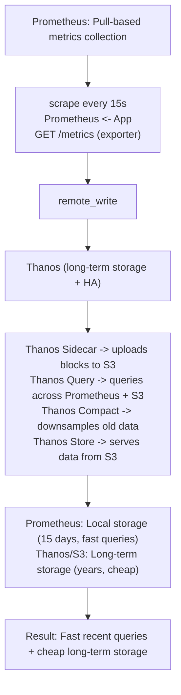
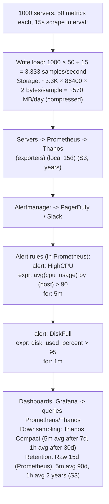
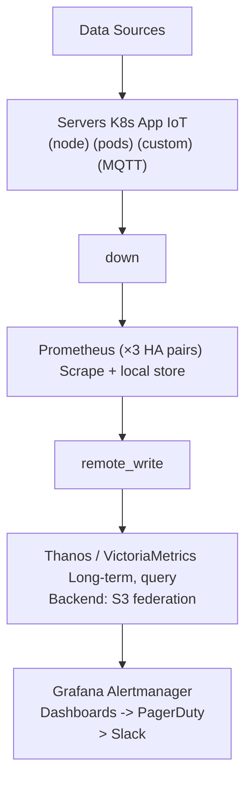

# Topic 06: Time-Series Database

> **Track**: Databases and Storage
> **Difficulty**: Intermediate
> **Prerequisites**: SQL vs NoSQL, Columnar DB

---

## Table of Contents

- [A. Concept Explanation](#a-concept-explanation)
- [B. Interview View](#b-interview-view)
- [C. Practical Engineering View](#c-practical-engineering-view)
- [D. Example](#d-example)
- [E. HLD and LLD](#e-hld-and-lld)
- [F. Summary & Practice](#f-summary--practice)

---

## A. Concept Explanation

### What is a Time-Series Database?

A **time-series database (TSDB)** is optimized for storing and querying data points indexed by time. Each data point is a timestamp + one or more values, often with tags/labels for identification.

```
Time-series data: values that change over time

  Metric: cpu_usage
  Tags: host=web-01, region=us-east
  
  Timestamp            Value
  2024-01-15T10:00:00  45.2%
  2024-01-15T10:00:10  47.8%
  2024-01-15T10:00:20  52.1%
  2024-01-15T10:00:30  48.5%
  ...

  Characteristics:
  • Append-only (rarely update old data)
  • High write throughput (thousands of metrics per second)
  • Queries are time-range based (last 1 hour, last 7 days)
  • Recent data queried most often
  • Old data can be downsampled or deleted
```

### Why Not Use a Regular Database?

```
PostgreSQL for 1000 servers × 50 metrics × 10s interval:
  5000 inserts/second → 432M rows/day → 13B rows/month
  
  Problems:
  • INSERT throughput bottleneck (B-tree index updates)
  • Table bloat (huge indexes)
  • Slow aggregation queries (AVG over millions of rows)
  • No built-in downsampling or retention policies
  • Storage grows unbounded

Time-series DB optimizations:
  • Columnar compression (timestamps compress 10-20×)
  • Append-only storage (no random writes)
  • Time-based partitioning (drop old partitions instantly)
  • Built-in downsampling (1-min avg instead of 10s raw)
  • Built-in retention policies (auto-delete after 30 days)
  • Specialized query functions (rate, derivative, moving avg)
```

### TSDB Landscape

| Database | Type | Best For | Scale |
|----------|------|----------|-------|
| **InfluxDB** | Purpose-built TSDB | Metrics, IoT | Single node to cluster |
| **TimescaleDB** | PostgreSQL extension | SQL + time-series | PostgreSQL scale |
| **Prometheus** | Pull-based monitoring | Infrastructure metrics | Single node (Thanos for scale) |
| **VictoriaMetrics** | Prometheus-compatible | High-cardinality metrics | Cluster |
| **QuestDB** | Purpose-built TSDB | High ingestion, SQL | Single node |
| **Apache Druid** | OLAP + time-series | Real-time analytics | Distributed |
| **ClickHouse** | Columnar OLAP | Analytics + time-series | Distributed |
| **Amazon Timestream** | Managed TSDB | AWS-native time-series | Serverless |

### Key Concepts

```
METRIC: What you're measuring (cpu_usage, request_latency, temperature)

TAGS/LABELS: Metadata that identifies the source
  host=web-01, region=us-east, environment=production
  Tags are indexed → used for filtering and grouping

FIELD: The actual measured values
  cpu_usage=45.2, memory_used=8192

TIMESTAMP: When the measurement was taken
  2024-01-15T10:00:00Z (usually UTC, nanosecond precision)

SERIES: A unique combination of metric name + tags
  cpu_usage{host="web-01", region="us-east"} → one series
  cpu_usage{host="web-02", region="us-east"} → another series

CARDINALITY: Number of unique series
  100 hosts × 50 metrics = 5,000 series (manageable)
  100K users × 50 metrics = 5M series (HIGH cardinality — expensive!)
```

### Downsampling and Retention

```
Raw data: 10-second intervals
  Problem: 365 days × 86400 seconds/day ÷ 10 = 3.15M points per series/year

Solution: DOWNSAMPLING
  Raw (10s intervals):   Keep for 7 days
  1-minute averages:     Keep for 30 days
  5-minute averages:     Keep for 90 days
  1-hour averages:       Keep for 1 year
  1-day averages:        Keep forever

  Recent data: high resolution (debugging, real-time dashboards)
  Old data: low resolution (trend analysis, capacity planning)

  Storage savings: ~95% reduction over keeping raw data forever

RETENTION POLICIES:
  Automatically delete data older than threshold
  InfluxDB: CREATE RETENTION POLICY "30d" ON metrics DURATION 30d
  Prometheus: --storage.tsdb.retention.time=30d
```

---

## B. Interview View

### What Interviewers Expect

| Level | Expectation |
|-------|------------|
| **Junior** | Knows time-series = data points over time; mentions Prometheus |
| **Mid** | Downsampling, retention, cardinality; can design metrics pipeline |
| **Senior** | TSDB internals (LSM, compression), high-cardinality solutions, HA |
| **Staff+** | Multi-tenant metrics, cost optimization, federation, long-term storage |

### Red Flags

- Using a regular SQL DB for high-volume metrics
- Not considering cardinality (unbounded labels)
- No retention or downsampling strategy (storage grows forever)

### Common Questions

1. What is a time-series database? Why not use PostgreSQL?
2. How does downsampling work?
3. What is cardinality and why does it matter?
4. Compare InfluxDB, TimescaleDB, and Prometheus.
5. How would you design the metrics pipeline for 1000 servers?

---

## C. Practical Engineering View

### Prometheus + Thanos Architecture



### TimescaleDB (PostgreSQL Extension)

```sql
-- TimescaleDB: Full SQL with time-series optimizations

-- Create hypertable (auto-partitions by time)
CREATE TABLE metrics (
    time        TIMESTAMPTZ NOT NULL,
    host        TEXT NOT NULL,
    metric_name TEXT NOT NULL,
    value       DOUBLE PRECISION
);
SELECT create_hypertable('metrics', 'time');

-- Continuous aggregate (materialized view, auto-refreshed)
CREATE MATERIALIZED VIEW metrics_hourly
WITH (timescaledb.continuous) AS
  SELECT time_bucket('1 hour', time) AS hour,
         host, metric_name,
         avg(value), max(value), min(value)
  FROM metrics
  GROUP BY hour, host, metric_name;

-- Retention policy (auto-delete raw data after 7 days)
SELECT add_retention_policy('metrics', INTERVAL '7 days');

-- Compression (10× storage reduction)
ALTER TABLE metrics SET (
  timescaledb.compress,
  timescaledb.compress_segmentby = 'host, metric_name'
);
SELECT add_compression_policy('metrics', INTERVAL '1 day');

-- Query: Average CPU last 24 hours, per host, per hour
SELECT time_bucket('1 hour', time) AS hour,
       host, avg(value) AS avg_cpu
FROM metrics
WHERE metric_name = 'cpu_usage'
  AND time > now() - INTERVAL '24 hours'
GROUP BY hour, host
ORDER BY hour;
```

---

## D. Example: Infrastructure Monitoring Pipeline



---

## E. HLD and LLD

### E.1 HLD — Metrics Platform



### E.2 LLD — Metrics Ingestion Service

```java
// Dependencies in the original example:
// import time
// from collections import defaultdict

public class MetricsCollector {
    private Object tsdb;
    private int flushInterval;
    private int batchSize;
    private List<Object> buffer;
    private Instant lastFlush;

    public MetricsCollector(Object tsdbClient, int flushIntervalSec, int batchSize) {
        this.tsdb = tsdbClient;
        this.flushInterval = flushIntervalSec;
        this.batchSize = batchSize;
        this.buffer = new ArrayList<>();
        this.lastFlush = System.currentTimeMillis();
    }

    public Object record(String metricName, double value, Map<String, Object> tags, double timestamp) {
        // point = {
        // "metric": metric_name,
        // "value": value,
        // "tags": tags or {},
        // "timestamp": timestamp or time.time(),
        // }
        // buffer.append(point)
        // if len(buffer) >= batch_size
        // ...
        return null;
    }

    public Object flush() {
        // if not buffer
        // return
        // batch = buffer[:]
        // buffer = []
        // tsdb.write_batch(batch)
        // last_flush = time.time()
        return null;
    }

    public Object recordHistogram(String metricName, double value, Map<String, Object> tags) {
        // Record value and auto-compute percentile buckets
        // ts = time.time()
        // base_tags = tags or {}
        // record(metric_name, value, base_tags, ts)
        // Increment bucket counters
        // buckets = [0.01, 0.05, 0.1, 0.25, 0.5, 1.0, 2.5, 5.0, 10.0]
        // for b in buckets
        // if value <= b
        // ...
        return null;
    }
}

public class MetricsQueryService {
    private Object tsdb;
    private Object cache;

    public MetricsQueryService(Object tsdbClient, Object cacheClient) {
        this.tsdb = tsdbClient;
        this.cache = cacheClient;
    }

    public List<Object> getMetric(String metricName, Map<String, Object> tags, String start, String end, String step) {
        // cache_key = f"metric:{metric_name}:{hash(str(tags))}:{start}:{end}:{step}"
        // cached = cache.get(cache_key)
        // if cached
        // return json.loads(cached)
        // result = tsdb.query_range(
        // metric=metric_name,
        // tags=tags,
        // start=start,
        // ...
        return null;
    }

    public List<Object> getTopN(String metricName, String groupBy, String period, int n) {
        // return tsdb.query(
        // f"topk({n}, avg_over_time({metric_name}[{period}])) by ({group_by})"
        // )
        return null;
    }
}
```

---

## F. Summary & Practice

### Key Takeaways

1. **TSDBs** are optimized for timestamped, append-only, high-throughput data
2. Regular databases can't handle high-volume metrics (index bloat, slow aggregations)
3. **Cardinality** = number of unique series; high cardinality kills TSDB performance
4. **Downsampling** reduces storage: keep raw data short-term, aggregates long-term
5. **Retention policies** auto-delete old data to control storage growth
6. **Prometheus** for infrastructure metrics (pull-based); **Thanos** for long-term + HA
7. **TimescaleDB** when you need full SQL with time-series optimizations
8. **InfluxDB** for purpose-built TSDB with its own query language (Flux)
9. Compression on timestamps and values gives 10-20× storage reduction
10. Pipeline: exporters → Prometheus → Thanos/S3 → Grafana dashboards + alerts

### Interview Questions

1. What is a time-series database? Why not use PostgreSQL?
2. How does downsampling work? Why is it important?
3. What is cardinality and why does it matter?
4. Compare Prometheus, InfluxDB, and TimescaleDB.
5. Design a metrics pipeline for 10,000 servers.
6. How do you handle long-term metric storage?

### Practice Exercises

1. **Exercise 1**: Design the monitoring and metrics infrastructure for a Kubernetes cluster with 500 pods. Include: collection, storage, querying, alerting, and retention strategy.
2. **Exercise 2**: Your Prometheus instance has 10M active series and is running out of memory. Propose 5 strategies to reduce cardinality.
3. **Exercise 3**: Design an IoT time-series platform for 100K sensors reporting every 5 seconds. Handle: ingestion, storage, real-time dashboards, and historical analysis.

---

> **Previous**: [05 — Graph DB](05-graph-db.md)
> **Next**: [07 — Read Replicas](07-read-replicas.md)
