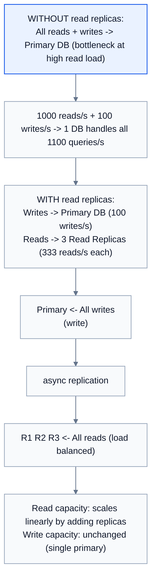
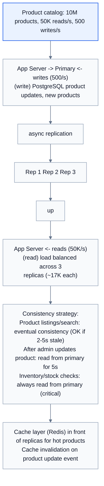
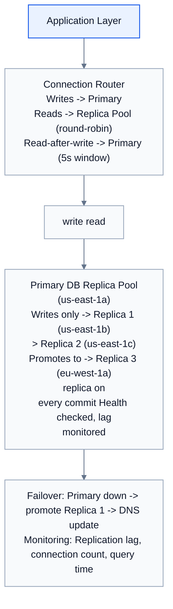

# Topic 07: Read Replicas

> **Track**: Databases and Storage
> **Difficulty**: Intermediate
> **Prerequisites**: SQL vs NoSQL, Replication (Fundamentals Topic 27)

---

## Table of Contents

- [A. Concept Explanation](#a-concept-explanation)
- [B. Interview View](#b-interview-view)
- [C. Practical Engineering View](#c-practical-engineering-view)
- [D. Example](#d-example)
- [E. HLD and LLD](#e-hld-and-lld)
- [F. Summary & Practice](#f-summary--practice)

---

## A. Concept Explanation

### What are Read Replicas?

**Read replicas** are copies of the primary database that serve read queries. All writes go to the primary; the primary replicates changes to replicas asynchronously. This scales read throughput horizontally without affecting write performance.



### Replication Lag

```
Replication is typically ASYNCHRONOUS:
  Primary commits write → sends to replicas → replicas apply

  Timeline:
    T0: Client writes "balance = $100" to Primary
    T0: Primary confirms write to client ✓
    T1: Primary sends WAL to Replica 1 (1ms network)
    T2: Replica 1 applies write (1-5ms)
    
  Replication lag = T2 - T0 = 2-6ms (typical)
  
  During lag, Replica 1 still shows old value!
  
  Problem scenarios:
    1. User updates profile → reads from replica → sees OLD profile
    2. User places order → checks order status → "order not found"
    
  This is called "read-after-write inconsistency"
```

### Consistency Patterns

```
1. READ-AFTER-WRITE CONSISTENCY:
   After a write, the SAME user always sees their own update.
   
   Implementation:
   • Route user's reads to PRIMARY for N seconds after their write
   • Or: track user's last write timestamp, only read from replicas
     that have caught up past that timestamp

2. MONOTONIC READS:
   A user never sees older data after seeing newer data.
   
   Implementation:
   • Pin a user to one specific replica (consistent routing)
   • Or: track the user's last-seen version

3. EVENTUAL CONSISTENCY:
   Replicas will eventually have the same data. No guarantees on timing.
   Acceptable for: social feeds, product listings, analytics dashboards

4. STRONG CONSISTENCY (synchronous replication):
   Write is confirmed only after ALL replicas have it.
   Slower writes but guaranteed fresh reads from any replica.
   Trade-off: Availability (if a replica is down, writes block)
```

### When to Use Read Replicas

```
✓ Read-heavy workloads (90%+ reads)
  Social media feeds, product catalogs, news sites

✓ Reporting/analytics queries
  Run heavy reports on a replica without affecting production writes

✓ Geographic distribution
  Place replicas near users for lower read latency
  Primary in US, replicas in EU and Asia

✓ High availability
  If primary fails, promote a replica to primary (failover)

✗ Write-heavy workloads (replicas don't help with writes)
✗ Requires strong consistency for all reads (use synchronous replication)
✗ Very small databases (overhead not worth it)
```

---

## B. Interview View

### What Interviewers Expect

| Level | Expectation |
|-------|------------|
| **Junior** | Knows reads go to replicas, writes to primary |
| **Mid** | Understands replication lag, read-after-write consistency |
| **Senior** | Can design routing strategy, handle failover, choose sync vs async |
| **Staff+** | Multi-region replicas, consistency SLAs, lag monitoring, cost analysis |

### Red Flags

- Not mentioning replication lag when proposing read replicas
- Not handling read-after-write consistency for user-facing writes
- Assuming replicas are always perfectly in sync

### Common Questions

1. What are read replicas? How do they work?
2. What is replication lag and how do you handle it?
3. How do you ensure read-after-write consistency?
4. When would you use synchronous vs asynchronous replication?
5. How does failover work with read replicas?

---

## C. Practical Engineering View

### AWS RDS Read Replicas

```
PostgreSQL on RDS:
  Primary: db.r6g.2xlarge (us-east-1a)
  Replica 1: db.r6g.xlarge (us-east-1b) — same region, fast replication
  Replica 2: db.r6g.xlarge (eu-west-1a) — cross-region, higher lag
  Replica 3: db.r6g.xlarge (ap-southeast-1a) — cross-region

  Replication lag:
    Same-AZ: < 10ms typically
    Cross-AZ: 10-50ms
    Cross-region: 100ms-1s

  Limits: Up to 5 read replicas per primary (RDS PostgreSQL)
  Cascade: Replicas can have their own replicas (replica of replica)
  Failover: Promote replica to standalone primary (~60 seconds)

  Cost: Each replica costs the same as its instance type
    Primary (2xlarge): $0.72/hr
    3 Replicas (xlarge): 3 × $0.36/hr = $1.08/hr
    Total: $1.80/hr = ~$1,300/month
```

### Monitoring Replication Lag

```
PostgreSQL:
  SELECT client_addr, state, sent_lsn, write_lsn, flush_lsn, replay_lsn,
         (extract(epoch from now()) - extract(epoch from replay_lag))::int AS lag_seconds
  FROM pg_stat_replication;

MySQL:
  SHOW SLAVE STATUS\G
  → Seconds_Behind_Master: 3

Key metrics to monitor:
  • Replication lag (seconds) — alert if > 5s
  • Replication state (streaming/catchup/disconnected)
  • WAL send rate vs apply rate
  • Replica disk space (WAL accumulation if replica falls behind)

Alert thresholds:
  Warning: lag > 5 seconds
  Critical: lag > 30 seconds
  P1: replication broken (replica not connected)
```

### Connection Routing

```
Application-level routing:

  Read/Write splitting proxy:
    PgBouncer + custom routing
    ProxySQL (MySQL)
    Amazon RDS Proxy

  Or application-level:
    def get_connection(query_type, user_context):
        if query_type == "write":
            return primary_pool.get_connection()
        
        # Read-after-write: route to primary for 5 seconds after user's write
        if user_context.last_write_time and \
           time.time() - user_context.last_write_time < 5:
            return primary_pool.get_connection()
        
        # Regular read: load-balance across replicas
        return replica_pool.get_connection()
```

---

## D. Example: E-Commerce Product Service



---

## E. HLD and LLD

### E.1 HLD — Read Replica Architecture



### E.2 LLD — Read/Write Router

```java
// Dependencies in the original example:
// import time
// import random
// import threading

public class DatabaseRouter {
    private Object primary;
    private List<Object> replicas;
    private int rawWindow;
    private Object userWriteTimes;
    private Object lock;

    public DatabaseRouter(Object primaryPool, List<Object> replicaPools, int readAfterWriteWindow) {
        this.primary = primaryPool;
        this.replicas = replicaPools;
        this.rawWindow = readAfterWriteWindow;
        this.userWriteTimes = new HashMap<>();
        this.lock = threading.Lock();
    }

    public Object getConnection(String queryType, String userId) {
        // if query_type == "write"
        // _record_write(user_id)
        // return primary.get_connection()
        // Read-after-write: route to primary if recent write
        // if user_id and _needs_primary_read(user_id)
        // return primary.get_connection()
        // Regular read: pick a healthy replica
        // return _get_healthy_replica()
        return null;
    }

    public Object recordWrite(String userId) {
        // if user_id
        // with _lock
        // user_write_times[user_id] = time.time()
        return null;
    }

    public boolean needsPrimaryRead(String userId) {
        // with _lock
        // last_write = user_write_times.get(user_id)
        // if last_write is null
        // return false
        // return (time.time() - last_write) < raw_window
        return false;
    }

    public boolean getHealthyReplica() {
        // healthy = [r for r in replicas if r.is_healthy()]
        // if not healthy
        // Fallback to primary if all replicas unhealthy
        // return primary.get_connection()
        // Round-robin with lag check
        // replica = random.choice(healthy)
        // if replica.replication_lag_seconds() > 30
        // Skip replicas with high lag
        // ...
        return false;
    }

    public Object executeRead(String query, Object params, String userId) {
        // conn = get_connection("read", user_id)
        // return conn.execute(query, params)
        return null;
    }

    public Object executeWrite(String query, Object params, String userId) {
        // conn = get_connection("write", user_id)
        // result = conn.execute(query, params)
        // conn.commit()
        // return result
        return null;
    }
}
```

---

## F. Summary & Practice

### Key Takeaways

1. **Read replicas** scale read throughput by distributing reads across copies
2. Writes go to **primary only**; replicas receive changes via replication
3. **Replication lag** means replicas may serve stale data (ms to seconds)
4. **Read-after-write consistency**: route user's reads to primary for N seconds after their write
5. **Monotonic reads**: pin users to a specific replica
6. **Eventual consistency** is fine for many use cases (feeds, catalogs, dashboards)
7. **Cross-region replicas** reduce read latency for global users
8. **Failover**: promote replica to primary when primary fails (~60s)
9. Monitor replication lag — alert if > 5 seconds
10. Read replicas don't help with **write scaling** (see Topic 08)

### Interview Questions

1. What are read replicas and how do they work?
2. What is replication lag? How do you handle it?
3. How do you ensure read-after-write consistency?
4. When would you use synchronous vs asynchronous replication?
5. How does failover work with read replicas?
6. How many read replicas do you need for [X] reads/second?

### Practice Exercises

1. **Exercise 1**: Design the database architecture for a news website with 100K reads/s and 100 writes/s. Include: replica count, routing strategy, consistency model, and failover plan.
2. **Exercise 2**: A user complains they update their profile but sometimes see the old version. Diagnose the issue and implement a fix.
3. **Exercise 3**: Your cross-region replica has 3 seconds of lag. Is this acceptable? For which use cases? How would you reduce it?

---

> **Previous**: [06 — Time-Series DB](06-time-series-db.md)
> **Next**: [08 — Write Scaling](08-write-scaling.md)
