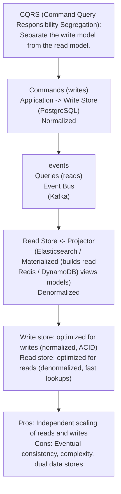
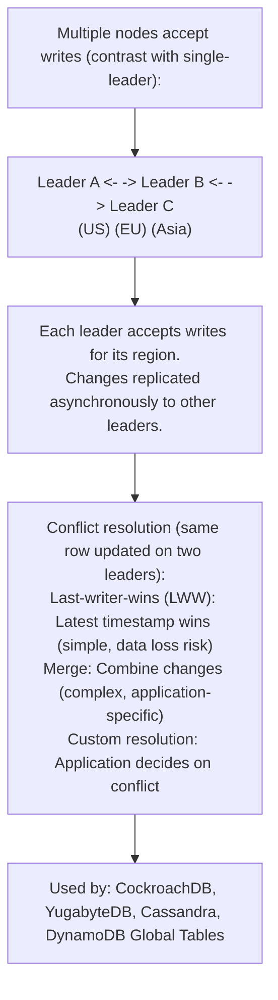
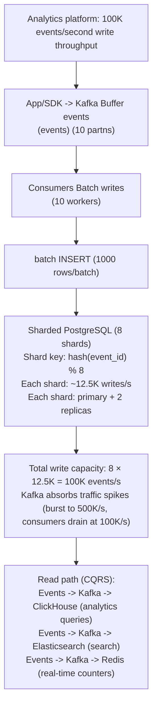
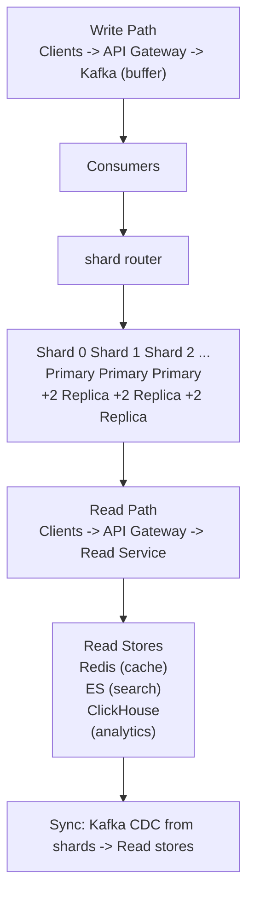

# Topic 08: Write Scaling

> **Track**: Databases and Storage
> **Difficulty**: Advanced
> **Prerequisites**: Read Replicas, Sharding, Partitioning

---

## Table of Contents

- [A. Concept Explanation](#a-concept-explanation)
- [B. Interview View](#b-interview-view)
- [C. Practical Engineering View](#c-practical-engineering-view)
- [D. Example](#d-example)
- [E. HLD and LLD](#e-hld-and-lld)
- [F. Summary & Practice](#f-summary--practice)

---

## A. Concept Explanation

### The Write Scaling Problem

Read replicas scale reads, but **all writes still go to a single primary**. When write throughput exceeds what one machine can handle, you need a different strategy.

```
Single primary bottleneck:
  Primary DB: max ~10K writes/s (depends on hardware, query complexity)
  
  If your app needs 50K writes/s → single primary can't handle it.
  Adding read replicas doesn't help — writes are the bottleneck.

Write scaling strategies (ordered by complexity):
  1. Vertical scaling (bigger machine) — simplest, limited ceiling
  2. Write optimization (batching, async) — low effort, moderate gain
  3. Sharding (horizontal partitioning) — splits data across DBs
  4. CQRS (separate read/write models) — architectural pattern
  5. Multi-leader replication — writes to multiple nodes
  6. Distributed databases — built-in horizontal scaling
```

### Strategy 1: Vertical Scaling

```
Scale UP: bigger CPU, more RAM, faster SSDs

  db.r6g.xlarge  → db.r6g.8xlarge
  4 vCPU, 32 GB  → 32 vCPU, 256 GB
  ~3K writes/s   → ~15K writes/s

  Pros: No application changes, simple
  Cons: Hardware ceiling, cost grows non-linearly, single point of failure
  
  Verdict: Good first step, buys time, but not a long-term solution
```

### Strategy 2: Write Optimization

```
Batch writes:
  BAD:  1000 individual INSERTs (1000 round trips)
  GOOD: 1 bulk INSERT with 1000 rows (1 round trip)
  
  INSERT INTO events (user_id, event_type, data) VALUES
    (1, 'click', '{}'), (2, 'view', '{}'), ... (1000 rows)
  
  10-50× faster than individual inserts

Async writes (write-behind):
  Application → Message Queue → Worker → Database
  
  Decouple write throughput from database throughput.
  Queue absorbs spikes; workers drain at DB's pace.

Connection pooling:
  PgBouncer: Reduce connection overhead from 1000s of app connections
  to 50 actual DB connections. Each connection costs ~10 MB RAM.

Index optimization:
  Fewer indexes = faster writes (each index updated on every INSERT)
  Remove unused indexes, use partial indexes
```

### Strategy 3: Sharding

```
Split data across multiple database instances by a shard key:

  Shard key: user_id (hash-based)
  
  user_id % 4:
    Shard 0: users 0, 4, 8, 12, ...  → DB instance A
    Shard 1: users 1, 5, 9, 13, ...  → DB instance B
    Shard 2: users 2, 6, 10, 14, ... → DB instance C
    Shard 3: users 3, 7, 11, 15, ... → DB instance D

  Write capacity: 4× single instance
  Each shard is independent (own primary + replicas)

  Challenges:
  • Cross-shard queries (JOINs across shards are expensive)
  • Cross-shard transactions (2PC or saga pattern)
  • Resharding (adding shards requires data migration)
  • Hotspots (uneven distribution)
  • Application complexity (routing logic)
```

### Strategy 4: CQRS



### Strategy 5: Multi-Leader Replication



### Strategy 6: Distributed Databases

```
Purpose-built for horizontal write scaling:

  CockroachDB / YugabyteDB / TiDB:
    SQL interface + automatic sharding + distributed transactions
    Writes spread across all nodes automatically
    No manual sharding logic needed

  Cassandra / DynamoDB:
    NoSQL, write to any node (leaderless or multi-leader)
    Tunable consistency (ONE, QUORUM, ALL)
    Designed for massive write throughput

  Trade-offs:
    Higher per-query latency (distributed consensus)
    More operational complexity
    Cost (more nodes)
    But: linear write scaling with no application sharding logic
```

---

## B. Interview View

### What Interviewers Expect

| Level | Expectation |
|-------|------------|
| **Junior** | Knows sharding exists for write scaling |
| **Mid** | Can explain sharding, CQRS; knows trade-offs |
| **Senior** | Chooses appropriate strategy for given requirements; handles resharding |
| **Staff+** | Multi-leader conflict resolution, distributed DB internals, cost modeling |

### Red Flags

- Suggesting read replicas for write scaling
- Not considering the application-level complexity of sharding
- Not mentioning cross-shard query/transaction challenges

### Common Questions

1. How do you scale writes beyond a single database?
2. What is sharding? What are the challenges?
3. What is CQRS? When would you use it?
4. How do you handle cross-shard transactions?
5. Compare sharding vs distributed databases.

---

## C. Practical Engineering View

### Write Batching

```java
import java.sql.Connection;
import java.sql.PreparedStatement;
import java.sql.SQLException;
import java.util.List;

public final class EventBatchWriter {
    private final Connection connection;

    public EventBatchWriter(Connection connection) {
        this.connection = connection;
    }

    public void insertIndividually(List<String> events) throws SQLException {
        try (PreparedStatement statement =
                     connection.prepareStatement("INSERT INTO events (data) VALUES (?)")) {
            for (String event : events) {
                statement.setString(1, event);
                statement.executeUpdate();
            }
        }
    }

    public void insertBatch(List<String> events) throws SQLException {
        try (PreparedStatement statement =
                     connection.prepareStatement("INSERT INTO events (data) VALUES (?)")) {
            for (String event : events) {
                statement.setString(1, event);
                statement.addBatch();
            }
            statement.executeBatch();
        }
    }
}
```

### Resharding Strategy

```
Adding shards without downtime:

  Phase 1: PREPARE
    Add new shard instances (Shard 4, 5)
    Set up replication from existing shards

  Phase 2: BACKFILL
    Copy historical data to new shards based on new shard function
    hash(key) % 6 instead of hash(key) % 4

  Phase 3: DUAL WRITE
    Write to both old and new shard assignment
    Read from old shards

  Phase 4: SWITCH READS
    Start reading from new shard assignment
    Verify data consistency

  Phase 5: STOP OLD WRITES
    Only write to new shard assignment
    Clean up old data from original shards

  Tools: Vitess (MySQL), Citus (PostgreSQL), application-level
```

---

## D. Example: High-Volume Event Ingestion



---

## E. HLD and LLD

### E.1 HLD — Write-Scaled Architecture



### E.2 LLD — Shard Router

```java
// Dependencies in the original example:
// import hashlib

public class ShardRouter {
    private Object shards;
    private int numShards;

    public ShardRouter(Map<String, Object> shardConnections, int numShards) {
        this.shards = shardConnections;
        this.numShards = numShards;
    }

    public int getShardId(String shardKey) {
        // hash_val = int(hashlib.md5(shard_key.encode()).hexdigest(), 16)
        // return hash_val % num_shards
        return 0;
    }

    public Object getConnection(String shardKey, boolean readOnly) {
        // shard_id = get_shard_id(shard_key)
        // pool = shards[shard_id]
        // if read_only
        // return pool.get_replica_connection()
        // return pool.get_primary_connection()
        return null;
    }

    public Object executeOnShard(String shardKey, String query, Object params) {
        // conn = get_connection(shard_key)
        // result = conn.execute(query, params)
        // conn.commit()
        // return result
        return null;
    }

    public List<Object> executeOnAllShards(String query, Object params) {
        // Fan-out query to all shards (expensive, avoid if possible)
        // results = []
        // for shard_id, pool in shards.items()
        // conn = pool.get_replica_connection()
        // results.extend(conn.execute(query, params))
        // return results
        return null;
    }

    public Object batchInsert(String table, List<Object> rows, String shardKeyField) {
        // Group rows by shard and batch insert to each
        // shard_batches = {}
        // for row in rows
        // shard_id = get_shard_id(str(row[shard_key_field]))
        // if shard_id not in shard_batches
        // shard_batches[shard_id] = []
        // shard_batches[shard_id].append(row)
        // for shard_id, batch in shard_batches.items()
        // ...
        return null;
    }
}
```

---

## F. Summary & Practice

### Key Takeaways

1. **Read replicas don't scale writes** — all writes go to one primary
2. **Vertical scaling** is the simplest first step (bigger machine)
3. **Write batching** gives 10-50× improvement with minimal code changes
4. **Async writes** via message queue decouple throughput from DB capacity
5. **Sharding** splits data across DBs — linear write scaling, but complex
6. **CQRS** separates read/write models — independent scaling of each
7. **Multi-leader** accepts writes at multiple nodes — conflict resolution required
8. **Distributed DBs** (CockroachDB, Cassandra) have built-in write scaling
9. Sharding challenges: cross-shard queries, transactions, resharding, hotspots
10. Start simple (optimize → vertical → queue → shard) not complex (don't shard on day 1)

### Interview Questions

1. How do you scale writes beyond a single database?
2. What is sharding and what are its challenges?
3. What is CQRS? When would you use it?
4. How do you handle cross-shard transactions?
5. Compare manual sharding vs distributed databases.
6. How would you handle resharding without downtime?

### Practice Exercises

1. **Exercise 1**: Design the write path for a social media platform handling 50K posts/second. Include: buffering, sharding strategy, and consistency guarantees.
2. **Exercise 2**: Your single PostgreSQL primary is at 80% write capacity. Propose a phased plan to scale writes 10×, with estimated cost and complexity for each phase.
3. **Exercise 3**: Implement a CQRS architecture for an order management system. Show the write model, event bus, read model projector, and how reads/writes are handled differently.

---

> **Previous**: [07 — Read Replicas](07-read-replicas.md)
> **Next**: [09 — Schema Design](09-schema-design.md)
