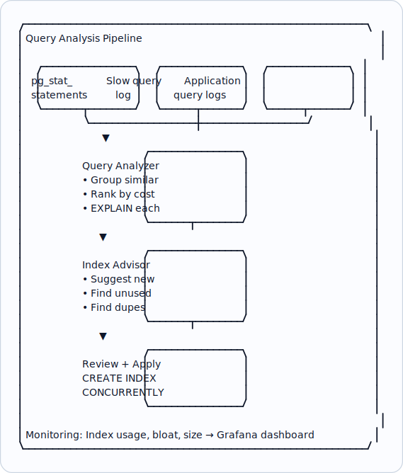

# Topic 10: Indexing Strategy

> **Track**: Databases and Storage
> **Difficulty**: Intermediate → Advanced
> **Prerequisites**: Schema Design, SQL vs NoSQL, Fundamentals Topic 31

---

## Table of Contents

- [A. Concept Explanation](#a-concept-explanation)
- [B. Interview View](#b-interview-view)
- [C. Practical Engineering View](#c-practical-engineering-view)
- [D. Example](#d-example)
- [E. HLD and LLD](#e-hld-and-lld)
- [F. Summary & Practice](#f-summary--practice)

---

## A. Concept Explanation

### Why Indexing Strategy Matters

An index is a data structure that makes queries faster at the cost of slower writes and additional storage. Choosing **which** indexes to create — and which **not** to — is one of the most impactful decisions for database performance.

```
Without index: Sequential scan (read every row)
  10M rows → ~10 seconds

With index: B-tree lookup
  10M rows → ~5 milliseconds

  But: Each index adds overhead
  • INSERT: must update every index (5 indexes = 5× more writes)
  • Storage: indexes consume disk and RAM
  • Maintenance: VACUUM, REINDEX, bloat management

  Goal: Minimum indexes for maximum query coverage
```

### Index Types (PostgreSQL Focus)

```
1. B-TREE (default, most common):
   Balanced tree structure. O(log n) lookup.
   Supports: =, <, >, <=, >=, BETWEEN, IN, IS NULL, LIKE 'prefix%'
   CREATE INDEX idx_users_email ON users(email);

2. HASH:
   Hash table. O(1) for equality only.
   Supports: = only (no range queries)
   CREATE INDEX idx_users_id ON users USING HASH(id);
   Rarely better than B-tree in modern PostgreSQL.

3. GIN (Generalized Inverted Index):
   For multi-valued columns (arrays, JSONB, full-text).
   CREATE INDEX idx_products_tags ON products USING GIN(tags);
   CREATE INDEX idx_products_attrs ON products USING GIN(attributes jsonb_path_ops);

4. GiST (Generalized Search Tree):
   For geometric, range, and proximity data.
   CREATE INDEX idx_locations_geo ON locations USING GiST(coordinates);
   Supports: @>, &&, <<, nearest-neighbor

5. BRIN (Block Range Index):
   Stores min/max per block range. Tiny index, good for sorted data.
   CREATE INDEX idx_events_time ON events USING BRIN(created_at);
   Best for: time-series, append-only tables where data is naturally ordered.
   Size: 1000× smaller than B-tree, but less precise.

6. BLOOM:
   Probabilistic index for multi-column equality.
   Good when you have many columns to filter but can't predict which combination.
```

### Composite Indexes

```
Index on MULTIPLE columns (order matters!):

  CREATE INDEX idx_orders ON orders(user_id, created_at DESC);

  This index supports:
  ✓ WHERE user_id = 123                        (leftmost prefix)
  ✓ WHERE user_id = 123 AND created_at > '...' (both columns)
  ✓ WHERE user_id = 123 ORDER BY created_at DESC (sort)
  
  This index does NOT support:
  ✗ WHERE created_at > '...'  (missing leftmost prefix user_id)

  LEFTMOST PREFIX RULE:
    Index on (A, B, C) supports:
    ✓ (A)
    ✓ (A, B)
    ✓ (A, B, C)
    ✗ (B)
    ✗ (B, C)
    ✗ (C)

  Column order strategy:
    1. Equality columns first (WHERE status = 'active')
    2. Range/inequality columns next (WHERE created_at > '...')
    3. Sort columns last (ORDER BY created_at DESC)
```

### Covering Indexes (Index-Only Scans)

```
A covering index contains ALL columns the query needs.
The database reads the index only — never touches the table.

  Query: SELECT email, name FROM users WHERE email = 'alice@example.com'
  
  Regular index: idx(email) → find row pointer → fetch row from table → read name
  Covering index: idx(email) INCLUDE (name) → read email + name directly from index

  CREATE INDEX idx_users_email_covering ON users(email) INCLUDE (name);

  INCLUDE columns are stored in the index but not used for searching.
  
  Performance: 2× faster (no table access = fewer I/O operations)
  Cost: Larger index (stores additional columns)
  
  Best for: frequently run queries that SELECT specific columns
```

### Partial Indexes

```
Index only a SUBSET of rows (smaller, faster, less overhead):

  -- Only index active orders (90% of queries are for active orders)
  CREATE INDEX idx_orders_active ON orders(user_id, created_at)
  WHERE status = 'active';

  -- Only index featured products
  CREATE INDEX idx_products_featured ON products(category_id, price)
  WHERE is_featured = true;

  Benefits:
  • Much smaller index (only matching rows)
  • Faster writes (only updates index for matching rows)
  • Less storage and RAM

  Ideal when: Most queries filter by a specific condition
```

---

## B. Interview View

### What Interviewers Expect

| Level | Expectation |
|-------|------------|
| **Junior** | Knows indexes speed up reads; can create basic index |
| **Mid** | Composite indexes, leftmost prefix rule, EXPLAIN |
| **Senior** | Covering indexes, partial indexes, index-only scans, cardinality analysis |
| **Staff+** | Index maintenance, bloat management, cost-based optimizer behavior |

### Red Flags

- Indexing every column (wastes writes and storage)
- Not knowing the leftmost prefix rule for composite indexes
- Never checking EXPLAIN output
- Not considering index maintenance overhead

### Common Questions

1. How do you decide which indexes to create?
2. Explain composite indexes and the leftmost prefix rule.
3. What is a covering index?
4. How do you identify slow queries that need indexes?
5. What are the downsides of too many indexes?

---

## C. Practical Engineering View

### EXPLAIN ANALYZE

```sql
-- Always verify index usage with EXPLAIN ANALYZE

EXPLAIN ANALYZE
SELECT * FROM orders WHERE user_id = 'usr_123' AND status = 'active'
ORDER BY created_at DESC LIMIT 20;

-- Output:
-- Limit (actual time=0.05..0.08 rows=20)
--   → Index Scan using idx_orders_user_status on orders
--     Index Cond: (user_id = 'usr_123' AND status = 'active')
--     Rows Removed by Filter: 0
--     Actual rows: 20, loops: 1
-- Planning Time: 0.2ms
-- Execution Time: 0.1ms  ← FAST ✓

-- vs without index:
-- Seq Scan on orders (actual time=500..850 rows=20)
--   Filter: (user_id = 'usr_123' AND status = 'active')
--   Rows Removed by Filter: 9999980
-- Execution Time: 850ms  ← SLOW ✗

Key things to look for:
  ✓ "Index Scan" or "Index Only Scan" → index is being used
  ✗ "Seq Scan" on large tables → missing index
  ✗ "Rows Removed by Filter: 9999980" → index not selective enough
  ✓ Low "Execution Time" → query is fast
```

### Index Selection Process

```
Step 1: Identify slow queries
  pg_stat_statements: top queries by total_exec_time
  SELECT query, calls, mean_exec_time, total_exec_time
  FROM pg_stat_statements
  ORDER BY total_exec_time DESC LIMIT 20;

Step 2: Analyze each slow query with EXPLAIN ANALYZE
  Is it doing a sequential scan?
  Which columns are in WHERE, JOIN, ORDER BY?

Step 3: Check existing indexes
  SELECT indexname, indexdef FROM pg_indexes WHERE tablename = 'orders';
  
  Can an existing composite index be extended?
  Are there redundant indexes?

Step 4: Create the minimal index
  Equality columns first, range columns second, sort last
  Consider: partial index if condition is selective
  Consider: covering index if query selects few columns

Step 5: Verify improvement
  EXPLAIN ANALYZE before and after
  Monitor pg_stat_user_indexes for usage
```

### Index Maintenance

```
BLOAT: Deleted/updated rows leave dead tuples in indexes
  Monitor: SELECT pg_relation_size('idx_name') — growing without data growth?
  Fix: REINDEX CONCURRENTLY idx_name;

UNUSED INDEXES: Waste writes/storage with no benefit
  Find them:
    SELECT indexrelname, idx_scan
    FROM pg_stat_user_indexes
    WHERE idx_scan = 0 AND indexrelname NOT LIKE '%pkey'
    ORDER BY pg_relation_size(indexrelid) DESC;

  If idx_scan = 0 for 30+ days → safe to drop

DUPLICATE INDEXES:
  idx_a ON orders(user_id)
  idx_b ON orders(user_id, created_at)
  → idx_a is redundant (idx_b covers all queries idx_a supports)
  → DROP INDEX idx_a;

STATISTICS:
  ANALYZE orders;  — updates table statistics for query planner
  Auto-analyze usually handles this, but run manually after bulk loads
```

---

## D. Example: Optimizing an E-Commerce Query Set

```sql
-- Top 5 queries for an e-commerce orders table:

-- Q1: Get user's recent orders
SELECT id, total, status, created_at FROM orders
WHERE user_id = $1 ORDER BY created_at DESC LIMIT 20;

-- Q2: Get pending orders for processing
SELECT * FROM orders
WHERE status = 'pending' AND created_at > now() - interval '24 hours';

-- Q3: Order detail by ID
SELECT * FROM orders WHERE id = $1;

-- Q4: Revenue report by day
SELECT date_trunc('day', created_at) AS day, sum(total)
FROM orders WHERE created_at BETWEEN $1 AND $2
GROUP BY day ORDER BY day;

-- Q5: Search orders by tracking number
SELECT * FROM orders WHERE tracking_number = $1;

-- Optimal indexes:
CREATE INDEX idx_orders_user_recent ON orders(user_id, created_at DESC)
  INCLUDE (total, status);                    -- Q1: covering index
CREATE INDEX idx_orders_pending ON orders(created_at)
  WHERE status = 'pending';                   -- Q2: partial index
-- Q3: uses primary key (id) → already indexed
CREATE INDEX idx_orders_created ON orders(created_at)
  WHERE status = 'completed';                 -- Q4: partial for revenue
CREATE UNIQUE INDEX idx_orders_tracking ON orders(tracking_number)
  WHERE tracking_number IS NOT NULL;          -- Q5: sparse unique

-- Total: 4 indexes (not 5!) covering all 5 query patterns
-- Q3 uses the primary key index
```

---

## E. HLD and LLD

### E.1 HLD — Index Management System



### E.2 LLD — Index Advisor

```java
public class IndexAdvisor {
    private Object db;

    public IndexAdvisor(Object dbConnection) {
        this.db = dbConnection;
    }

    public List<Object> getSlowQueries(double minAvgTimeMs, int minCalls) {
        // return db.execute(
        // SELECT query, calls, mean_exec_time, total_exec_time,
        // rows AS avg_rows
        // FROM pg_stat_statements
        // WHERE mean_exec_time > %s AND calls > %s
        // ORDER BY total_exec_time DESC
        // LIMIT 50
        // , (min_avg_time_ms, min_calls))
        return null;
    }

    public Map<String, Object> analyzeQuery(String query) {
        // plan = db.execute(f"EXPLAIN (FORMAT JSON, ANALYZE) {query}")
        // plan_data = plan[0][0][0]["Plan"]
        // return {
        // "node_type": plan_data["Node Type"],
        // "total_cost": plan_data["Total Cost"],
        // "actual_time": plan_data.get("Actual Total Time"),
        // "rows": plan_data.get("Actual Rows"),
        // "is_seq_scan": "Seq Scan" in str(plan_data),
        // ...
        return null;
    }

    public List<Object> getUnusedIndexes(int minAgeDays) {
        // return db.execute(
        // SELECT schemaname, indexrelname,
        // pg_size_pretty(pg_relation_size(indexrelid)) AS size,
        // idx_scan AS scans
        // FROM pg_stat_user_indexes
        // WHERE idx_scan = 0
        // AND indexrelname NOT LIKE '%%pkey'
        // AND indexrelname NOT LIKE '%%unique%%'
        // ...
        return null;
    }

    public List<Object> getDuplicateIndexes() {
        // return db.execute(
        // SELECT a.indexrelid::regclass AS index_a,
        // b.indexrelid::regclass AS index_b,
        // pg_size_pretty(pg_relation_size(a.indexrelid)) AS size_a
        // FROM pg_index a
        // JOIN pg_index b ON a.indrelid = b.indrelid
        // AND a.indexrelid != b.indexrelid
        // AND a.indkey::text = LEFT(b.indkey::text, length(a.indkey::text))
        // ...
        return null;
    }

    public List<Object> getIndexBloat(double bloatThreshold) {
        // return db.execute(
        // SELECT indexrelname,
        // pg_size_pretty(pg_relation_size(indexrelid)) AS size,
        // idx_scan AS scans,
        // pg_stat_get_dead_tuples(indrelid) AS dead_tuples
        // FROM pg_stat_user_indexes
        // JOIN pg_index ON pg_stat_user_indexes.indexrelid = pg_index.indexrelid
        // ORDER BY pg_relation_size(pg_stat_user_indexes.indexrelid) DESC
        // ...
        return null;
    }

    public String suggestIndex(String table, List<Object> whereCols, List<Object> sortCols, List<Object> selectCols) {
        // Generate CREATE INDEX statement based on query pattern
        // Equality columns first, then range/sort
        // idx_cols = where_cols[:]
        // if sort_cols
        // for col in sort_cols
        // if col not in idx_cols
        // idx_cols.append(col)
        // cols_str = ", ".join(idx_cols)
        // ...
        return null;
    }
}
```

---

## F. Summary & Practice

### Key Takeaways

1. **Indexes trade write speed for read speed** — create the minimum needed
2. **B-tree** is the default; use **GIN** for JSONB/arrays, **BRIN** for time-series
3. **Composite index** order: equality first, range second, sort last
4. **Leftmost prefix rule**: index on (A, B, C) supports (A), (A, B), (A, B, C) only
5. **Covering indexes** (INCLUDE) enable index-only scans — 2× faster
6. **Partial indexes** reduce size by indexing only relevant rows
7. **EXPLAIN ANALYZE** is mandatory — always verify index usage
8. **Find and remove** unused indexes (pg_stat_user_indexes where idx_scan = 0)
9. **Find and remove** duplicate indexes (composite covers single-column)
10. Indexing is iterative: monitor → identify slow queries → add index → verify

### Interview Questions

1. How do you decide which indexes to create?
2. Explain the leftmost prefix rule for composite indexes.
3. What is a covering index? When would you use one?
4. What is a partial index? Give an example.
5. How do you find unused or duplicate indexes?
6. Walk through optimizing a slow query using EXPLAIN ANALYZE.

### Practice Exercises

1. **Exercise 1**: Given 10 common queries for a social media app (feed, profile, search, notifications, etc.), design the minimal set of indexes. Show your reasoning.
2. **Exercise 2**: Your database has 50 indexes on a table with 100M rows. Writes are slow. Audit the indexes and propose which to drop.
3. **Exercise 3**: Convert a query running 500ms (seq scan on 10M rows) to <5ms. Show the EXPLAIN before/after and the index you created.

---

> **Previous**: [09 — Schema Design](09-schema-design.md)
> **Next**: [11 — Query Optimization](11-query-optimization.md)
