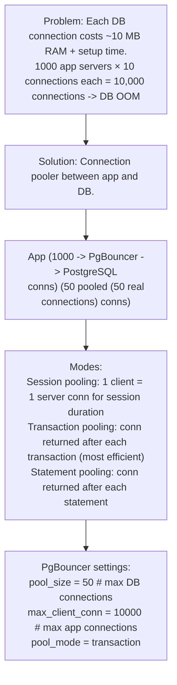
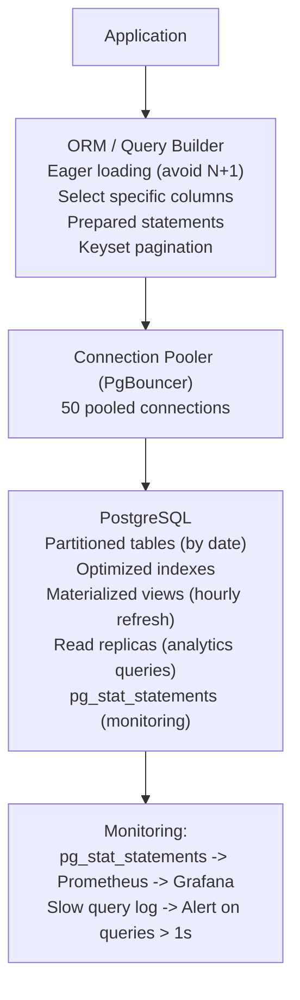

# Topic 11: Query Optimization

> **Track**: Databases and Storage
> **Difficulty**: Intermediate → Advanced
> **Prerequisites**: Indexing Strategy, Schema Design

---

## Table of Contents

- [A. Concept Explanation](#a-concept-explanation)
- [B. Interview View](#b-interview-view)
- [C. Practical Engineering View](#c-practical-engineering-view)
- [D. Example](#d-example)
- [E. HLD and LLD](#e-hld-and-lld)
- [F. Summary & Practice](#f-summary--practice)

---

## A. Concept Explanation

### What is Query Optimization?

**Query optimization** is the process of rewriting queries, restructuring schemas, and configuring the database to minimize execution time and resource usage. The database's **query planner** chooses an execution plan, but it's the engineer's job to give it the best possible conditions.

```
Query lifecycle:
  1. SQL text received
  2. PARSE: Syntax check, build parse tree
  3. PLAN: Query planner considers multiple execution strategies
     • Which indexes to use
     • Join order and algorithm (nested loop, hash join, merge join)
     • Whether to scan or seek
  4. EXECUTE: Run the chosen plan
  5. RETURN: Stream results to client

  You optimize by:
  • Writing efficient SQL
  • Creating the right indexes
  • Providing accurate statistics (ANALYZE)
  • Structuring data to match query patterns
```

### Common Query Anti-Patterns

```
1. SELECT * (fetches all columns):
   BAD:  SELECT * FROM orders WHERE user_id = 123
   GOOD: SELECT id, total, status FROM orders WHERE user_id = 123
   Why: Reads less data, enables index-only scans

2. N+1 QUERY PROBLEM:
   BAD:  users = SELECT * FROM users LIMIT 100
         for user in users:
             orders = SELECT * FROM orders WHERE user_id = user.id
         → 101 queries!
   
   GOOD: SELECT u.*, o.* FROM users u
         JOIN orders o ON u.id = o.user_id
         LIMIT 100
         → 1 query

3. FUNCTIONS ON INDEXED COLUMNS:
   BAD:  WHERE LOWER(email) = 'alice@example.com'
         → Can't use index on email (function wraps column)
   GOOD: WHERE email = 'alice@example.com'
         (store normalized, or create expression index)
   
   Or: CREATE INDEX idx_email_lower ON users(LOWER(email));

4. IMPLICIT TYPE CASTING:
   BAD:  WHERE user_id = '123'  (user_id is INT, comparing to STRING)
         → May skip index due to type cast
   GOOD: WHERE user_id = 123

5. LIKE WITH LEADING WILDCARD:
   BAD:  WHERE name LIKE '%alice%'  → full table scan
   OK:   WHERE name LIKE 'alice%'   → can use B-tree index
   GOOD: Use full-text search for substring matching

6. OR CONDITIONS:
   BAD:  WHERE status = 'active' OR status = 'pending'
         → May not use index efficiently
   GOOD: WHERE status IN ('active', 'pending')
```

### Join Algorithms

```
The database chooses a join algorithm based on data size and indexes:

1. NESTED LOOP JOIN:
   For each row in Table A, scan Table B for matches.
   Best when: One table is small, or inner table has an index.
   Cost: O(N × M) worst case, O(N × log M) with index on inner.

2. HASH JOIN:
   Build hash table from smaller table, probe with larger table.
   Best when: No useful index, both tables are large.
   Cost: O(N + M) but needs memory for hash table.

3. MERGE JOIN:
   Both tables sorted on join key, merge like merge-sort.
   Best when: Both tables already sorted (index on join column).
   Cost: O(N + M) but requires sorted input.

  PostgreSQL chooses automatically based on cost estimation.
  You influence the choice by:
  • Creating indexes on join columns → nested loop or merge join
  • Increasing work_mem → allows larger hash joins in memory
  • ANALYZE to update statistics → better cost estimates
```

### Pagination

```
OFFSET-based (simple but slow for deep pages):
  SELECT * FROM products ORDER BY created_at DESC LIMIT 20 OFFSET 10000;
  → Database must skip 10,000 rows → slow at deep offsets

KEYSET (cursor-based) pagination (fast for any page):
  SELECT * FROM products
  WHERE created_at < '2024-01-15T10:00:00'
  ORDER BY created_at DESC
  LIMIT 20;
  → Uses index, skips nothing, constant performance

  Client sends: "give me 20 items after cursor X"
  Server returns: items + next cursor (last item's created_at)

  Keyset is O(log n) for any "page" vs O(n) for OFFSET.
  Use keyset for infinite scroll, feeds, large datasets.
  Use OFFSET only for small datasets or admin pages.
```

---

## B. Interview View

### What Interviewers Expect

| Level | Expectation |
|-------|------------|
| **Junior** | Knows to avoid SELECT *, understands N+1 problem |
| **Mid** | Can read EXPLAIN output, knows join types, pagination strategies |
| **Senior** | Cost-based optimization, query rewriting, partitioning for performance |
| **Staff+** | Connection pooling, prepared statements, query caching, DB tuning |

### Red Flags

- Writing SELECT * in production queries
- Not knowing about N+1 queries
- Not being able to read EXPLAIN output
- Using OFFSET for deep pagination

### Common Questions

1. How do you optimize a slow SQL query?
2. What is the N+1 query problem?
3. Compare OFFSET and keyset pagination.
4. What join algorithms does PostgreSQL use?
5. How do you identify and fix slow queries in production?

---

## C. Practical Engineering View

### Connection Pooling



### Prepared Statements

```
Reuse query plans for repeated queries:

  BAD (parse + plan every time):
    cursor.execute("SELECT * FROM users WHERE id = 123")
    cursor.execute("SELECT * FROM users WHERE id = 456")
    → Parse + plan each time

  GOOD (parse + plan once, execute many):
    stmt = cursor.prepare("SELECT * FROM users WHERE id = $1")
    stmt.execute(123)
    stmt.execute(456)
    → Parse + plan once, just execute with different params

  Also prevents SQL injection (parameters are never interpolated into SQL).
```

### Materialized Views

```sql
-- Pre-compute expensive aggregations

CREATE MATERIALIZED VIEW daily_revenue AS
  SELECT date_trunc('day', created_at) AS day,
         count(*) AS order_count,
         sum(total) AS revenue,
         avg(total) AS avg_order_value
  FROM orders
  WHERE status = 'completed'
  GROUP BY day;

CREATE UNIQUE INDEX idx_daily_revenue ON daily_revenue(day);

-- Query: instant (reads pre-computed table)
SELECT * FROM daily_revenue WHERE day >= '2024-01-01';

-- Refresh: run periodically (e.g., every hour)
REFRESH MATERIALIZED VIEW CONCURRENTLY daily_revenue;

-- CONCURRENTLY: doesn't lock reads during refresh
-- Requires a unique index on the materialized view

-- Best for: dashboards, reports, analytics queries
-- Not for: real-time data (stale by refresh interval)
```

### Partitioning for Query Performance

```sql
-- Partition large tables by date for faster queries

CREATE TABLE events (
    id BIGINT GENERATED ALWAYS AS IDENTITY,
    event_type TEXT,
    user_id UUID,
    data JSONB,
    created_at TIMESTAMPTZ NOT NULL
) PARTITION BY RANGE (created_at);

-- Monthly partitions
CREATE TABLE events_2024_01 PARTITION OF events
  FOR VALUES FROM ('2024-01-01') TO ('2024-02-01');
CREATE TABLE events_2024_02 PARTITION OF events
  FOR VALUES FROM ('2024-02-01') TO ('2024-03-01');

-- Query automatically uses partition pruning:
SELECT * FROM events WHERE created_at >= '2024-02-01' AND created_at < '2024-03-01';
-- Only scans events_2024_02 partition → much faster

-- Drop old data instantly:
DROP TABLE events_2023_01;  -- Instant, no vacuum needed
```

---

## D. Example: Optimizing a Dashboard Query

```sql
-- BEFORE: 12 seconds on 50M rows
SELECT
    date_trunc('hour', created_at) AS hour,
    status,
    count(*) AS order_count,
    sum(total) AS revenue
FROM orders
WHERE created_at >= '2024-01-01' AND created_at < '2024-02-01'
GROUP BY hour, status
ORDER BY hour;

-- EXPLAIN ANALYZE shows: Seq Scan on orders, 50M rows scanned

-- OPTIMIZATION STEPS:

-- 1. Add index (still slow — aggregation over 5M matching rows)
CREATE INDEX idx_orders_created ON orders(created_at);

-- 2. Partition by month
ALTER TABLE orders RENAME TO orders_old;
CREATE TABLE orders (...) PARTITION BY RANGE (created_at);
-- Migrate data to partitions
-- Now: only scans Jan 2024 partition (5M rows instead of 50M)

-- 3. Create materialized view for dashboard
CREATE MATERIALIZED VIEW hourly_order_stats AS
  SELECT date_trunc('hour', created_at) AS hour,
         status, count(*) AS order_count, sum(total) AS revenue
  FROM orders GROUP BY hour, status;
REFRESH MATERIALIZED VIEW CONCURRENTLY hourly_order_stats;

-- 4. Query the materialized view
SELECT * FROM hourly_order_stats
WHERE hour >= '2024-01-01' AND hour < '2024-02-01'
ORDER BY hour;

-- AFTER: 5ms (reads pre-computed, indexed materialized view)
-- Improvement: 12,000ms → 5ms (2,400× faster)
```

---

## E. HLD and LLD

### E.1 HLD — Query Performance Infrastructure



### E.2 LLD — Query Optimizer Helper

```java
public class QueryOptimizer {
    private Object db;

    public QueryOptimizer(Object dbPool) {
        this.db = dbPool;
    }

    public Map<String, Object> paginateKeyset(String table, List<Object> columns, String orderCol, String orderDir, Object cursorValue, int limit, Map<String, Object> filters) {
        // Keyset pagination — O(log n) for any page depth
        // cols = ", ".join(columns)
        // where_parts = []
        // params = {}
        // if filters
        // for key, value in filters.items()
        // where_parts.append(f"{key} = %({key})s")
        // params[key] = value
        // ...
        return null;
    }

    public List<Object> batchGet(String table, List<Object> ids, String idCol, List<Object> columns) {
        // Batch fetch by IDs (avoids N+1)
        // if not ids
        // return []
        // cols = ", ".join(columns) if columns else "*"
        // placeholders = ", ".join(["%s"] * len(ids))
        // query = f"SELECT {cols} FROM {table} WHERE {id_col} IN ({placeholders})"
        // return db.execute(query, ids)
        return null;
    }

    public Map<String, Object> explainQuery(String query, Object params) {
        // Run EXPLAIN ANALYZE and parse results
        // explain_query = f"EXPLAIN (ANALYZE, BUFFERS, FORMAT JSON) {query}"
        // result = db.execute(explain_query, params)
        // plan = result[0][0][0]
        // return {
        // "execution_time_ms": plan["Execution Time"],
        // "planning_time_ms": plan["Planning Time"],
        // "plan": plan["Plan"]["Node Type"],
        // ...
        return null;
    }
}
```

---

## F. Summary & Practice

### Key Takeaways

1. **Avoid SELECT \***: fetch only needed columns for less I/O and index-only scans
2. **Fix N+1 queries**: use JOINs or batch fetching instead of loops
3. **Keyset pagination** over OFFSET for large datasets — O(log n) vs O(n)
4. **Join algorithms**: nested loop (indexed), hash join (large tables), merge join (sorted)
5. **Connection pooling** (PgBouncer): reduce 10K app connections to 50 DB connections
6. **Prepared statements**: parse and plan once, execute many times
7. **Materialized views**: pre-compute expensive aggregations, refresh periodically
8. **Table partitioning**: prune irrelevant partitions, instant old data deletion
9. **EXPLAIN ANALYZE** every slow query — look for Seq Scans, high row counts
10. Monitor with **pg_stat_statements** — find top queries by total execution time

### Interview Questions

1. How do you optimize a slow SQL query?
2. What is the N+1 query problem? How do you fix it?
3. Compare OFFSET and keyset pagination.
4. What are materialized views? When would you use them?
5. How does connection pooling work?
6. Walk through reading an EXPLAIN ANALYZE output.

### Practice Exercises

1. **Exercise 1**: A dashboard query takes 15 seconds on 100M rows. Show step-by-step optimization: indexing, partitioning, materialized views. Target: <50ms.
2. **Exercise 2**: Your ORM generates N+1 queries for a page showing 50 users with their latest order and order items. Rewrite as 1-2 optimized SQL queries.
3. **Exercise 3**: Design a query performance monitoring system: collect slow queries, auto-suggest indexes, alert on regressions, generate weekly reports.

---

> **Previous**: [10 — Indexing Strategy](10-indexing-strategy.md)
> **Next**: [12 — Data Archival](12-data-archival.md)
