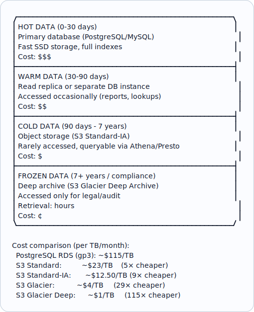
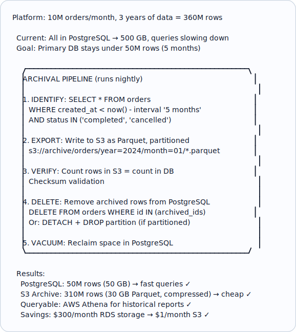
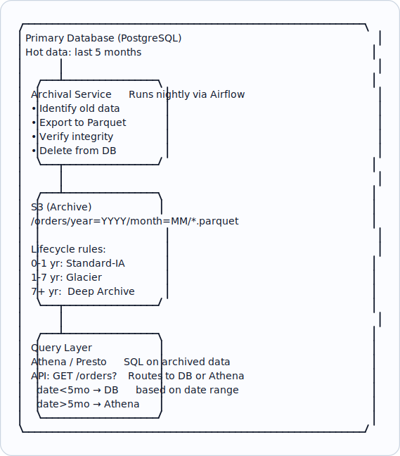

# Topic 12: Data Archival

> **Track**: Databases and Storage
> **Difficulty**: Intermediate
> **Prerequisites**: Schema Design, Partitioning, Blob Storage

---

## Table of Contents

- [A. Concept Explanation](#a-concept-explanation)
- [B. Interview View](#b-interview-view)
- [C. Practical Engineering View](#c-practical-engineering-view)
- [D. Example](#d-example)
- [E. HLD and LLD](#e-hld-and-lld)
- [F. Summary & Practice](#f-summary--practice)

---

## A. Concept Explanation

### What is Data Archival?

**Data archival** is the process of moving old, infrequently accessed data from the primary database to cheaper, long-term storage. This keeps the primary database small, fast, and cost-effective while preserving data for compliance, auditing, or historical analysis.

```
Without archival:
  Year 1: 10M rows → fast queries
  Year 3: 300M rows → queries slow down, storage expensive
  Year 5: 1B rows → indexes huge, backups take hours, migrations painful

With archival:
  Primary DB: only last 90 days (~30M rows) → always fast
  Archive: older data in S3/Glacier → cheap, queryable when needed
  
  Result: Primary DB stays the same size regardless of business growth.
```

### Data Lifecycle



### Archival Strategies

```
1. TIME-BASED ARCHIVAL:
   Move data older than N days to archive.
   Most common and simplest approach.
   
   Archive rule: Move orders older than 90 days to S3.
   Schedule: Run nightly at 2 AM.

2. STATUS-BASED ARCHIVAL:
   Move data that has reached a terminal state.
   
   Archive rule: Move orders with status = 'completed' or 'cancelled'
   that are older than 30 days.
   Active orders stay in primary regardless of age.

3. SIZE-BASED ARCHIVAL:
   Trigger archival when table exceeds a threshold.
   
   Archive rule: When orders table exceeds 50M rows,
   archive the oldest 10M rows.

4. TIERED ARCHIVAL:
   Move through tiers: hot → warm → cold → frozen.
   
   0-30d:  Primary DB (hot)
   30-90d: Move to separate "archive" DB (warm)
   90d-2y: Export to S3 Parquet (cold)
   2y+:    Move to Glacier (frozen)
```

### Archive Formats

```
PARQUET (recommended for analytics):
  Columnar format, compressed, schema-embedded
  Queryable with Athena, Spark, Presto
  Excellent compression (5-10× vs CSV)
  Supports predicate pushdown (skip irrelevant data)

CSV/JSON (simple but inefficient):
  Human-readable, easy to produce
  Large files, no schema enforcement
  No compression by default

AVRO (good for streaming/schema evolution):
  Row-based, schema embedded
  Good for Kafka consumers writing to archive
  Schema evolution support

ORC (Hive ecosystem):
  Columnar, similar to Parquet
  Better for Hive queries

Recommendation: Use PARQUET for most archival use cases.
  Partition by date: s3://archive/orders/year=2024/month=01/data.parquet
```

---

## B. Interview View

### What Interviewers Expect

| Level | Expectation |
|-------|------------|
| **Junior** | Knows old data should be moved out of production DB |
| **Mid** | Can describe archival strategy, knows S3 storage classes |
| **Senior** | Designs full data lifecycle, handles compliance, queryable archives |
| **Staff+** | Cost modeling, cross-region archival, data retention policies at scale |

### Red Flags

- No plan for data growth ("we'll just add more storage")
- Not considering compliance requirements (GDPR, SOX, HIPAA)
- Archiving without ability to query archived data
- No testing of archive restoration

### Common Questions

1. How do you handle data growth in a production database?
2. What is data archival? What strategies exist?
3. How do you query archived data?
4. How do you handle compliance requirements (data retention)?
5. Design the data lifecycle for an e-commerce platform.

---

## C. Practical Engineering View

### PostgreSQL Partitioning for Archival

```sql
-- Partition by month: easy to archive and drop old data

CREATE TABLE orders (
    id UUID,
    user_id UUID,
    total DECIMAL(10,2),
    status TEXT,
    created_at TIMESTAMPTZ NOT NULL
) PARTITION BY RANGE (created_at);

-- Create partitions
CREATE TABLE orders_2024_01 PARTITION OF orders
  FOR VALUES FROM ('2024-01-01') TO ('2024-02-01');
CREATE TABLE orders_2024_02 PARTITION OF orders
  FOR VALUES FROM ('2024-02-01') TO ('2024-03-01');

-- Archive: Export old partition to S3
-- pg_dump or COPY TO for the specific partition
COPY orders_2023_01 TO '/tmp/orders_2023_01.csv' WITH CSV HEADER;
-- Upload to S3, convert to Parquet

-- Then detach and drop:
ALTER TABLE orders DETACH PARTITION orders_2023_01;
DROP TABLE orders_2023_01;
-- Instant! No vacuum, no dead tuples, no lock contention.
```

### Querying Archived Data

```
AWS Athena (serverless SQL on S3):

  -- Point Athena at S3 archive location
  CREATE EXTERNAL TABLE archived_orders (
    id STRING, user_id STRING, total DOUBLE, status STRING
  )
  PARTITIONED BY (year INT, month INT)
  STORED AS PARQUET
  LOCATION 's3://myapp-archive/orders/';

  -- Query archived data with standard SQL
  SELECT user_id, sum(total) AS total_spent
  FROM archived_orders
  WHERE year = 2023 AND month = 6
  GROUP BY user_id;

  -- Cost: $5 per TB scanned
  -- Parquet + partitioning → only scan relevant data → very cheap

  -- Combine hot + cold data:
  SELECT * FROM orders WHERE created_at > '2024-01-01'
  UNION ALL
  SELECT * FROM archived_orders WHERE year = 2023 AND month = 12;
```

### GDPR and Compliance

```
GDPR Right to Erasure: User requests data deletion.
  Challenge: Data is archived in S3 (immutable files).

  Solutions:
  1. SOFT DELETE + CRYPTO SHREDDING:
     Encrypt each user's archived data with a per-user key.
     To "delete": destroy the user's encryption key.
     Data becomes unreadable (effectively deleted).

  2. TOMBSTONE FILE:
     Maintain a list of deleted user IDs.
     When querying archive, filter out tombstoned users.
     Periodically rewrite archive files without deleted users.

  3. PARTITION BY USER SEGMENT:
     Group users by ID range in archive files.
     Rewrite only affected files on deletion request.

  Data retention policies:
    Financial records: 7 years (SOX compliance)
    Healthcare records: 6-10 years (HIPAA)
    General user data: Delete when user requests (GDPR)
    Logs: 90 days - 1 year (operational need)
```

---

## D. Example: E-Commerce Order Archival



---

## E. HLD and LLD

### E.1 HLD — Data Archival Architecture



### E.2 LLD — Archival Service

```java
// Dependencies in the original example:
// import json
// import pyarrow as pa
// import pyarrow.parquet as pq
// from datetime import datetime, timedelta

public class ArchivalService {
    private Object db;
    private Object s3;
    private String bucket;
    private int retentionDays;

    public ArchivalService(Object dbPool, Object s3Client, String bucket, int retentionDays) {
        this.db = dbPool;
        this.s3 = s3Client;
        this.bucket = bucket;
        this.retentionDays = retentionDays;
    }

    public Object runArchival(String table, String dateColumn, int batchSize) {
        // cutoff = datetime.utcnow() - timedelta(days=retention_days)
        // print(f"Archiving {table} data before {cutoff.isoformat()}")
        // total_archived = 0
        // while true
        // 1. Fetch batch of old rows
        // rows = db.execute(f
        // SELECT * FROM {table}
        // WHERE {date_column} < %s
        // ...
        return null;
    }

    public List<Object> queryArchive(String table, int year, int month, String sqlFilter) {
        // Query archived data via S3 Select or Athena
        // prefix = f"archive/{table}/year={year}/month={month:02d}/"
        // List all Parquet files in the partition
        // response = s3.list_objects_v2(
        // Bucket=bucket, Prefix=prefix
        // )
        // results = []
        // for obj in response.get('Contents', [])
        // ...
        return null;
    }
}
```

---

## F. Summary & Practice

### Key Takeaways

1. **Data archival** moves old data from expensive primary DB to cheap storage
2. **Data lifecycle**: hot (DB) → warm (replica) → cold (S3-IA) → frozen (Glacier)
3. **Time-based archival** is the most common strategy (archive data older than N days)
4. **Parquet** format for archives: columnar, compressed, queryable
5. **Partitioned tables** make archival easy: detach partition → export → drop
6. **AWS Athena** provides SQL-on-S3 for querying archived data ($5/TB scanned)
7. **Verify before deleting**: always confirm archive integrity before removing from DB
8. **GDPR crypto shredding**: encrypt per-user, destroy key to "delete"
9. **S3 lifecycle rules** automate tier transitions (Standard → IA → Glacier)
10. Cost savings: 10-100× cheaper storage with preserved queryability

### Interview Questions

1. How do you handle data growth in a production database?
2. What is data archival? What strategies exist?
3. How do you query archived data?
4. How do you handle GDPR right to erasure for archived data?
5. Design the data lifecycle for a financial application.

### Practice Exercises

1. **Exercise 1**: Design the archival strategy for a SaaS platform with 500M events/month. Include: retention tiers, archive format, query access, and cost estimate.
2. **Exercise 2**: Your PostgreSQL database has 2 TB of data and queries are slow. Design a migration plan to archive 80% to S3 while maintaining query access.
3. **Exercise 3**: A user invokes their GDPR right to erasure. Their data exists in: PostgreSQL, Redis cache, S3 archives (Parquet), Elasticsearch, and Kafka. Design the deletion workflow.

---

> **Previous**: [11 — Query Optimization](11-query-optimization.md)
> **Next**: [13 — Backup & Recovery](13-backup-recovery.md)
