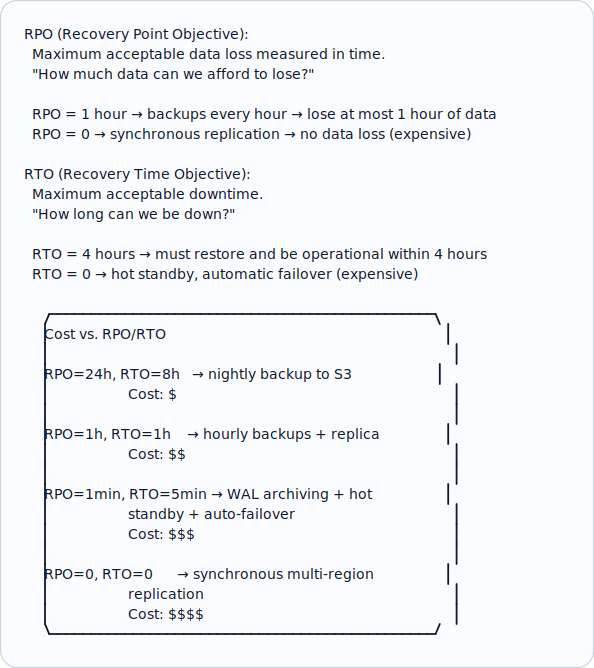
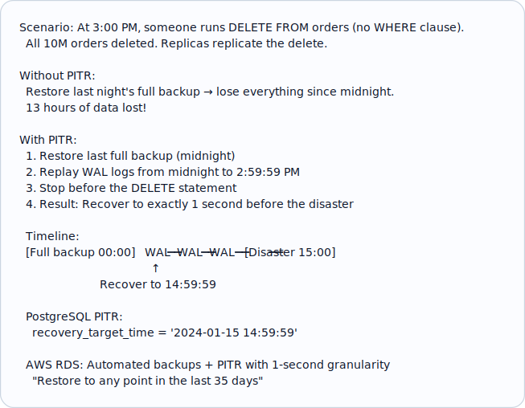
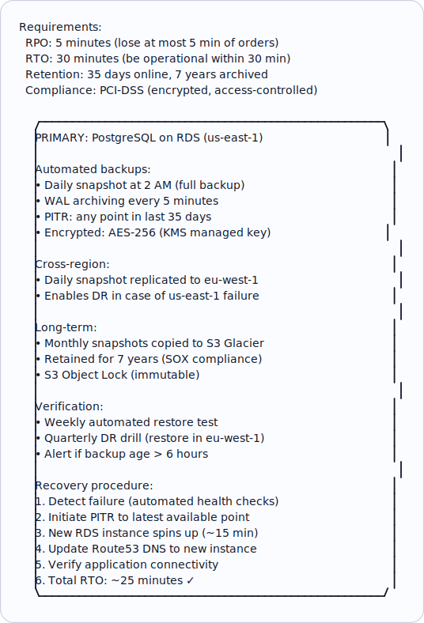
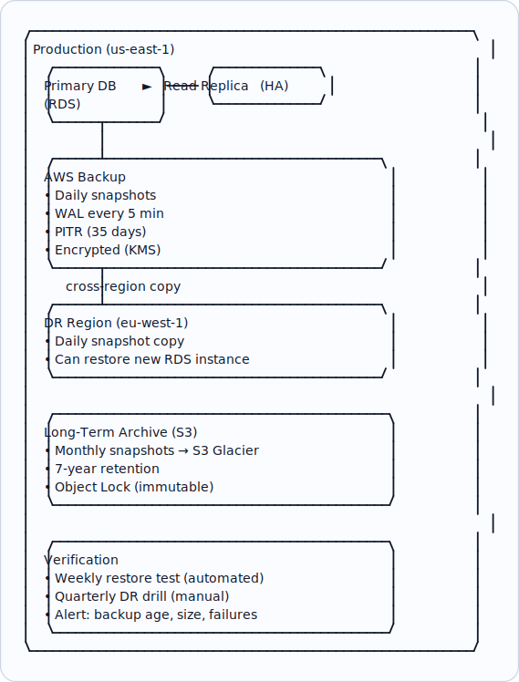

# Topic 13: Backup & Recovery

> **Track**: Databases and Storage
> **Difficulty**: Intermediate → Advanced
> **Prerequisites**: Replication, Data Archival, Read Replicas

---

## Table of Contents

- [A. Concept Explanation](#a-concept-explanation)
- [B. Interview View](#b-interview-view)
- [C. Practical Engineering View](#c-practical-engineering-view)
- [D. Example](#d-example)
- [E. HLD and LLD](#e-hld-and-lld)
- [F. Summary & Practice](#f-summary--practice)

---

## A. Concept Explanation

### Why Backup & Recovery?

Disasters happen: hardware failure, accidental deletion, ransomware, software bugs corrupting data, human error (`DROP TABLE` in production). Without backups, data loss is permanent. Backup & recovery is your **last line of defense**.

```
"Everyone has a backup strategy. Almost nobody has a tested restore strategy."

  Data loss scenarios:
  • Hardware failure (disk dies)
  • Human error (DELETE without WHERE clause)
  • Software bug (corrupts data silently for days)
  • Security breach (ransomware encrypts your DB)
  • Natural disaster (data center fire, flood)
  • Cloud provider outage (region goes down)

  Replication is NOT a backup:
  • If you DROP TABLE, replicas drop it too (instantly replicated)
  • If data is corrupted, corruption replicates to all replicas
  • Replicas protect against hardware failure, not logical errors
```

### Key Metrics



### Backup Types

```
1. FULL BACKUP:
   Complete copy of the entire database.
   
   Pros: Self-contained, simplest restore
   Cons: Slowest, largest storage, heaviest DB load
   Frequency: Weekly or daily for small DBs
   
2. INCREMENTAL BACKUP:
   Only data that changed since the LAST backup (any type).
   
   Restore: Full + all incrementals in sequence
   Pros: Fast backup, small size
   Cons: Complex restore (chain of incrementals)

3. DIFFERENTIAL BACKUP:
   Only data that changed since the LAST FULL backup.
   
   Restore: Full + latest differential
   Pros: Simpler restore than incremental
   Cons: Grows larger over time until next full backup

4. WAL / TRANSACTION LOG ARCHIVING (PostgreSQL):
   Continuously ship WAL (Write-Ahead Log) segments to archive.
   
   Restore: Full backup + replay WAL up to any point in time.
   This enables POINT-IN-TIME RECOVERY (PITR).
   
   RPO: Seconds to minutes (depends on WAL archive frequency)
   
   PostgreSQL: archive_mode = on, archive_command = 'copy to S3'
   MySQL: binlog shipping
```

### Point-in-Time Recovery (PITR)



---

## B. Interview View

### What Interviewers Expect

| Level | Expectation |
|-------|------------|
| **Junior** | Knows backups are important; mentions daily backups |
| **Mid** | Understands RPO/RTO; knows full vs incremental; PITR |
| **Senior** | Designs backup strategy for specific RPO/RTO; handles multi-region |
| **Staff+** | Backup verification, disaster recovery drills, compliance, cost optimization |

### Red Flags

- "Replicas are our backup" (replicas replicate deletes too!)
- No mention of RPO/RTO when discussing backup strategy
- Never testing restore procedures
- Not encrypting backups

### Common Questions

1. What is the difference between RPO and RTO?
2. How does PITR work?
3. Why isn't replication a substitute for backups?
4. How would you design a backup strategy for [system X]?
5. How do you verify backups actually work?

---

## C. Practical Engineering View

### AWS RDS Backup Strategy

```
Automated backups (built-in):
  • Automated daily snapshots (full backup)
  • Transaction log backups every 5 minutes
  • PITR: restore to any second in last 35 days
  • Retention: 1-35 days (configurable)
  • Stored in S3 (managed by AWS)
  • Cost: Free storage up to DB size; then $0.095/GB/month

Manual snapshots:
  • On-demand full backup (before deployments, migrations)
  • Retained until explicitly deleted
  • Can copy cross-region for disaster recovery

Cross-region backup:
  • Enable cross-region automated backups
  • Or copy snapshots to another region
  • Enables recovery even if entire region goes down

RDS restore:
  • Restores to a NEW instance (not in-place)
  • Takes 10-60 minutes depending on size
  • Update DNS/connection strings to point to new instance
```

### Backup Verification

```
UNTESTED BACKUPS ARE NOT BACKUPS.

Backup verification strategy:
  1. AUTOMATED RESTORE TEST (weekly):
     • Restore latest backup to a test instance
     • Run integrity checks (checksums, row counts)
     • Run a set of smoke queries
     • Compare with production (sample data)
     • Tear down test instance
     
  2. FULL DISASTER RECOVERY DRILL (quarterly):
     • Simulate production failure
     • Restore from backup in a different region
     • Verify application works end-to-end
     • Measure actual RTO (vs target RTO)
     • Document findings, fix gaps

  3. MONITORING:
     • Alert if backup job fails
     • Alert if backup size is unexpectedly small (partial backup?)
     • Alert if backup age exceeds RPO
     • Track backup duration trends (growing = scaling issue)

  Schedule automated restore tests:
    Every Sunday 2 AM:
    1. Restore latest RDS snapshot to test instance
    2. Run: SELECT count(*) from orders → compare with production
    3. Run: smoke test queries
    4. If any check fails → PagerDuty alert
    5. Delete test instance
```

### Backup Encryption and Security

```
Backups contain ALL your data — they're a prime target.

  Requirements:
  • Encrypt backups at rest (AES-256)
  • Encrypt in transit (TLS)
  • Restrict access (IAM policies, separate AWS account)
  • Separate backup storage from production account
  • Immutable backups (Object Lock in S3 — ransomware protection)

  S3 Object Lock (WORM — Write Once Read Many):
    Put backup in S3 with Object Lock retention = 30 days
    Even root account cannot delete within retention period
    Protects against: ransomware, malicious admin, accidental deletion

  AWS Backup Vault Lock:
    Same concept for AWS managed backups
    Once locked, even AWS support cannot delete
```

### Multi-Database Backup Coordination

```
Challenge: Microservices with 10 databases.
  If each DB backs up independently, they're at different points in time.
  Restoring all to "consistent state" is hard.

  Strategies:
  1. EVENT-SOURCED: Replay events from Kafka to rebuild any DB state
     Store Kafka topics with retention = 30 days
     Rebuild any service's state by replaying events

  2. COORDINATED SNAPSHOTS:
     Use distributed snapshot (Kafka offsets as coordination point)
     Each DB backs up at the same logical point

  3. PER-SERVICE BACKUP + EVENT REPLAY:
     Each service backs up its own DB independently
     On restore: restore DB + replay events from last backup timestamp

  4. ACCEPT EVENTUAL CONSISTENCY:
     Restore each DB to its latest backup independently
     Accept that cross-service data may be slightly inconsistent
     Let reconciliation jobs fix inconsistencies
```

---

## D. Example: E-Commerce Backup Strategy



---

## E. HLD and LLD

### E.1 HLD — Backup & Recovery Architecture



### E.2 LLD — Backup Verification Service

```java
// Dependencies in the original example:
// import datetime

public class BackupVerificationService {
    private Object rds;
    private Object s3;
    private Object dbConnector;
    private Object alert;
    private Object config;

    public BackupVerificationService(Object rdsClient, Object s3Client, Object dbConnector, Object alertService, Object config) {
        this.rds = rdsClient;
        this.s3 = s3Client;
        this.dbConnector = dbConnector;
        this.alert = alertService;
        this.config = config;
    }

    public Map<String, Object> verifyLatestBackup() {
        // report = {"timestamp": datetime.datetime.utcnow().isoformat()}
        // try
        // 1. Check backup exists and is recent
        // backup = _get_latest_backup()
        // report["backup_id"] = backup["id"]
        // report["backup_age_hours"] = backup["age_hours"]
        // if backup["age_hours"] > config["max_backup_age_hours"]
        // alert.critical(
        // ...
        return null;
    }

    public Map<String, Object> getLatestBackup() {
        // snapshots = rds.describe_db_snapshots(
        // DBInstanceIdentifier=config["db_instance_id"],
        // SnapshotType="automated"
        // )["DBSnapshots"]
        // latest = sorted(snapshots, key=lambda s: s["SnapshotCreateTime"])[-1]
        // age = (datetime.datetime.utcnow().replace(tzinfo=null) -
        // latest["SnapshotCreateTime"].replace(tzinfo=null))
        // return {
        // ...
        return null;
    }

    public Map<String, Object> restoreToTest(String snapshotId) {
        // test_id = f"backup-verify-{datetime.date.today().isoformat()}"
        // rds.restore_db_instance_from_db_snapshot(
        // DBInstanceIdentifier=test_id,
        // DBSnapshotIdentifier=snapshot_id,
        // DBInstanceClass="db.t3.medium",
        // Tags=[{"Key": "purpose", "Value": "backup-verification"}]
        // )
        // Wait for instance to be available
        // ...
        return null;
    }

    public List<Object> runIntegrityChecks(Map<String, Object> testInstance) {
        // conn = db_connector.connect(test_instance["id"])
        // checks = []
        // Check 1: Key table row counts
        // for table in config["verify_tables"]
        // prod_count = _get_production_count(table)
        // test_count = conn.execute(f"SELECT count(*) FROM {table}")[0][0]
        // deviation = abs(prod_count - test_count) / max(prod_count, 1)
        // checks.append({
        // ...
        return null;
    }

    public Object cleanupTestInstance(String instanceId) {
        // rds.delete_db_instance(
        // DBInstanceIdentifier=instance_id,
        // SkipFinalSnapshot=true
        // )
        return null;
    }

    public int getProductionCount(String table) {
        // conn = db_connector.connect(config["db_instance_id"])
        // count = conn.execute(f"SELECT count(*) FROM {table}")[0][0]
        // conn.close()
        // return count
        return 0;
    }
}
```

---

## F. Summary & Practice

### Key Takeaways

1. **Replication ≠ backup**: replicas replicate deletes and corruption too
2. **RPO** = max data loss (time); **RTO** = max downtime (time)
3. **Full + WAL archiving** enables **Point-in-Time Recovery** (PITR) to any second
4. **PITR** is the gold standard: restore to 1 second before disaster
5. **Test your backups**: untested backups are not backups — automate weekly restore tests
6. **Encrypt backups**: AES-256 at rest, TLS in transit, restrict IAM access
7. **S3 Object Lock**: immutable backups, protection against ransomware
8. **Cross-region backups** for disaster recovery (entire region failure)
9. **Long-term retention**: monthly snapshots to Glacier for compliance (7 years)
10. Define RPO/RTO first, then design the backup strategy to meet them

### Interview Questions

1. What is RPO and RTO? How do they influence backup design?
2. Why isn't replication a substitute for backups?
3. How does Point-in-Time Recovery work?
4. How do you verify that backups work?
5. Design a backup strategy for a financial application with RPO=1min, RTO=15min.
6. How do you protect backups from ransomware?
7. How do you coordinate backups across multiple microservice databases?

### Practice Exercises

1. **Exercise 1**: Design the complete backup & recovery strategy for a healthcare platform (HIPAA compliant). Include: RPO/RTO, backup types, encryption, cross-region DR, retention, and verification.
2. **Exercise 2**: At 3 PM, an engineer accidentally runs `DELETE FROM users` on production. All 5M users are deleted. Replicas also deleted. Walk through the recovery process step by step.
3. **Exercise 3**: Your company has 20 microservices, each with its own database. Design the backup coordination strategy that enables consistent cross-service recovery.

---

> **Previous**: [12 — Data Archival](12-data-archival.md)
> **Index**: [Databases README](README.md)
