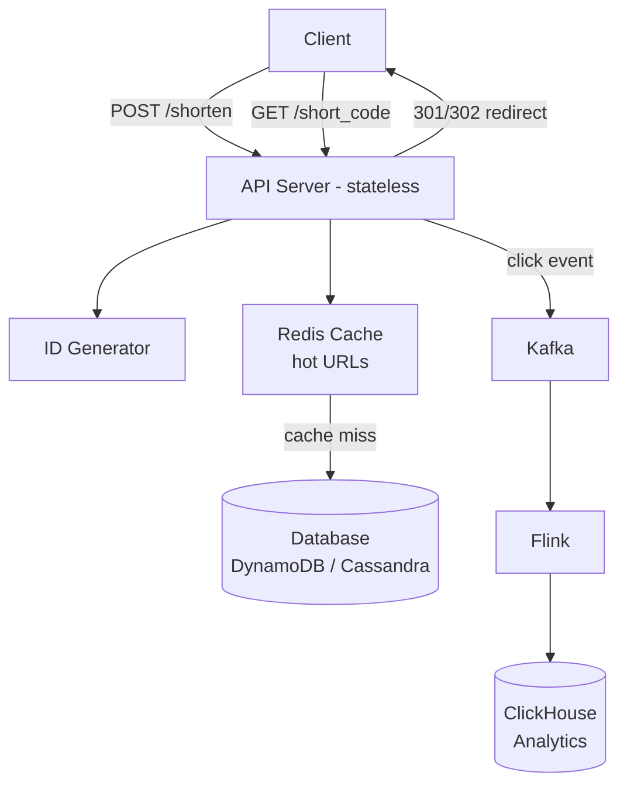

# HLD 01: URL Shortener (TinyURL / Bit.ly)

> **Difficulty**: Easy
> **Key Concepts**: Hashing, KV store, caching, redirection, analytics

---

## 1. Requirements

### Functional Requirements

- Shorten a long URL → return short URL (e.g., `tiny.url/abc123`)
- Redirect short URL → original long URL (HTTP 301/302)
- Custom aliases (optional)
- Expiration / TTL (optional)
- Analytics: click count, referrer, geography (optional)

### Non-Functional Requirements

- **Low latency**: Redirect in <50ms
- **High availability**: 99.99% uptime (reads are critical)
- **Scale**: 100M URLs created/month, 10B redirects/month
- **Durability**: Once created, short URLs must always work (until expired)

---

## 2. Capacity Estimation

```
Write: 100M new URLs/month ≈ 40 URLs/sec
Read:  10B redirects/month ≈ 4000 reads/sec (100:1 read/write ratio)

Storage (5-year retention):
  100M/month × 12 × 5 = 6B URLs
  Each record: ~500 bytes (short_url + long_url + metadata)
  6B × 500B = 3 TB total storage

Cache (80/20 rule — 20% URLs get 80% traffic):
  Daily unique URLs accessed: 10B/30 ÷ 100 ≈ 3.3M unique/day
  Cache 20%: 660K × 500B ≈ 330 MB (easily fits in Redis)

Short URL length:
  Base62 (a-z, A-Z, 0-9) with 7 chars: 62^7 = 3.5 trillion combinations
  Far more than 6B URLs needed → 7 chars is sufficient
```

---

## 3. API Design

```
POST /api/v1/shorten
  Request:  { "long_url": "https://example.com/very/long/path", "custom_alias": "mylink", "ttl_days": 30 }
  Response: { "short_url": "https://tiny.url/abc1234", "expires_at": "2024-02-15T00:00:00Z" }

GET /{short_code}
  Response: HTTP 301 (permanent) or 302 (temporary) redirect to long_url
  Header: Location: https://example.com/very/long/path

GET /api/v1/stats/{short_code}
  Response: { "short_url": "...", "long_url": "...", "clicks": 15432, "created_at": "..." }
```

---

## 4. Database Design

```
Table: urls
┌──────────────┬──────────────────────────────────────────┐
│ short_code   │ VARCHAR(7), PRIMARY KEY                   │
│ long_url     │ TEXT, NOT NULL                            │
│ user_id      │ UUID (nullable, for registered users)     │
│ created_at   │ TIMESTAMP                                │
│ expires_at   │ TIMESTAMP (nullable)                     │
│ click_count  │ BIGINT DEFAULT 0                         │
└──────────────┴──────────────────────────────────────────┘

Database choice:
  Primary store: DynamoDB or Cassandra
    • Key-value access pattern (lookup by short_code)
    • High read throughput
    • Horizontal scaling
  
  Alternative: PostgreSQL + read replicas
    • If analytics/reporting is important
    • ACID for URL creation
```

---

## 5. High-Level Architecture



---

## 6. Key Design Decisions

### Short Code Generation

```
Option A: HASH-BASED
  MD5(long_url) → take first 7 chars (Base62-encoded)
  Problem: Collisions possible → check DB, rehash if collision
  Pro: Same URL always gets same short code (deduplication)

Option B: COUNTER-BASED (recommended)
  Auto-incrementing counter → Base62 encode
  Counter sources:
    • Snowflake ID / Twitter Snowflake (distributed unique IDs)
    • Range-based: Each server gets a range (Server1: 1-1M, Server2: 1M-2M)
    • ZooKeeper / etcd for range coordination
  
  Pro: No collisions, predictable, fast
  Con: Sequential (predictable short codes — add random salt if needed)

Option C: PRE-GENERATED KEY SERVICE
  Background service pre-generates unused short codes.
  Store in a "key pool" table.
  On create: pop a key from the pool.
  
  Pro: No collision check, no counter coordination
  Con: Requires key pool management
```

### Redirection: 301 vs 302

```
301 (Permanent Redirect):
  Browser caches the redirect → subsequent visits don't hit our server
  Pro: Reduces server load
  Con: Can't track clicks accurately (browser skips us)

302 (Temporary Redirect):
  Browser always hits our server first
  Pro: Accurate click tracking
  Con: Higher server load

Decision: Use 302 if analytics matter; 301 for maximum performance.
```

---

## 7. Scaling & Bottlenecks

```
Read scaling:
  • Redis cache for hot URLs (99% cache hit rate)
  • Read replicas for DB
  • CDN for popular redirects (301 + Cache-Control)

Write scaling:
  • Pre-generated key pool (no coordination needed)
  • Async analytics (Kafka + ClickHouse, not in critical path)
  • Sharding by short_code hash

Bottlenecks:
  1. Database reads → solved by caching
  2. ID generation at scale → solved by range-based counters
  3. Analytics writes → solved by async pipeline (Kafka)
  4. Cache stampede on popular URLs → solved by cache warming + mutex
```

---

## 8. Trade-offs

| Decision | Trade-off |
|----------|-----------|
| 301 vs 302 redirect | Performance vs analytics accuracy |
| Counter vs hash IDs | Simplicity vs deduplication |
| SQL vs NoSQL | ACID + analytics vs simple KV scale |
| Cache TTL | Freshness vs cache hit rate |
| Custom aliases | Flexibility vs uniqueness enforcement complexity |

---

## 9. Summary

- **Core flow**: Generate unique short code → store mapping → redirect on lookup
- **Key insight**: Read-heavy (100:1), caching is critical, key-value access pattern
- **Database**: KV store (DynamoDB/Cassandra) or SQL with caching
- **ID generation**: Counter-based or pre-generated key pool
- **Analytics**: Async via Kafka → ClickHouse (not in redirect critical path)

> **Next**: [02 — Pastebin](02-pastebin.md)
