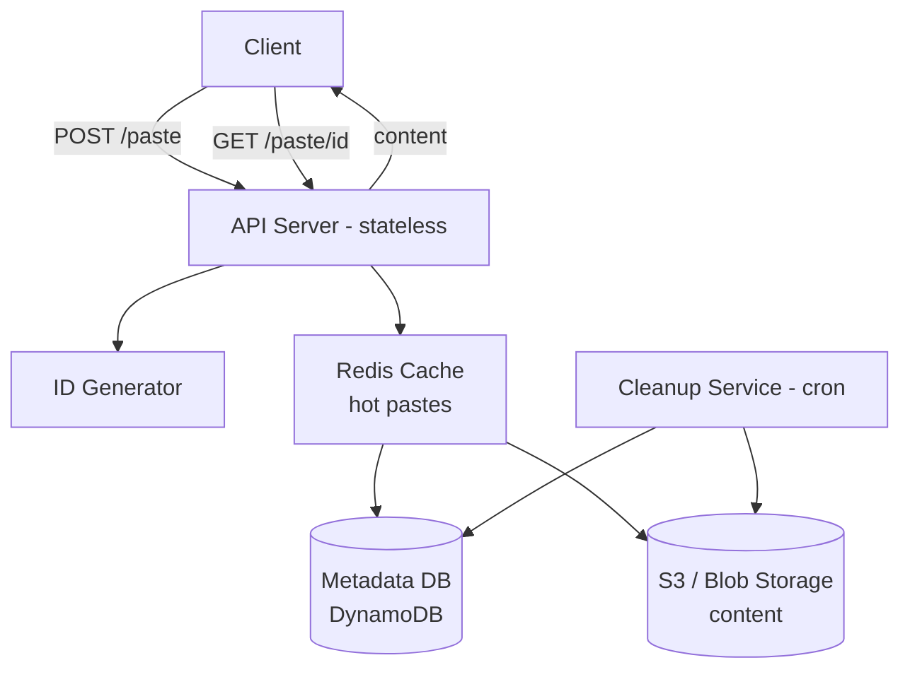

# HLD 02: Pastebin

> **Difficulty**: Easy
> **Key Concepts**: Object storage, unique IDs, TTL, content addressing

---

## 1. Requirements

### Functional Requirements

- Create a paste: user submits text → get a unique URL
- Read a paste: visit URL → see the content
- Optional: syntax highlighting, expiration (TTL), password protection
- Optional: user accounts, paste history, edit/delete

### Non-Functional Requirements

- **Low latency**: Paste retrieval < 100ms
- **High availability**: 99.9% uptime
- **Scale**: 5M pastes/day, 25M reads/day (5:1 read/write)
- **Size limit**: 10 MB per paste
- **Durability**: Pastes must persist until expiration

---

## 2. Capacity Estimation

```
Writes: 5M pastes/day ≈ 60 pastes/sec
Reads:  25M reads/day ≈ 300 reads/sec

Storage (5-year retention):
  Avg paste size: 10 KB
  5M/day × 365 × 5 = 9.1B pastes
  9.1B × 10 KB = 91 TB of content

  Metadata: 9.1B × 200 bytes = 1.8 TB

Bandwidth:
  Write: 60 × 10 KB = 600 KB/s
  Read:  300 × 10 KB = 3 MB/s (very manageable)

Key length:
  Base62, 8 chars: 62^8 = 218 trillion → more than enough
```

---

## 3. API Design

```
POST /api/v1/paste
  Request:  { "content": "...", "language": "python", "ttl_minutes": 1440, "password": "optional" }
  Response: { "paste_id": "aBc12345", "url": "https://paste.io/aBc12345", "expires_at": "..." }

GET /api/v1/paste/{paste_id}
  Headers:  X-Password: optional
  Response: { "paste_id": "...", "content": "...", "language": "python", "created_at": "...", "expires_at": "..." }

DELETE /api/v1/paste/{paste_id}
  Auth: Bearer token (owner only)
  Response: 204 No Content
```

---

## 4. Database Design

```
Metadata store (SQL or DynamoDB):
  paste_id      VARCHAR(8) PRIMARY KEY
  user_id       UUID (nullable)
  language      VARCHAR(20)
  content_key   VARCHAR(255)   -- S3 object key
  password_hash VARCHAR(255)   -- bcrypt, nullable
  size_bytes    INT
  created_at    TIMESTAMP
  expires_at    TIMESTAMP (nullable)

Content store:
  S3 / object storage
  Key: pastes/{paste_id}
  Content: raw text (gzip compressed)
```

---

## 5. High-Level Architecture



---

## 6. Key Design Decisions

### Content Storage: DB vs Object Storage

```
Small pastes (<1 KB): Store directly in database (inline)
  Avoids S3 round trip, faster retrieval

Large pastes (1 KB - 10 MB): Store in S3
  S3 is optimized for blob storage
  Database stays lean (only metadata)

Hybrid approach:
  if paste.size < 1024:
      store content in metadata DB (inline column)
  else:
      upload to S3, store S3 key in metadata DB
```

### Expiration / Cleanup

```
Option A: TTL in database (DynamoDB native TTL)
  DynamoDB auto-deletes items after TTL expires
  S3 lifecycle rule for corresponding objects

Option B: Cleanup cron job
  Run every hour: find expired pastes → delete from DB + S3
  Use batch operations for efficiency

Option C: Lazy deletion
  On read: check if expired → return 404 + mark for deletion
  Background job cleans up periodically
  
  Recommended: Combine B + C (lazy check on read + batch cleanup)
```

---

## 7. Scaling & Bottlenecks

```
Read scaling:
  • CDN for popular pastes (Cache-Control: max-age=3600)
  • Redis cache for recently accessed (LRU, 10 GB)
  • S3 handles massive concurrent reads natively

Write scaling:
  • Pre-generated IDs (no coordination)
  • S3 handles unlimited concurrent uploads
  • Database: DynamoDB auto-scales writes

Bottlenecks:
  1. Large paste uploads → limit to 10 MB, compress with gzip
  2. Hot pastes (viral) → CDN + cache
  3. Expired paste cleanup → batch deletion, not one-by-one
```

---

## 8. Trade-offs

| Decision | Trade-off |
|----------|-----------|
| S3 vs DB for content | Latency (DB faster for small) vs cost (S3 cheaper for large) |
| CDN caching | Freshness (deleted paste still served) vs performance |
| Eager vs lazy deletion | Storage cost vs implementation complexity |
| Password protection | Security vs UX simplicity |

---

## 9. Summary

- **Core flow**: Generate ID → store metadata in DB + content in S3 → serve on read
- **Key insight**: Separate metadata (small, queryable) from content (large, blob)
- **Storage**: S3 for content, DynamoDB for metadata, Redis for caching
- **Cleanup**: TTL + background job for expired pastes
- **Similar to URL Shortener** but with large content storage (S3)

> **Next**: [03 — Rate Limiter](03-rate-limiter.md)
