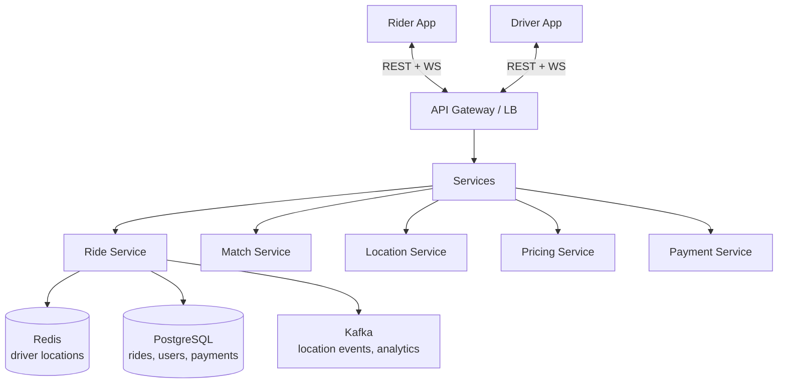

# HLD 06: Uber / Ride-Hailing

> **Difficulty**: Hard
> **Key Concepts**: Geospatial indexing, real-time matching, ETA, location tracking

---

## 1. Requirements

### Functional Requirements

- Rider requests a ride (pickup → destination)
- System matches rider with nearby available driver
- Real-time location tracking during ride
- Fare estimation and calculation
- Payment processing
- Rating system (rider ↔ driver)

### Non-Functional Requirements

- **Low latency**: Match rider to driver in < 10s
- **Real-time**: Location updates every 3-5 seconds
- **Scale**: 20M rides/day, 5M concurrent drivers
- **Availability**: 99.99% (ride-matching is revenue-critical)
- **Consistency**: No double-booking a driver

---

## 2. Capacity Estimation

```
Rides: 20M/day ≈ 230 rides/sec
Active drivers: 5M sending location every 4s = 1.25M location updates/sec
Active riders: 10M (tracking during ride) = additional updates

Storage:
  Ride records: 20M/day × 1 KB = 20 GB/day
  Location history: 1.25M/sec × 100 bytes × 86400s = 10.8 TB/day

Geospatial queries:
  Ride requests: 230/sec → each queries nearby drivers
  Each query: "find drivers within 5 km of (lat, lng)"
```

---

## 3. High-Level Architecture



---

## 4. Key Design Decisions

### Geospatial Indexing

```
How to find "drivers within 5 km of rider"?

Option A: GEOHASH + Redis
  Divide the world into grid cells (geohash).
  Each cell is a Redis key → set of driver IDs.
  
  Driver location update:
    1. Compute geohash of (lat, lng) at precision 6 (~1.2 km cells)
    2. GEOADD drivers:active lng lat driver_id
    3. Or: maintain in-memory grid → SADD cell:{geohash} driver_id
  
  Find nearby drivers:
    GEORADIUS drivers:active lng lat 5 km COUNT 20 ASC
    Returns up to 20 drivers sorted by distance

Option B: QUADTREE (in-memory)
  Tree-based spatial index, subdivides space recursively.
  Leaf nodes contain driver locations.
  Query: traverse tree to find all drivers in bounding box.
  
  Used by: Uber's internal H3 hexagonal grid system

Option C: PostGIS (PostgreSQL extension)
  SQL-based geospatial queries.
  Slower than in-memory, but rich query capabilities.
  Good for historical analysis, not real-time matching.

Recommended: Redis GEOADD for real-time matching (Option A)
  + PostGIS for historical analytics
```

### Matching Algorithm

```
Rider requests ride from A → B:

1. Find nearby drivers:
   GEORADIUS drivers:active rider_lng rider_lat 5 km COUNT 20 ASC

2. Filter candidates:
   - Driver is available (not on another ride)
   - Driver's vehicle matches ride type (economy, premium)
   - Driver hasn't declined this rider before

3. Rank candidates:
   Score = w1 × (1/distance) + w2 × (1/ETA) + w3 × rating

4. Send ride request to top candidate:
   - Driver has 15 seconds to accept
   - If declined/timeout → send to next candidate
   - After 3 declines → expand search radius

5. Driver accepts:
   - Lock driver (mark unavailable) — atomic operation
   - Create ride record in DB
   - Notify rider: "Driver is on the way"
   - Start real-time tracking
```

### Location Tracking

```
During ride: Both rider and driver apps send GPS every 4 seconds.

Driver app → Location Service:
  { "driver_id": "d1", "lat": 37.7749, "lng": -122.4194, "ts": 1705363200 }

Flow:
  1. App sends location update via WebSocket
  2. Location Service writes to Kafka (location-updates topic)
  3. Kafka consumers:
     a. Update Redis (real-time position for matching + tracking)
     b. Write to time-series DB (historical tracking, route replay)
     c. Update ETA for active rides

  1.25M updates/sec → Kafka handles this easily with partitioning by driver_id
```

---

## 5. Pricing / Fare Estimation

```
Fare = base_fare + (rate_per_km × distance) + (rate_per_min × duration) × surge_multiplier

Surge pricing:
  Demand (ride requests in area) / Supply (available drivers in area)
  If ratio > 1.5 → surge multiplier = ratio (e.g., 2.0×)
  
  Computed per geohash cell, updated every 30 seconds.
  Stored in Redis: surge:{geohash} → multiplier

ETA estimation:
  Use historical trip data + real-time traffic
  ML model: input (origin, destination, time_of_day, day_of_week) → predicted_minutes
  Cache popular routes: airport → downtown = ~25 min avg
```

---

## 6. Scaling & Bottlenecks

```
Location updates (1.25M/sec):
  Kafka with 100+ partitions, partitioned by driver_id
  Redis Cluster for real-time driver positions

Matching (230 rides/sec):
  Each match queries Redis GEORADIUS → O(log N + M) where M = results
  Shard by geographic region (city-level partitioning)

Database:
  PostgreSQL for rides, users, payments (ACID)
  Cassandra or ClickHouse for location history (time-series, append-only)

WebSocket connections:
  5M drivers + 10M riders = 15M concurrent connections
  300 WS gateway servers (50K connections each)
```

---

## 7. Trade-offs

| Decision | Trade-off |
|----------|-----------|
| Redis geo vs QuadTree | Simplicity vs fine-grained control |
| Surge pricing | Revenue optimization vs rider experience |
| Sequential vs broadcast matching | Fair distribution vs faster matching |
| Location frequency (4s vs 10s) | Accuracy vs bandwidth/battery |

---

## 8. Summary

- **Core**: Geospatial matching (GEORADIUS) + real-time tracking (WebSocket + Kafka)
- **Location**: Redis GEO for real-time, Kafka → time-series DB for history
- **Matching**: Find nearby → filter → rank → offer sequentially
- **Pricing**: Distance + time + surge (demand/supply per cell)
- **Scale**: Kafka for 1M+ location updates/sec, Redis Cluster for geo queries

> **Next**: [07 — Food Delivery](07-food-delivery.md)
