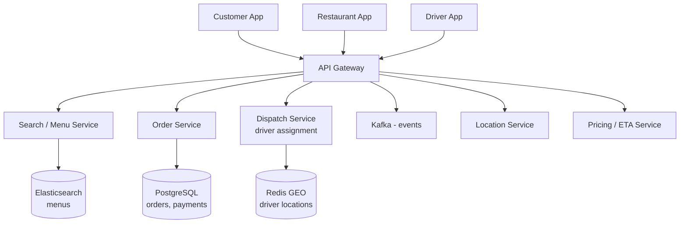
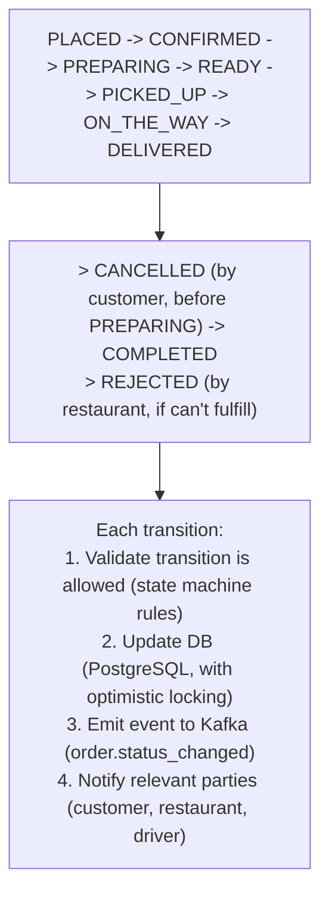

# HLD 07: Food Delivery (DoorDash / Uber Eats)

> **Difficulty**: Hard
> **Key Concepts**: Multi-party system, ETA, dispatch optimization, real-time tracking

---

## 1. Requirements

### Functional Requirements

- Browse restaurants and menus (with availability, hours, delivery radius)
- Place order (cart → checkout → payment)
- Restaurant receives and confirms order
- System assigns delivery driver
- Real-time order tracking (preparing → picked up → on the way → delivered)
- Rating and reviews (restaurant + driver)

### Non-Functional Requirements

- **Low latency**: Search/browse < 200ms, order placement < 2s
- **Scale**: 10M orders/day, 500K concurrent users
- **Availability**: 99.99% during meal hours (11am-2pm, 5pm-9pm)
- **Accuracy**: ETA within ±5 minutes

---

## 2. Capacity Estimation

```
Orders: 10M/day, peak 2× avg = ~230 orders/sec avg, 460/sec peak
Active drivers: 1M during peak, sending location every 5s = 200K updates/sec
Restaurant count: 500K active restaurants

Storage:
  Orders: 10M/day × 2 KB = 20 GB/day
  Menus: 500K restaurants × 50 items × 1 KB = 25 GB (relatively static)
  Location history: 200K/sec × 100B × 86400s = 1.7 TB/day
```

---

## 3. High-Level Architecture



---

## 4. Key Design Decisions

### Order State Machine



### Dispatch / Driver Assignment

```
When order status = PREPARING (restaurant accepted):

1. Estimate when food will be READY
   prep_time = restaurant's avg prep time for this order size

2. Find available drivers near RESTAURANT (not customer)
   GEORADIUS drivers:available restaurant_lng restaurant_lat 3 km

3. Assign driver to arrive when food is ready
   Target: driver arrives at restaurant ≈ when food is ready
   driver_ETA_to_restaurant ≈ prep_time → optimal dispatch

4. Optimization: Batch multiple orders to same driver
   If driver is already picking up nearby → add this order
   Reduces cost, slight delay for second order

5. If no drivers available:
   Expand radius → offer bonus pay → retry every 30s
```

### ETA Calculation

```
Total ETA = prep_time + driver_to_restaurant + restaurant_to_customer

  prep_time: ML model trained on restaurant's historical prep times
    Inputs: order items, current queue depth, time of day
    
  driver_to_restaurant: Google Maps / OSRM routing
    Adjusted for real-time traffic

  restaurant_to_customer: routing distance + traffic
    Cached for popular routes

  Update ETA in real-time as conditions change:
    - Restaurant taking longer? → increase ETA
    - Driver stuck in traffic? → increase ETA
    - Push updated ETA to customer app via WebSocket
```

---

## 5. Scaling & Bottlenecks

```
Search/browse (read-heavy):
  Elasticsearch for restaurant/menu search
  Redis cache for popular restaurants (5 min TTL)
  CDN for restaurant images

Order placement (write-heavy at peak):
  PostgreSQL with connection pooling
  Kafka for async processing (notifications, analytics)
  Idempotency keys to prevent duplicate orders

Driver location:
  Redis GEO (same as Uber pattern)
  Kafka for location event streaming
  Partition by city/region for geographic isolation

Peak handling (lunch/dinner rush):
  Auto-scale API servers based on request rate
  Pre-warm caches before expected peaks
  Queue orders if system is overwhelmed (with user notification)
```

---

## 6. Trade-offs

| Decision | Trade-off |
|----------|-----------|
| Dispatch at PREPARING vs READY | Optimal timing vs risk of driver waiting |
| Batching multiple orders per driver | Cost efficiency vs delivery speed |
| Real-time ETA vs cached ETA | Accuracy vs compute cost |
| Restaurant push vs pull for new orders | Instant notification vs simpler infra |

---

## 7. Summary

- **Three-sided marketplace**: customer, restaurant, driver — each with different apps
- **Order state machine**: PLACED → CONFIRMED → PREPARING → READY → PICKED_UP → DELIVERED
- **Dispatch**: Assign driver to arrive when food is ready (not when ordered)
- **ETA**: ML-based prep time + routing for driver legs, updated in real-time
- **Location**: Redis GEO for driver matching, Kafka for location streaming
- **Similar to Uber** but adds restaurant as third party + food preparation time

> **Next**: [08 — Social Media Feed](08-social-media-feed.md)
