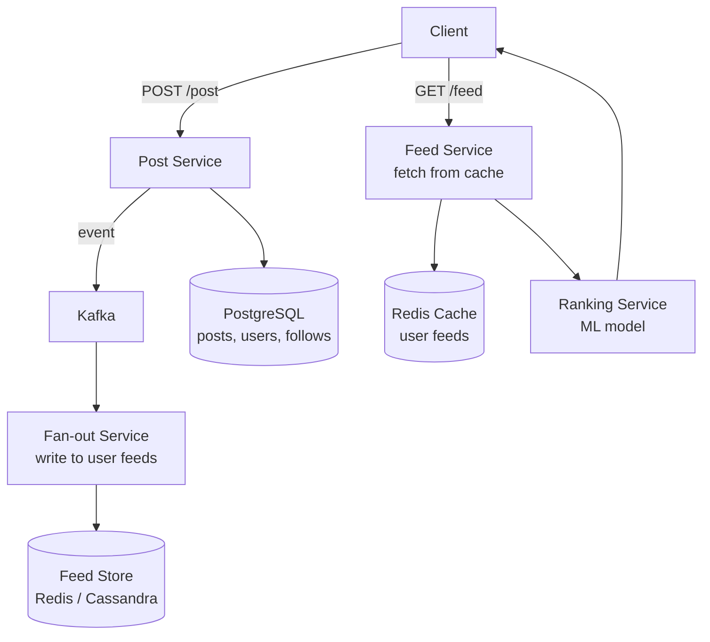

# HLD 08: Social Media Feed (Facebook News Feed)

> **Difficulty**: Medium
> **Key Concepts**: Fan-out, ranking, caching, feed generation

---

## 1. Requirements

### Functional Requirements

- Users create posts (text, images, videos, links)
- Users follow other users
- Home feed shows posts from followed users, ranked by relevance
- Like, comment, share on posts
- Real-time feed updates

### Non-Functional Requirements

- **Low latency**: Feed loads in < 500ms
- **Scale**: 500M DAU, each follows 200 users on average
- **Availability**: 99.99% (feed is the core product)
- **Freshness**: New posts appear within 30 seconds

---

## 2. Capacity Estimation

```
Posts: 100M new posts/day ≈ 1200 posts/sec
Feed reads: 500M DAU × 10 feed loads/day = 5B feed reads/day ≈ 58K reads/sec
Follows: 500M users × 200 avg follows = 100B follow edges

Storage:
  Posts: 100M/day × 1 KB = 100 GB/day
  Feed cache: 500M users × 500 post IDs × 8 bytes = 2 TB
```

---

## 3. High-Level Architecture



---

## 4. Key Design Decisions

### Fan-out Strategy

```
FAN-OUT ON WRITE (push model):
  When Alice posts → immediately push post ID to ALL followers' feeds.
  
  Alice has 500 followers → write to 500 feed caches.
  Feed read = just read from cache → O(1), super fast.
  
  Pros: Fast reads (pre-computed feed)
  Cons: Slow writes for popular users, wasted work if followers are inactive

FAN-OUT ON READ (pull model):
  When Bob opens feed → fetch latest posts from all 200 followed users.
  
  200 queries → merge → rank → return top 50.
  
  Pros: No wasted writes, always fresh
  Cons: Slow reads (200 queries per feed load)

HYBRID (recommended — Facebook/Twitter approach):
  Regular users (< 10K followers): Fan-out on WRITE
    Push to followers' feeds immediately
  
  Celebrities (> 10K followers): Fan-out on READ
    Don't push to millions of feeds.
    When loading feed, merge regular feed cache + fetch celebrity posts.

  Celebrity post: 10M followers
  Fan-out on write: 10M writes (expensive, most followers may never see it)
  Fan-out on read: Only fetched when a follower opens their feed
```

### Feed Ranking

```
Simple: Reverse chronological (newest first)
Better: Relevance scoring (Facebook approach)

Score = f(affinity, edge_weight, time_decay)

  affinity: How close is the viewer to the poster?
    (interaction frequency, mutual friends, relationship)
  
  edge_weight: How engaging is this post type?
    (video > photo > link > text, historically)
  
  time_decay: How old is the post?
    score *= 1 / (1 + age_hours * decay_rate)

  Additional signals:
  - Post engagement (likes, comments, shares)
  - Viewer's past behavior (what they click, linger on)
  - Content type preference
  - Diversity (don't show 10 posts from same person)

  ML model: trained on click-through data, dwell time, engagement
```

### Feed Storage

```
Per-user feed cache in Redis:

  Key: feed:{user_id}
  Value: Sorted Set (score = timestamp or ranking score)
  
  ZADD feed:bob 1705363200 post:123
  ZADD feed:bob 1705363210 post:456
  
  Read feed: ZREVRANGE feed:bob 0 49 (top 50 posts, newest first)
  
  TTL: Evict feeds of inactive users after 7 days
  Size: 500 post IDs × 8 bytes = 4 KB per user
  Total: 500M users × 4 KB = 2 TB (Redis Cluster)
```

---

## 5. Scaling & Bottlenecks

```
Fan-out workers:
  100M posts/day → each fans out to avg 200 followers = 20B feed writes/day
  Kafka consumers: 100+ workers processing fan-out in parallel

Feed cache:
  Redis Cluster: 2 TB across 20+ nodes
  Cache miss: Regenerate feed from Post Store + Follow graph

Celebrity problem:
  Hybrid approach: Don't fan-out for celebrities
  At read time: merge cached feed + celebrity posts
  Cache celebrity posts separately (shared across all followers)

Hot posts (viral):
  Cache viral post data (not just ID) to avoid DB hotspot
  CDN for media (images, videos)
```

---

## 6. Trade-offs

| Decision | Trade-off |
|----------|-----------|
| Fan-out write vs read | Write cost vs read latency |
| Chronological vs ranked | Simplicity vs engagement |
| Pre-computed vs on-demand feed | Freshness vs latency |
| Celebrity threshold (10K) | Where to draw the line |

---

## 7. Summary

- **Core**: Hybrid fan-out (push for regular users, pull for celebrities)
- **Feed storage**: Redis sorted sets per user (pre-computed feed)
- **Ranking**: ML-based relevance scoring (affinity × engagement × recency)
- **Scale**: Kafka for async fan-out, Redis Cluster for feed cache
- **Celebrity problem**: Don't fan-out; merge at read time

> **Next**: [09 — Instagram](09-instagram.md)
