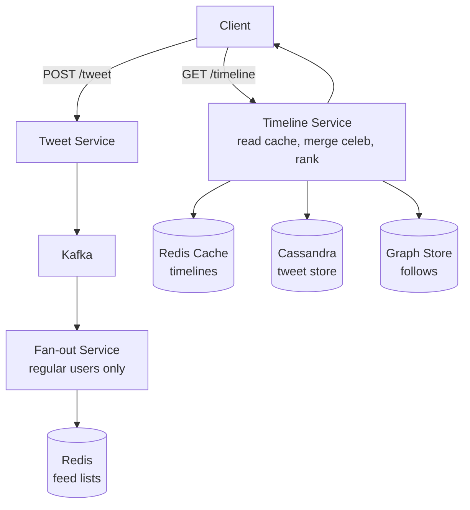

# HLD 10: Twitter/X Timeline

> **Difficulty**: Medium
> **Key Concepts**: Fan-out on write vs read, celebrity problem, timeline ranking

---

## 1. Requirements

### Functional Requirements

- Post tweets (280 chars, images, videos)
- Follow/unfollow users
- Home timeline (tweets from followed users)
- User timeline (all tweets by one user)
- Like, retweet, reply
- Search tweets
- Trending topics

### Non-Functional Requirements

- **Low latency**: Timeline load < 300ms
- **Scale**: 400M DAU, 500M tweets/day
- **Availability**: 99.99%
- **Eventual consistency**: Tweets appear within seconds

---

## 2. Capacity Estimation

```
Tweets: 500M/day ≈ 6000/sec
Timeline reads: 400M DAU × 20 reads/day = 8B/day ≈ 93K/sec
Avg follows: 200 per user, some celebrities have 50M+

Fan-out volume:
  500M tweets × 200 avg followers = 100B feed deliveries/day
  But: celebrities skew this massively
```

---

## 3. Key Design: The Celebrity Problem

```
The core challenge of Twitter's timeline:

Regular user (500 followers) tweets:
  Fan-out on write: Push to 500 timelines → 500 writes → fast, manageable

Celebrity (50M followers) tweets:
  Fan-out on write: Push to 50M timelines → 50M writes per tweet!
  If celebrity tweets 10×/day → 500M writes/day from ONE user
  
  This is the "celebrity problem" or "hot partition problem"

SOLUTION: Hybrid approach (what Twitter actually does)

  Regular users (< 5K followers): Fan-out on WRITE
    Tweet → push to all followers' cached timelines
    
  Celebrities (> 5K followers): Fan-out on READ
    Tweet stored in celebrity's timeline only
    When user loads feed:
      1. Read pre-computed timeline (regular user tweets)
      2. Fetch latest tweets from followed celebrities (N queries)
      3. Merge and rank
      4. Return top results

  Most users follow < 50 celebrities → 50 additional queries at read time
  Celebrity tweets cached aggressively (same content for millions)
```

---

## 4. High-Level Architecture



---

## 5. Timeline Construction

```
User opens home timeline:

1. Read pre-computed timeline from Redis:
   ZREVRANGE timeline:{user_id} 0 49 → [tweet_ids]
   (Contains tweets from regular followed users, already pushed)

2. Get followed celebrities:
   celebrities = GET user:{user_id}:celebrity_follows → [celeb_ids]

3. Fetch celebrity tweets (parallel):
   For each celeb_id: GET celeb_tweets:{celeb_id} → latest 10 tweets
   (Celebrity tweets cached in Redis, shared across all followers)

4. Merge:
   all_tweets = timeline_tweets + celebrity_tweets
   Sort by (ranking_score or timestamp)
   Return top 50

5. Hydrate:
   Batch fetch full tweet objects (content, author, media, counts)
   Return to client

Latency: ~50ms cache reads + ~50ms hydration = ~100ms total
```

---

## 6. Search & Trending

```
Search:
  Elasticsearch index on tweet text, hashtags, user names
  Partitioned by time (recent tweets prioritized)
  Updates via Kafka → Elasticsearch consumer

Trending:
  Kafka stream of hashtags/topics → Flink/Spark Streaming
  Sliding window counter: count hashtag mentions in last 1 hour
  Normalize by baseline (filter always-popular topics)
  Top 10 trending per region, refreshed every 5 minutes
  Cached in Redis: trending:{region} → [topics]
```

---

## 7. Trade-offs

| Decision | Trade-off |
|----------|-----------|
| Celebrity threshold (5K) | More fan-out cost vs more read-time merging |
| Chronological vs ranked | Simplicity vs engagement |
| Push vs pull for notifications | Real-time vs resource efficiency |
| Cassandra vs PostgreSQL | Scale vs query flexibility |

---

## 8. Summary

- **Core insight**: Hybrid fan-out solves the celebrity problem
- **Regular users**: Fan-out on write (push to followers' timelines)
- **Celebrities**: Fan-out on read (merge at read time, cache celebrity tweets)
- **Storage**: Cassandra for tweets, Redis for timeline cache, Elasticsearch for search
- **Trending**: Stream processing on hashtag counts, sliding window

> **Next**: [11 — YouTube](11-youtube.md)
