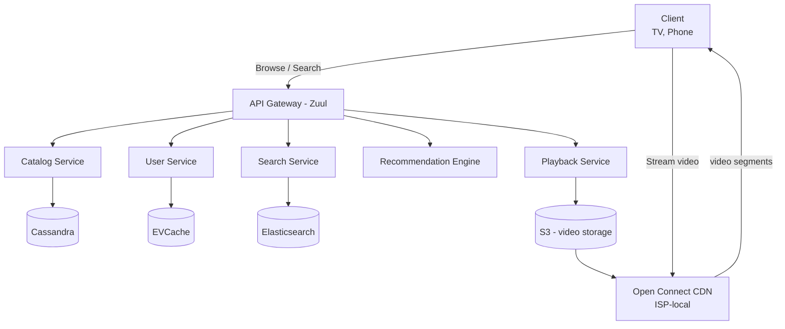

# HLD 12: Netflix

> **Difficulty**: Hard
> **Key Concepts**: Adaptive streaming, CDN (Open Connect), microservices, recommendations

---

## 1. Requirements

### Functional Requirements

- Browse catalog (movies, TV shows, by genre/category)
- Search content (title, actor, genre)
- Stream video (adaptive quality based on bandwidth)
- User profiles (multiple per account, personalized)
- Continue watching / watch history
- Download for offline viewing
- Personalized recommendations

### Non-Functional Requirements

- **Scale**: 230M subscribers, 100M concurrent streams during peak
- **Availability**: 99.99% (entertainment is prime-time critical)
- **Latency**: Video start < 2s, browse < 200ms
- **Global**: 190+ countries, localized content

---

## 2. Capacity Estimation

```
Concurrent streams: 100M peak
  Avg bitrate: 5 Mbps (1080p)
  Peak bandwidth: 100M × 5 Mbps = 500 Tbps (served from CDN edge)

Catalog: ~15,000 titles
  Each title: 10+ resolutions × 30+ audio tracks (languages) = ~300 variants
  15K × 300 × avg 2 GB per variant = 9 PB catalog storage
  Replicated to 1000+ CDN edge locations (subset per region)

API requests: 100M users × 100 API calls/session = 10B API calls/day
```

---

## 3. High-Level Architecture



---

## 4. Key Design Decisions

### Open Connect CDN

```
Netflix's custom CDN: Open Connect Appliances (OCAs)
  Physical servers placed INSIDE ISPs' data centers.
  
  Traditional CDN: User → ISP → Internet → CDN edge → Origin
  Open Connect:    User → ISP → OCA (inside ISP) → done
  
  Benefits:
  • Zero internet transit cost (content is local to ISP)
  • Lower latency (1 hop vs multiple)
  • Better quality (no congestion on internet backbone)
  
  Content distribution:
  • Overnight: Push popular content to OCAs based on predicted demand
  • Regional: Each OCA stores content popular in that region
  • Fill: If OCA doesn't have content → fetch from upstream OCA or S3
  
  Scale: 1000+ OCA sites in ISPs worldwide
  Serves 95%+ of Netflix traffic from within the ISP network
```

### Microservices Architecture

```
Netflix pioneered microservices at scale:

  700+ microservices, each independently deployable
  
  Key services:
  • API Gateway (Zuul): Routing, auth, rate limiting
  • Catalog Service: Movie/show metadata, availability per region
  • User Service: Profiles, preferences, watch history
  • Playback Service: License validation, stream URL generation
  • Recommendation Service: Personalized home page
  • Search Service: Elasticsearch-backed full-text search
  • Encoding Pipeline: Transcode new content
  
  Resilience:
  • Hystrix: Circuit breaker (graceful degradation)
  • Retry with exponential backoff
  • Bulkheading: Isolate failures between services
  • Chaos Monkey: Randomly kill instances to test resilience
```

### Recommendation Engine

```
80% of content watched on Netflix comes from recommendations.

  Home page is entirely personalized:
  • Row order is personalized (which genre rows you see first)
  • Content within each row is personalized
  • Artwork is personalized (different poster image per user!)

  Algorithms:
  1. Collaborative filtering: Users with similar taste liked X
  2. Content-based: Tag genome (themes, mood, pace, etc.)
  3. Trending: Popular in your region right now
  4. Because you watched X: Direct content similarity
  5. Continue watching: Unfinished content, weighted by recency

  Pipeline:
    User events → Kafka → Flink (real-time features)
    Batch training: Spark + TensorFlow (daily model retraining)
    Serving: Pre-computed recommendations cached in EVCache
    Personalized artwork: A/B tested, select image variant per user
```

### Encoding Pipeline

```
New content ingestion:
  1. Receive mezzanine file (high-quality master)
  2. Quality analysis: scene complexity, shot detection
  3. Per-title encoding: Each title gets custom bitrate ladder
     - Simple animated movie: 1080p at 3 Mbps looks great
     - Complex action movie: 1080p needs 8 Mbps
  4. Encode all variants:
     - Resolutions: 240p → 4K HDR
     - Audio: 30+ languages, Dolby Atmos, stereo
     - Subtitles: 30+ languages
  5. DRM encryption (Widevine, FairPlay, PlayReady)
  6. Push to S3 → distribute to OCAs overnight

  Per-title encoding saves 20% bandwidth vs fixed bitrate ladder
```

---

## 5. Scaling & Bottlenecks

```
Streaming (read-heavy):
  Open Connect CDN handles 95%+ → origin rarely hit
  EVCache (memcached): 30M+ ops/sec for metadata
  Cassandra: Viewing history, bookmarks (write-heavy, eventual consistency)

API layer:
  Zuul gateway: Auto-scaled, handles millions of concurrent connections
  Each microservice independently auto-scaled based on load

Data:
  Cassandra: Multi-region, tunable consistency
  EVCache: Distributed memcached (Netflix's custom layer)
  S3: Exabyte-scale video storage

Resilience:
  Multi-region deployment (US-East, US-West, EU)
  If one region fails → DNS failover to another
  Chaos engineering: Continuously test failure scenarios
```

---

## 6. Trade-offs

| Decision | Trade-off |
|----------|-----------|
| Custom CDN vs commercial CDN | Massive upfront investment vs lower per-GB cost at scale |
| Per-title encoding | CPU cost vs bandwidth savings (20%) |
| Microservices (700+) | Independent deployment vs operational complexity |
| Pre-computed recommendations | Staleness vs latency |

---

## 7. Summary

- **Core**: Custom CDN (Open Connect) inside ISPs for ultra-low-latency streaming
- **Architecture**: 700+ microservices, API gateway (Zuul), circuit breakers (Hystrix)
- **Recommendations**: 80% of views driven by personalized ML recommendations
- **Encoding**: Per-title optimized bitrate ladder, DRM, multi-language
- **Data**: Cassandra (history), EVCache (hot data), S3 (video), Elasticsearch (search)
- **Resilience**: Multi-region, chaos engineering, graceful degradation

> **Next**: [13 — Dropbox / Google Drive](13-dropbox-google-drive.md)
