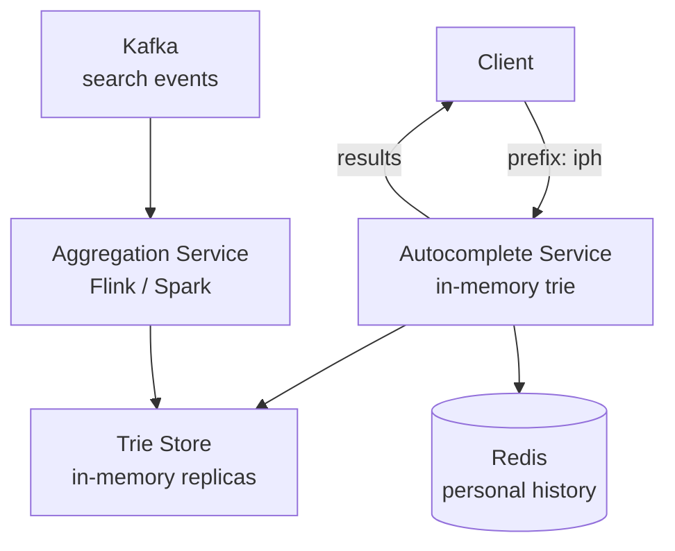
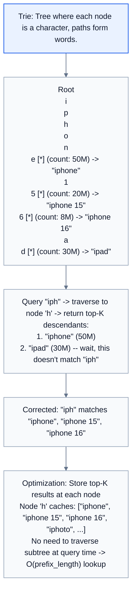

# HLD 15: Search Autocomplete (Typeahead)

> **Difficulty**: Medium
> **Key Concepts**: Trie, prefix matching, ranking, low latency

---

## 1. Requirements

### Functional Requirements

- As user types, suggest top 5-10 completions in real-time
- Rank suggestions by popularity/relevance
- Support personalized suggestions (recent searches)
- Handle multi-language input
- Update suggestions based on trending queries

### Non-Functional Requirements

- **Latency**: < 50ms per keystroke (must feel instant)
- **Scale**: 10B searches/day, 100K autocomplete requests/sec
- **Availability**: 99.99%
- **Freshness**: Trending queries reflected within minutes

---

## 2. Capacity Estimation

```
Searches: 10B/day, avg 4 chars typed before selecting → 40B autocomplete requests/day
Peak: 100K requests/sec

Unique queries: ~5B (long tail)
Top 10M queries: Cover 90% of autocomplete results

Trie storage:
  10M popular queries × avg 20 chars = 200 MB (easily fits in memory)
  With metadata (count, rank): ~1 GB per trie replica
```

---

## 3. High-Level Architecture



---

## 4. Key Design Decisions

### Trie Data Structure



### Trie Building Pipeline

```
Offline aggregation (not real-time):

  1. Search events → Kafka topic: search.queries
  2. Flink/Spark streaming: Aggregate query counts
     Window: last 7 days, weighted (recent = higher weight)
     
     query_score = Σ (count × recency_weight)
     Day 1: weight=1.0, Day 7: weight=0.3
     
  3. Build new trie from top 10M queries (by score)
  4. Serialize trie → distribute to autocomplete servers
  5. Servers load new trie (hot swap, no downtime)
  
  Rebuild frequency: Every 15 minutes
  Trending: Flink detects sudden spikes → inject into trie immediately
```

### Personalization

```
Merge global suggestions with user's personal history:

  Global trie: "iph" → ["iphone", "iphone 15", "iphone 16"]
  User history (Redis): "iph" → ["iphone repair near me"]

  Final results:
    1. "iphone repair near me" (personal, recent)
    2. "iphone" (global, top)
    3. "iphone 15" (global)
    4. "iphone 16" (global)

  Redis key: autocomplete:user:{user_id}
  Value: Recent 100 searches (sorted set by timestamp)
  TTL: 30 days
```

### Client-Side Optimization

```
1. DEBOUNCE: Don't send request on every keystroke
   Wait 100-200ms after last keystroke before querying
   Reduces requests by ~60%

2. LOCAL CACHE: Cache prefix → results on client
   "ip" → results cached → "iph" refines locally first
   Only query server if local cache misses

3. PREFETCH: When user types "i", prefetch "ip", "in", "im"
   Speculative, but improves perceived speed

4. ADAPTIVE: If results are loading slow, increase debounce time
```

---

## 5. Scaling & Bottlenecks

```
Trie servers:
  In-memory trie (~1 GB) replicated across 50+ servers
  Load balancer distributes requests
  100K req/sec ÷ 50 servers = 2K req/sec per server (easy)

Trie updates:
  Build new trie offline → ship to all servers → hot swap
  Blue-green: Load new trie in background, switch pointer atomically

Trending:
  Flink streaming: Detect 10× spike in query volume
  Inject trending queries into trie within minutes
  Example: Breaking news → "earthquake" suddenly spikes → add to trie

Geographic:
  Different tries per region (queries popular in India vs US differ)
  Base global trie + regional overlay
```

---

## 6. Trade-offs

| Decision | Trade-off |
|----------|-----------|
| Trie vs Elasticsearch prefix | Latency (trie: <5ms) vs flexibility |
| Pre-computed top-K per node | Memory vs query speed |
| 15-min rebuild vs real-time | Freshness vs complexity |
| Debounce 100ms vs 200ms | Responsiveness vs server load |

---

## 7. Summary

- **Core**: In-memory trie with pre-computed top-K at each node
- **Latency**: < 5ms server-side (trie lookup is O(prefix_length))
- **Freshness**: Trie rebuilt every 15 min from streaming aggregation
- **Personalization**: User recent searches (Redis) merged with global results
- **Client**: Debounce + local cache + prefetch for perceived instant response

> **Next**: [16 — API Rate Limiting Gateway](16-api-rate-limiting-gateway.md)
