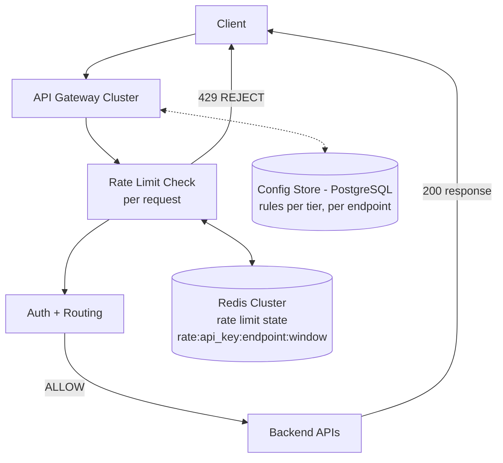

# HLD 16: API Rate Limiting Gateway

> **Difficulty**: Medium
> **Key Concepts**: Token bucket, distributed state, API gateway, multi-tenant

---

## 1. Requirements

### Functional Requirements

- Rate limit API requests per client/API key/IP
- Support multiple limit tiers (free: 100/min, pro: 10K/min)
- Per-endpoint limits (e.g., /search: 10/min, /upload: 5/min)
- Return informative headers (remaining, reset time)
- Admin dashboard: view usage, configure limits, block clients

### Non-Functional Requirements

- **Latency**: < 2ms overhead per request
- **Scale**: 500K requests/sec across all tenants
- **Accuracy**: ±1% tolerance on limits
- **Availability**: 99.99% (gateway is in the critical path)
- **Fail-open**: If rate limiter fails, allow traffic

---

## 2. High-Level Architecture



---

## 3. Key Design Decisions

### Multi-Dimensional Rate Limiting

```
Rate limits applied in layers:

  Layer 1: Global (protect infrastructure)
    Total: 500K req/sec across all clients
    If exceeded → 503 Service Unavailable

  Layer 2: Per-tenant (fair usage)
    Free tier:  100 req/min
    Pro tier:   10,000 req/min
    Enterprise: 100,000 req/min (custom)

  Layer 3: Per-endpoint (protect expensive operations)
    GET  /api/products:    1000 req/min (cheap)
    POST /api/search:      100 req/min  (expensive)
    POST /api/upload:      10 req/min   (very expensive)

  Layer 4: Per-IP (anti-abuse)
    Any single IP: 1000 req/min (prevent DDoS from single source)

  Check order: IP → Global → Tenant → Endpoint
  Reject at first failure (cheapest checks first)
```

### Distributed Counter with Redis

```lua
-- Atomic rate limit check + increment (Redis Lua script)
local key = KEYS[1]
local limit = tonumber(ARGV[1])
local window = tonumber(ARGV[2])

local current = redis.call('INCR', key)
if current == 1 then
    redis.call('EXPIRE', key, window)
end

if current > limit then
    local ttl = redis.call('TTL', key)
    return {0, current, ttl}  -- REJECT: {allowed, count, reset_seconds}
end

local ttl = redis.call('TTL', key)
return {1, current, ttl}  -- ALLOW: {allowed, count, reset_seconds}
```

### Response Headers

```
HTTP/1.1 200 OK
X-RateLimit-Limit: 1000
X-RateLimit-Remaining: 742
X-RateLimit-Reset: 1705363260
Retry-After: 45  (only on 429 responses)

HTTP/1.1 429 Too Many Requests
X-RateLimit-Limit: 1000
X-RateLimit-Remaining: 0
X-RateLimit-Reset: 1705363260
Retry-After: 45
Content-Type: application/json
{"error": "rate_limit_exceeded", "message": "Too many requests. Retry after 45 seconds."}
```

---

## 4. Scaling & Fault Tolerance

```
Redis Cluster:
  Shard by API key hash → distribute load
  500K req/sec → 500K Redis ops/sec (well within capacity)

Local cache (gateway-level):
  Cache rate limit rules in-memory (refresh every 30s)
  Avoid DB lookup per request

Failure modes:
  Redis down → FAIL OPEN (allow all traffic)
  Log rate limit decisions locally for audit
  Alert ops team immediately

  Redis partition → Stale counts per shard
  Acceptable: brief over-limit (seconds, not minutes)

  Gateway node failure → LB routes to healthy nodes
  Stateless gateways (all state in Redis)
```

---

## 5. Trade-offs

| Decision | Trade-off |
|----------|-----------|
| Fixed window vs sliding window | Simplicity vs accuracy at window boundaries |
| Centralized Redis vs local counters | Accuracy vs latency |
| Fail-open vs fail-closed | Availability vs protection |
| Per-request Redis call vs local batch | Accuracy vs Redis load |

---

## 6. Summary

- **Multi-layer**: IP → global → tenant → endpoint rate limiting
- **Storage**: Redis with atomic Lua scripts for distributed counters
- **Algorithm**: Sliding window counter (balanced accuracy + efficiency)
- **Headers**: Standard X-RateLimit-* headers + Retry-After on 429
- **Failure**: Fail-open (allow traffic if Redis is down)
- **Config**: Per-tier, per-endpoint rules stored in DB, cached in gateway

> **Next**: [17 — E-Commerce Platform](17-ecommerce-platform.md)
