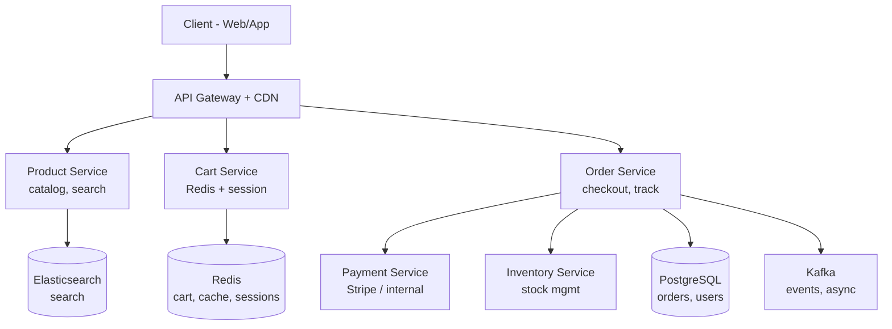

# HLD 17: E-Commerce Platform (Amazon)

> **Difficulty**: Hard
> **Key Concepts**: Catalog, cart, inventory, payments, order management

---

## 1. Requirements

### Functional Requirements

- Product catalog (browse, search, filter, product detail pages)
- Shopping cart (add, remove, update quantity)
- Checkout and payment processing
- Order management (place, track, cancel, return)
- Inventory management (stock tracking, reservations)
- User accounts, addresses, order history
- Reviews and ratings
- Seller/admin portal

### Non-Functional Requirements

- **Scale**: 500M products, 100M DAU, 10M orders/day
- **Availability**: 99.99% (revenue-critical)
- **Latency**: Search < 200ms, checkout < 2s
- **Consistency**: Inventory must be accurate (no overselling)
- **Peak handling**: 10× traffic on sale events (Black Friday)

---

## 2. High-Level Architecture



---

## 3. Key Design Decisions

### Product Catalog

```
500M products → Elasticsearch for search, PostgreSQL for source of truth

Search: Elasticsearch
  - Full-text search on title, description, brand
  - Faceted filters: category, price range, rating, brand
  - Personalized ranking: boosted by user preferences
  - Autocomplete / typeahead

Product detail page:
  - PostgreSQL: product metadata (price, description, seller)
  - Redis cache: hot products (top 100K by views)
  - CDN: product images (S3 → CloudFront)
  - Cache strategy: cache product data for 5 min, invalidate on update
```

### Shopping Cart

```
Cart stored in Redis (fast, session-based):

  Key: cart:{user_id} or cart:{session_id} (guest)
  Value: Hash map of {product_id: quantity}

  HSET cart:user_123 prod_abc 2
  HSET cart:user_123 prod_xyz 1
  HGETALL cart:user_123 → {prod_abc: 2, prod_xyz: 1}
  TTL: 30 days (abandoned cart)

  Cart merge on login:
    Guest cart (session) + logged-in cart → merge, keep higher quantity
    Delete session cart after merge

  Cart validation at checkout:
    Re-check: product still available? price changed? stock available?
    Show user any changes before confirming order
```

### Checkout / Order Flow

```
Checkout is a critical multi-step process:

  1. VALIDATE CART
     Check stock, prices, shipping eligibility
     
  2. RESERVE INVENTORY (temporary hold)
     Decrement available_stock, increment reserved_stock
     Hold expires after 10 minutes (if payment fails)

  3. CREATE ORDER (status: pending_payment)
     Store order in PostgreSQL with ACID transaction

  4. PROCESS PAYMENT
     Call Payment Service → Stripe/PayPal
     Idempotency key: order_id (prevent double charge)

  5. CONFIRM ORDER
     Payment success → order status: confirmed
     Release inventory reservation → decrement reserved → decrement total
     
  6. EMIT EVENTS
     Kafka: order.confirmed → triggers:
       - Notification Service (order confirmation email)
       - Warehouse Service (pick and pack)
       - Analytics (revenue tracking)

  Failure handling:
    Payment fails → release inventory reservation
    Order timeout → release reservation after 10 min
    Double submission → idempotency key rejects duplicate
```

### Inventory Management

```
Stock tracking must prevent overselling:

  product_stock:
    product_id | total_stock | reserved_stock | available_stock
    prod_abc   | 100         | 5              | 95

  available_stock = total_stock - reserved_stock

  Reserve (atomic):
    UPDATE product_stock
    SET reserved_stock = reserved_stock + quantity,
        available_stock = available_stock - quantity
    WHERE product_id = 'prod_abc' AND available_stock >= quantity;
    
    If 0 rows updated → insufficient stock → reject

  Confirm (payment success):
    UPDATE product_stock
    SET total_stock = total_stock - quantity,
        reserved_stock = reserved_stock - quantity
    WHERE product_id = 'prod_abc';

  Release (payment failed / timeout):
    UPDATE product_stock
    SET reserved_stock = reserved_stock - quantity,
        available_stock = available_stock + quantity
    WHERE product_id = 'prod_abc';
```

---

## 4. Scaling & Bottlenecks

```
Search:
  Elasticsearch cluster: Sharded by category, replicated
  Cache hot search results in Redis (1 min TTL)

Checkout (peak: Black Friday):
  Pre-warm inventory cache
  Queue-based checkout: If overwhelmed, put users in virtual queue
  Separate payment service scales independently
  Database: Read replicas for product lookups, primary for orders

Inventory hotspot:
  Flash sale: 10K users buying same product simultaneously
  Solution: Shard inventory by product_id, use Redis for real-time stock
  Redis DECR (atomic): fast stock check without DB round-trip
  Sync Redis → DB periodically

CDN:
  Product images, static assets cached at edge
  Personalized content (cart, recommendations) served from origin
```

---

## 5. Trade-offs

| Decision | Trade-off |
|----------|-----------|
| Redis cart vs DB cart | Speed vs durability (Redis AOF mitigates) |
| Inventory reservation vs optimistic | No overselling vs reservation management |
| Sync vs async order processing | Instant feedback vs higher throughput |
| Elasticsearch vs DB search | Speed + relevance vs operational complexity |

---

## 6. Summary

- **Microservices**: Product, Cart, Order, Inventory, Payment — independently scalable
- **Search**: Elasticsearch with faceted filters and personalized ranking
- **Cart**: Redis hash per user, TTL for abandoned carts, merge on login
- **Checkout**: Reserve inventory → payment → confirm → emit events
- **Inventory**: Atomic reserve/release with `available_stock >= quantity` guard
- **Peak**: Virtual queue, Redis inventory cache, pre-warmed caches

> **Next**: [18 — Payment System](18-payment-system.md)
