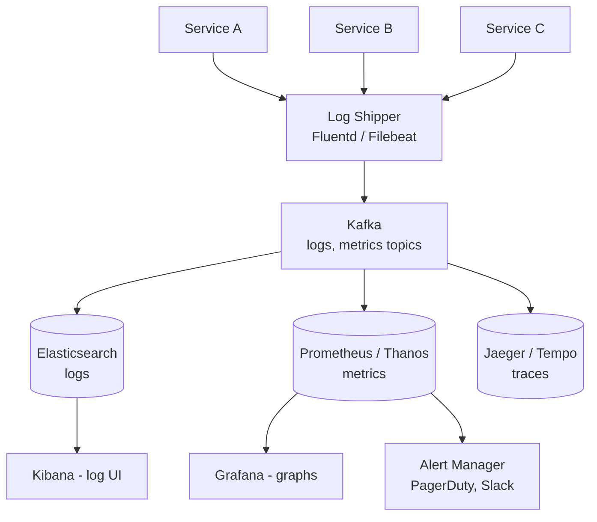

# HLD 24: Logging / Monitoring System

> **Difficulty**: Medium
> **Key Concepts**: ELK stack, time-series DB, alerting, distributed tracing

---

## 1. Requirements

### Functional Requirements

- Collect logs from all services (structured JSON logs)
- Collect metrics (CPU, memory, request rate, error rate, latency)
- Distributed tracing (trace a request across services)
- Search and filter logs by service, level, time range, keywords
- Dashboards (Grafana-style) with real-time graphs
- Alerting (PagerDuty, Slack) when metrics breach thresholds
- Log retention policies (30 days hot, 1 year archive)

### Non-Functional Requirements

- **Scale**: 1M log events/sec, 10M metric data points/sec
- **Latency**: Logs searchable within 30s of emission
- **Availability**: 99.9% (monitoring can't be less available than the system it monitors)
- **Storage**: Petabytes of log data per year

---

## 2. High-Level Architecture



---

## 3. Key Design Decisions

### Log Pipeline

```
1. Application emits structured JSON log:
   {"timestamp": "...", "level": "ERROR", "service": "order-svc",
    "trace_id": "abc", "message": "Payment failed", "user_id": "u1"}

2. Log shipper (Fluentd/Filebeat) on each host:
   - Reads from stdout/log files
   - Batches and compresses
   - Sends to Kafka topic: logs.{service_name}

3. Kafka:
   - Buffers during spikes (1M events/sec)
   - Decouples producers from consumers
   - Retention: 7 days (replay capability)

4. Kafka → Elasticsearch consumer:
   - Parses, enriches (add hostname, region)
   - Indexes into Elasticsearch (daily index: logs-2024.01.15)
   - Kibana for search and visualization

5. Retention:
   - Hot: 7 days (SSD, full-text searchable)
   - Warm: 30 days (HDD, searchable but slower)
   - Cold: 1 year (S3 / Glacier, archive only)
   - ILM (Index Lifecycle Management) automates tier transitions
```

### Metrics Pipeline

```
Prometheus model: PULL-based metrics collection

  Each service exposes /metrics endpoint:
    http_request_duration_seconds{method="GET", path="/api/orders"} 0.045
    http_requests_total{method="GET", status="200"} 150432

  Prometheus scrapes every 15 seconds.
  Stores in time-series DB (TSDB).

  For long-term storage: Prometheus → Thanos / Cortex
    Thanos: Stores metrics in S3, query across clusters
    Retention: 2 years of metrics

  Key metrics (RED method):
    Rate:    Requests per second
    Errors:  Error rate (% of 5xx responses)
    Duration: Latency percentiles (p50, p95, p99)

  Dashboard (Grafana):
    Service health: Request rate, error rate, latency
    Infrastructure: CPU, memory, disk, network
    Business: Orders/sec, revenue, active users
```

### Alerting

```
Alert rules defined in Prometheus/Grafana:

  alert: HighErrorRate
  expr: rate(http_requests_total{status=~"5.."}[5m]) / rate(http_requests_total[5m]) > 0.05
  for: 5m  (fire only if condition persists 5 minutes)
  labels:
    severity: critical
  annotations:
    summary: "Error rate > 5% for {{ $labels.service }}"

Alert routing (AlertManager):
  critical → PagerDuty (wake someone up)
  warning  → Slack #alerts channel
  info     → Slack #monitoring (FYI only)

Alert best practices:
  • Alert on symptoms (high error rate), not causes (CPU high)
  • Avoid alert fatigue: only alert on actionable conditions
  • Include runbook links in alert annotations
  • Aggregate: Don't fire 100 alerts for same incident
```

### Distributed Tracing

```
Request flows through 5 services → how to debug slow requests?

  Trace: End-to-end journey of a single request
  Span:  One service's work within a trace

  API Gateway → Order Svc → Payment Svc → Notification Svc
  Trace ID: abc-123 (propagated via header: X-Trace-ID)
  
  Span 1: API Gateway (10ms)
  Span 2: Order Svc (50ms)
    Span 3: Payment Svc (200ms) ← bottleneck!
    Span 4: Notification Svc (5ms, async)
  Total: 265ms

  Tools: Jaeger, Zipkin, Tempo (Grafana)
  Storage: Elasticsearch or Cassandra (trace data)
  Sampling: Store 1% of traces (100% is too expensive at scale)
```

---

## 4. Scaling & Bottlenecks

```
Log ingestion (1M events/sec):
  Kafka: 100+ partitions, handles millions/sec
  Elasticsearch: 10+ data nodes, sharded indices
  Hot-warm architecture: SSDs for recent, HDDs for older

Metrics (10M data points/sec):
  Prometheus: Federated setup (per-cluster Prometheus)
  Thanos: Global query across all Prometheus instances
  Downsampling: 15s → 1min → 1hr for long-term storage

Storage cost:
  Logs: 1M/sec × 1 KB × 86400s = 86 TB/day raw
  Compression: ~10:1 → 8.6 TB/day
  30-day hot: 258 TB Elasticsearch cluster
  1-year cold: S3 (~$0.023/GB) = manageable
```

---

## 5. Trade-offs

| Decision | Trade-off |
|----------|-----------|
| ELK vs Loki (Grafana) | Full-text search vs cost (Loki doesn't index content) |
| Pull (Prometheus) vs push (StatsD) | Service discovery vs firewall-friendly |
| 1% trace sampling vs 100% | Cost vs debugging capability |
| Centralized vs per-service logging | Correlation vs complexity |

---

## 6. Summary

- **Logs**: Services → Fluentd → Kafka → Elasticsearch → Kibana
- **Metrics**: Prometheus (pull) → Thanos (long-term) → Grafana (dashboard)
- **Traces**: Jaeger/Tempo with trace ID propagation, 1% sampling
- **Alerting**: AlertManager with severity routing (PagerDuty, Slack)
- **Scale**: Kafka buffer, ES hot-warm-cold, Thanos for metric federation

> **Next**: [25 — Real-Time Collaborative Editor](25-realtime-collaborative-editor.md)
