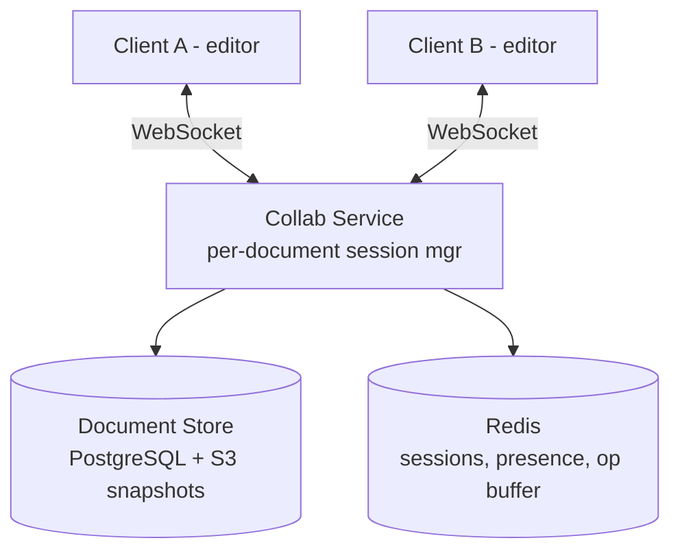

# HLD 25: Real-Time Collaborative Editor (Google Docs)

> **Difficulty**: Hard
> **Key Concepts**: CRDT/OT, conflict resolution, cursors, WebSocket

---

## 1. Requirements

### Functional Requirements

- Multiple users edit the same document simultaneously
- Real-time cursor and selection visibility (see where others are editing)
- Character-level conflict resolution (no data loss)
- Offline editing with sync on reconnect
- Version history and restore
- Comments and suggestions
- Permissions (owner, editor, viewer)

### Non-Functional Requirements

- **Latency**: Local edits appear instantly, remote edits < 200ms
- **Consistency**: All users converge to same document state
- **Scale**: 100M documents, 10M concurrent editors
- **Availability**: 99.99%

---

## 2. High-Level Architecture



---

## 3. Key Design Decisions

### Operational Transform (OT) vs CRDT

```
OPERATIONAL TRANSFORM (OT) — Google Docs approach:
  Each edit is an "operation": insert(pos, char), delete(pos)
  When concurrent ops arrive, TRANSFORM them against each other.

  Example:
    Document: "ABCD"
    User A: insert('X', pos=1) → "AXBCD"
    User B: delete(pos=3)      → "ABD" (deleted 'C')
    
    Both edits happened concurrently on "ABCD".
    
    Server receives A's op first: "AXBCD"
    Now apply B's op: delete(pos=3) → but pos=3 is now 'B', not 'C'!
    Transform B's op: Since A inserted before pos 3, shift B's pos to 4.
    Transformed: delete(pos=4) → "AXBD" ✓

  Pros: Battle-tested (Google Docs uses OT)
  Cons: Complex transformation logic, requires central server

CRDT (Conflict-free Replicated Data Types) — Figma approach:
  Each character has a unique ID + position between neighbors.
  No transformation needed — merge is automatic.

  Example (simplified):
    "A B C D"  (each char has fractional position)
     0.1 0.3 0.5 0.7
    
    User A inserts 'X' between A and B: pos = 0.2
    User B deletes 'C': mark pos 0.5 as tombstone
    
    Merge: Both operations apply cleanly — no conflict.
    Result: "A X B D"

  Pros: Works offline, no central server needed, simpler merge
  Cons: Higher memory (tombstones), larger wire format

Recommendation: OT for centralized (Google Docs), CRDT for P2P (Figma)
```

### Collaboration Session Flow

```
1. User A opens document:
   - Connect WebSocket to Collab Service
   - Server loads document state (or creates session)
   - Send full document to client

2. User A types 'X' at position 5:
   - Apply locally immediately (optimistic)
   - Send operation to server: {type: "insert", pos: 5, char: "X", version: 42}

3. Server receives operation:
   a. Check version: Is it based on current server version?
   b. If yes → apply, increment version, broadcast to other clients
   c. If stale → transform against intervening ops, then apply

4. Server broadcasts to User B:
   {type: "insert", pos: 5, char: "X", version: 43, author: "A"}

5. User B receives:
   - Transform against any local unacknowledged ops
   - Apply to local document
   - Show User A's cursor at position 5

Latency: Local edit = 0ms, remote edit = network RTT (~50-200ms)
```

### Presence & Cursors

```
Each client sends cursor position every 100ms (debounced):
  {type: "cursor", user_id: "A", pos: 42, selection: {start: 42, end: 50}}

Server broadcasts to all other clients in the session.
Each client renders colored cursors/selections for other users.

Presence stored in Redis:
  HSET doc:{doc_id}:presence {user_id} {cursor_json}
  TTL on presence entries: 30 seconds (heartbeat refresh)
  
  If user disconnects → heartbeat stops → presence auto-removed
```

### Document Storage

```
Operations are ephemeral — periodically snapshot the full document.

  Operation log: Kafka or Redis stream
    Every edit stored as an operation (insert, delete, format)
    Replay ops from last snapshot to reconstruct current state

  Snapshots: Every 100 operations or every 30 seconds
    Store full document state in PostgreSQL
    Older snapshots archived to S3

  Version history:
    User can browse snapshots (like Git commits)
    "Restore to version from 2 hours ago" = load that snapshot

  Offline sync:
    Client queues operations locally while offline
    On reconnect: Send queued ops → server transforms and merges
    CRDT makes this easier (no transformation needed)
```

---

## 4. Scaling & Bottlenecks

```
Per-document sessions:
  Each document is managed by ONE server (session affinity)
  Consistent hashing: hash(doc_id) → server assignment
  If server dies → another picks up, loads last snapshot + replay ops

Concurrent editors per document:
  Typical: 2-10 editors per doc (manageable per server)
  Extreme: 100+ editors (Google Docs limit) → fan-out broadcast

Cross-region:
  Document session pinned to one region (closest to first editor)
  Remote editors connect to that region (higher latency, but consistent)
  Alternative: Multi-region CRDT (eventually consistent)

WebSocket connections:
  10M concurrent editors → 200 WS gateway servers (50K each)
  Route by doc_id to correct session server
```

---

## 5. Trade-offs

| Decision | Trade-off |
|----------|-----------|
| OT vs CRDT | Central consistency vs offline + P2P support |
| Op-log vs snapshot-only | Granular history vs storage efficiency |
| Session affinity vs stateless | Simplicity vs fault tolerance |
| Cursor broadcast frequency | Smoothness vs bandwidth |

---

## 6. Summary

- **Core**: OT (centralized) or CRDT (P2P) for conflict-free concurrent editing
- **Flow**: Local apply → send op → server transforms → broadcast to others
- **Presence**: Cursor positions via WebSocket, stored in Redis with TTL
- **Storage**: Operation log + periodic snapshots, version history from snapshots
- **Scale**: Session affinity per document, consistent hashing for assignment

> **Next**: [26 — Stock Trading Platform](26-stock-trading-platform.md)
