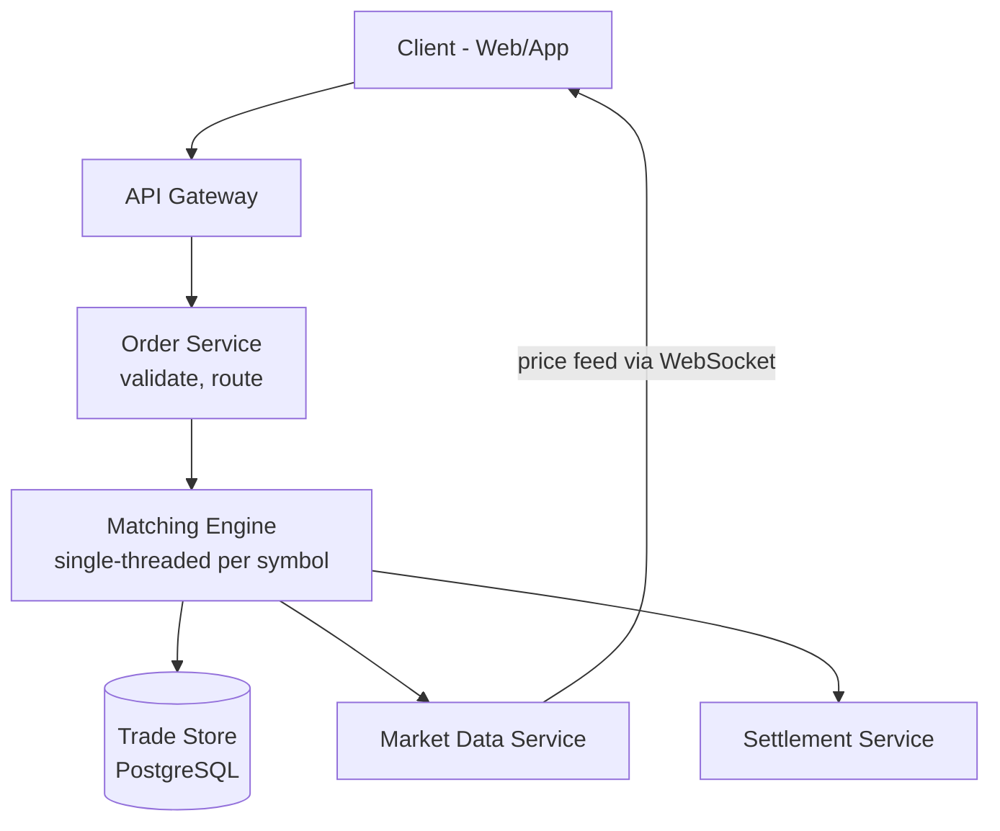

# HLD 26: Stock Trading Platform

> **Difficulty**: Hard
> **Key Concepts**: Order matching, low latency, audit trail, market data

---

## 1. Requirements

### Functional Requirements

- Place orders (buy/sell, market/limit, quantity, price)
- Order matching engine (match buy and sell orders)
- Real-time market data (price, volume, order book)
- Portfolio management (holdings, P&L)
- Order history and trade confirmations
- Watchlists and alerts (price targets)

### Non-Functional Requirements

- **Latency**: Order processing < 10ms, market data < 100ms
- **Throughput**: 100K orders/sec during peak
- **Consistency**: No partial fills without accounting, no lost orders
- **Availability**: 99.99% during trading hours
- **Auditability**: Complete audit trail for regulatory compliance

---

## 2. High-Level Architecture



---

## 3. Key Design Decisions

### Order Matching Engine

```
The heart of any trading platform:

  Order book per symbol (e.g., AAPL):
    BUY side (bids):     SELL side (asks):
    $150.10 × 500        $150.15 × 300
    $150.05 × 1000       $150.20 × 800
    $150.00 × 200        $150.25 × 150

  Matching rules (price-time priority):
    1. Best price first (highest buy, lowest sell)
    2. Same price → earliest order first (FIFO)

  Market order: "Buy 200 shares at any price"
    Match against best ask: $150.15 × 300 → fill 200 @ $150.15
    Remaining ask: $150.15 × 100

  Limit order: "Buy 200 shares at $150.10"
    Check: Any asks ≤ $150.10? No → add to buy order book
    Wait until a matching sell order arrives.

  Data structure:
    Buy side:  Max-heap (or sorted map by price DESC, then time ASC)
    Sell side: Min-heap (or sorted map by price ASC, then time ASC)
    
  Performance: Single-threaded per symbol → no locks needed
    100K orders/sec per symbol with in-memory order book
    Shard: One matching engine per symbol (AAPL, GOOG, MSFT)
```

### Order Flow

```
1. Client places order: "Buy 100 AAPL at market"
2. API Gateway → Order Service:
   - Validate: User authenticated? Sufficient funds? Market open?
   - Risk check: Order size within limits?
   - Debit buying power (reserve funds)
3. Order Service → Matching Engine (for AAPL):
   - Single-threaded, in-memory processing
   - Match against order book
   - Generate trade(s): {buyer, seller, price, quantity, timestamp}
4. Matching Engine emits events:
   - trade.executed → Trade Store (PostgreSQL)
   - order_book.updated → Market Data Service → WebSocket to clients
   - trade.executed → Settlement Service (T+1 settlement)
5. Client receives confirmation via WebSocket:
   { "order_id": "...", "status": "filled", "price": 150.15, "qty": 100 }
```

### Market Data Distribution

```
Real-time price feed to millions of users:

  Matching Engine → Kafka topic: market_data.{symbol}
  Market Data Service consumes and broadcasts:
  
  Level 1: Last price, bid, ask, volume (most users)
  Level 2: Full order book depth (professional traders)

  Distribution:
    WebSocket: 10M concurrent connections
    Throttle: Send updates at most every 100ms per symbol
    Batch: Aggregate multiple trades into one update

  Fan-out:
    Matching Engine → Kafka → Market Data Service → WebSocket Gateways → Clients
    
    Popular stocks (AAPL): Same update goes to millions
    → Multicast pattern: One message, many subscribers
    → WebSocket gateways subscribe to symbols their clients care about
```

---

## 4. Scaling & Bottlenecks

```
Matching Engine:
  One engine per symbol → 5000 symbols = 5000 engines
  Each engine: single server, single-threaded (no contention)
  Hot symbols (AAPL, TSLA): Dedicated high-performance servers

Order throughput:
  100K orders/sec total → distributed across symbols
  Most symbols: < 100 orders/sec → easily handled
  Hot symbols: Up to 10K orders/sec → in-memory, single-threaded handles this

Market data:
  Kafka: Handles millions of messages/sec
  WebSocket: 200+ gateway servers for 10M connections
  Symbol-based subscription: Only send data for symbols user watches

Audit trail:
  Every order and trade logged to append-only PostgreSQL + Kafka
  Kafka retention: 7 days (replay capability)
  PostgreSQL: Partitioned by date, archived to cold storage after 7 years
```

---

## 5. Trade-offs

| Decision | Trade-off |
|----------|-----------|
| Single-threaded engine | No lock contention vs single-core throughput limit |
| Per-symbol sharding | Natural partition vs hot symbol handling |
| In-memory order book | Speed vs durability (WAL for recovery) |
| 100ms market data throttle | Bandwidth vs real-time accuracy |

---

## 6. Summary

- **Matching engine**: Single-threaded per symbol, in-memory order book, price-time priority
- **Order flow**: Validate → risk check → match → trade → settle
- **Market data**: Kafka → Market Data Service → WebSocket fan-out
- **Audit**: Every order/trade logged to PostgreSQL + Kafka (regulatory compliance)
- **Scale**: Shard by symbol, dedicated engines for hot stocks

> **Next**: [27 — Ad Click Tracking](27-ad-click-tracking.md)
