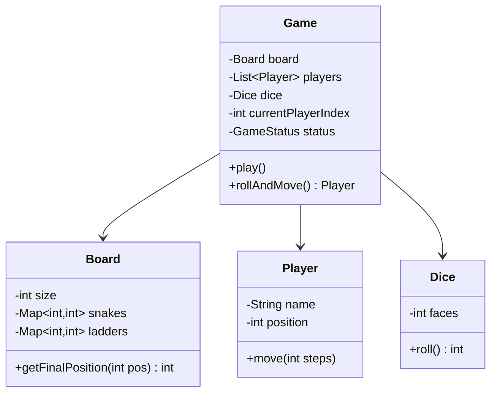
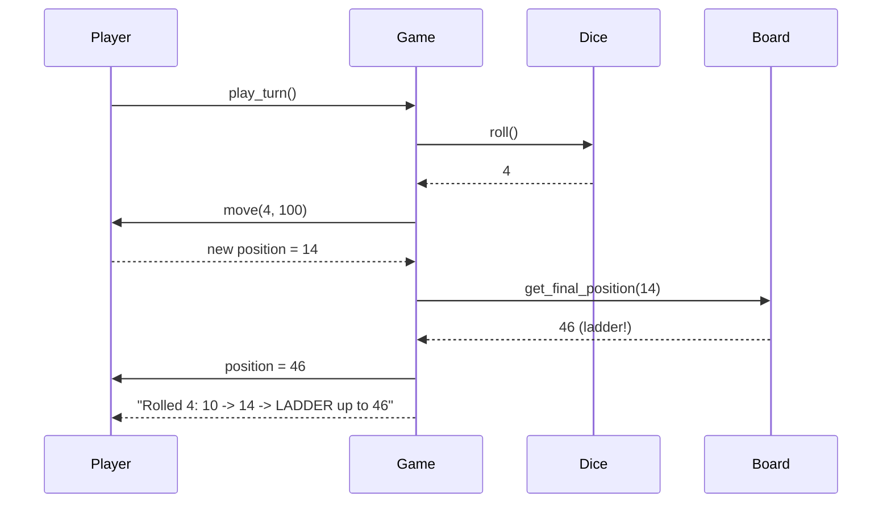

# LLD 09: Snake and Ladder

> **Difficulty**: Easy
> **Key Concepts**: OOP, game loop, board modeling, dice

---

## 1. Requirements

- Board with configurable size (default 100 cells)
- Configurable snakes (head → tail, moves down) and ladders (bottom → top, moves up)
- 2+ players, turn-based
- Dice roll (1–6), move player forward
- If land on snake head → slide down to tail
- If land on ladder bottom → climb to top
- First player to reach or exceed final cell wins

---

## 2. Class Diagram



---

## 3. Core Classes

```python
import random

class Dice:
    def __init__(self, faces: int = 6):
        self.faces = faces

    def roll(self) -> int:
        return random.randint(1, self.faces)


class Player:
    def __init__(self, name: str):
        self.name = name
        self.position = 0  # start off the board

    def move(self, steps: int, board_size: int) -> bool:
        new_pos = self.position + steps
        if new_pos > board_size:
            return False  # can't move beyond board
        self.position = new_pos
        return True


class Board:
    def __init__(self, size: int = 100):
        self.size = size
        self.snakes: dict[int, int] = {}   # head -> tail
        self.ladders: dict[int, int] = {}  # bottom -> top

    def add_snake(self, head: int, tail: int):
        if head <= tail:
            raise ValueError("Snake head must be above tail")
        if head in self.ladders:
            raise ValueError("Cannot place snake on ladder start")
        self.snakes[head] = tail

    def add_ladder(self, bottom: int, top: int):
        if bottom >= top:
            raise ValueError("Ladder bottom must be below top")
        if bottom in self.snakes:
            raise ValueError("Cannot place ladder on snake head")
        self.ladders[bottom] = top

    def get_final_position(self, position: int) -> int:
        if position in self.snakes:
            return self.snakes[position]
        if position in self.ladders:
            return self.ladders[position]
        return position
```

---

## 4. Game Controller

```python
from enum import Enum

class GameStatus(Enum):
    NOT_STARTED = 1
    IN_PROGRESS = 2
    FINISHED = 3

class Game:
    def __init__(self, board: Board, players: list[Player], dice: Dice = None):
        if len(players) < 2:
            raise ValueError("Need at least 2 players")
        self.board = board
        self.players = players
        self.dice = dice or Dice()
        self.current_player_index = 0
        self.status = GameStatus.NOT_STARTED
        self.winner: Player | None = None

    def play_turn(self) -> str:
        """Execute one turn for the current player. Returns description."""
        if self.status == GameStatus.FINISHED:
            raise Exception("Game is already over")

        self.status = GameStatus.IN_PROGRESS
        player = self.players[self.current_player_index]
        roll = self.dice.roll()
        old_pos = player.position

        moved = player.move(roll, self.board.size)
        if not moved:
            result = f"{player.name} rolled {roll} but can't move (would exceed board)"
        else:
            final_pos = self.board.get_final_position(player.position)
            if final_pos != player.position:
                if final_pos < player.position:
                    result = (f"{player.name} rolled {roll}: {old_pos} -> {player.position} "
                              f"-> SNAKE down to {final_pos}")
                else:
                    result = (f"{player.name} rolled {roll}: {old_pos} -> {player.position} "
                              f"-> LADDER up to {final_pos}")
                player.position = final_pos
            else:
                result = f"{player.name} rolled {roll}: {old_pos} -> {player.position}"

            if player.position == self.board.size:
                self.winner = player
                self.status = GameStatus.FINISHED
                result += f" — {player.name} WINS!"

        self.current_player_index = (self.current_player_index + 1) % len(self.players)
        return result

    def play(self) -> Player:
        """Play full game until someone wins."""
        while self.status != GameStatus.FINISHED:
            print(self.play_turn())
        return self.winner
```

---

## 5. Sequence Flow



---

## 6. Design Patterns Used

| Pattern | Where | Why |
|---------|-------|-----|
| **Composition** | Game has Board, Players, Dice | Clean separation of concerns |
| **Iterator** | Turn rotation via index | Cycle through players |
| **State** | GameStatus | Track game lifecycle |

---

## 7. Edge Cases

- **Roll exceeds board**: Player stays in place (must land exactly on 100)
- **Snake at 99**: Possible to be sent back near the end
- **Ladder on snake tail**: Chain reactions (optional rule)
- **Single dice vs two dice**: Configurable via Dice class
- **Consecutive 6s**: Optional rule — extra turn on 6

> **Next**: [10 — Tic-Tac-Toe](10-tic-tac-toe.md)
