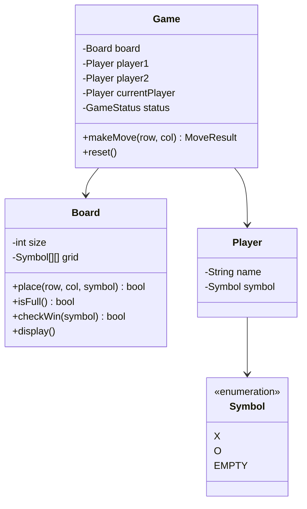
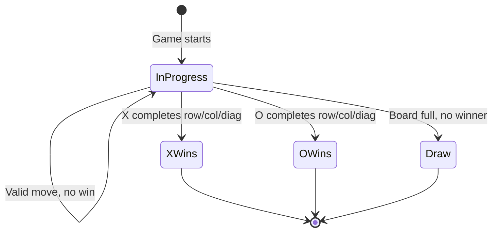

# LLD 10: Tic-Tac-Toe

> **Difficulty**: Easy
> **Key Concepts**: OOP, game state, win detection, board representation

---

## 1. Requirements

- 3×3 board (extensible to N×N)
- Two players (X and O), turn-based
- Detect win (row, column, diagonal) and draw
- Input validation (occupied cell, out of bounds)
- Display board state after each move

---

## 2. Class Diagram



---

## 3. Core Classes

```python
from enum import Enum

class Symbol(Enum):
    X = "X"
    O = "O"
    EMPTY = " "

class GameStatus(Enum):
    IN_PROGRESS = 1
    X_WINS = 2
    O_WINS = 3
    DRAW = 4

class Player:
    def __init__(self, name: str, symbol: Symbol):
        self.name = name
        self.symbol = symbol


class Board:
    def __init__(self, size: int = 3):
        self.size = size
        self.grid: list[list[Symbol]] = [
            [Symbol.EMPTY] * size for _ in range(size)
        ]
        self.moves_count = 0

    def place(self, row: int, col: int, symbol: Symbol) -> bool:
        if not (0 <= row < self.size and 0 <= col < self.size):
            raise ValueError(f"Position ({row},{col}) is out of bounds")
        if self.grid[row][col] != Symbol.EMPTY:
            raise ValueError(f"Position ({row},{col}) is already occupied")
        self.grid[row][col] = symbol
        self.moves_count += 1
        return True

    def is_full(self) -> bool:
        return self.moves_count == self.size * self.size

    def check_win(self, symbol: Symbol) -> bool:
        n = self.size

        # Check rows
        for r in range(n):
            if all(self.grid[r][c] == symbol for c in range(n)):
                return True

        # Check columns
        for c in range(n):
            if all(self.grid[r][c] == symbol for r in range(n)):
                return True

        # Check main diagonal
        if all(self.grid[i][i] == symbol for i in range(n)):
            return True

        # Check anti-diagonal
        if all(self.grid[i][n - 1 - i] == symbol for i in range(n)):
            return True

        return False

    def display(self) -> str:
        rows = []
        for r in range(self.size):
            row_str = " | ".join(cell.value for cell in self.grid[r])
            rows.append(f" {row_str} ")
        separator = "-" * (self.size * 4 - 1)
        return f"\n{separator}\n".join(rows)
```

---

## 4. Game Controller

```python
class Game:
    def __init__(self, player1_name: str, player2_name: str, board_size: int = 3):
        self.board = Board(board_size)
        self.player1 = Player(player1_name, Symbol.X)
        self.player2 = Player(player2_name, Symbol.O)
        self.current_player = self.player1
        self.status = GameStatus.IN_PROGRESS

    def make_move(self, row: int, col: int) -> str:
        if self.status != GameStatus.IN_PROGRESS:
            raise Exception("Game is already over")

        self.board.place(row, col, self.current_player.symbol)

        if self.board.check_win(self.current_player.symbol):
            self.status = (GameStatus.X_WINS
                           if self.current_player.symbol == Symbol.X
                           else GameStatus.O_WINS)
            return f"{self.current_player.name} ({self.current_player.symbol.value}) wins!"

        if self.board.is_full():
            self.status = GameStatus.DRAW
            return "It's a draw!"

        # Switch turns
        self.current_player = (self.player2
                               if self.current_player == self.player1
                               else self.player1)
        return f"{self.current_player.name}'s turn ({self.current_player.symbol.value})"

    def reset(self):
        self.board = Board(self.board.size)
        self.current_player = self.player1
        self.status = GameStatus.IN_PROGRESS
```

---

## 5. Game Flow



---

## 6. Design Patterns Used

| Pattern | Where | Why |
|---------|-------|-----|
| **State** | GameStatus | Track game lifecycle |
| **MVC** | Board (model), display (view), Game (controller) | Separation of concerns |
| **Turn-based** | current_player toggle | Alternate between players |

---

## 7. Edge Cases

- **Occupied cell**: Raise error, don't switch turns
- **Out of bounds**: Validate row/col before placing
- **Immediate win**: Check after every move (not batch)
- **N×N extension**: `check_win` works for any size
- **AI opponent**: Add `Player` subclass with minimax algorithm

> **Next**: [11 — Pub-Sub Messaging System](11-pub-sub-messaging.md)
