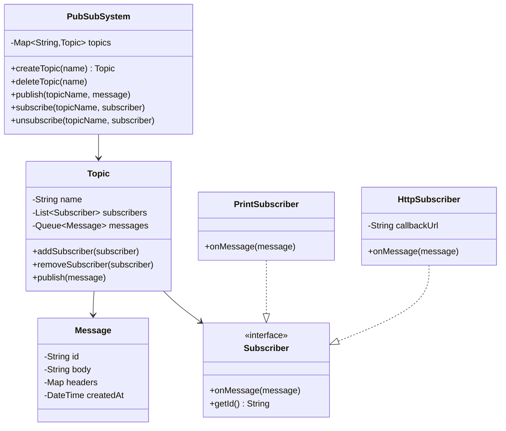
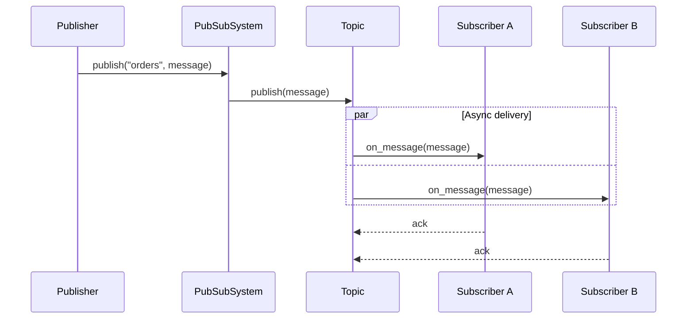

# LLD 11: Pub-Sub Messaging System

> **Difficulty**: Medium
> **Key Concepts**: Observer pattern, topics, subscribers, message delivery

---

## 1. Requirements

- Create topics (named channels)
- Publishers send messages to topics
- Subscribers subscribe/unsubscribe to topics
- Messages delivered to all subscribers of a topic
- Support message filtering (optional)
- At-least-once delivery guarantee
- Async message processing per subscriber

---

## 2. Class Diagram



---

## 3. Core Classes

```python
import uuid
import threading
from datetime import datetime
from abc import ABC, abstractmethod
from collections import defaultdict
from queue import Queue

class Message:
    def __init__(self, body: str, headers: dict = None):
        self.id = str(uuid.uuid4())
        self.body = body
        self.headers = headers or {}
        self.created_at = datetime.now()


class Subscriber(ABC):
    @abstractmethod
    def on_message(self, message: Message) -> None:
        pass

    @abstractmethod
    def get_id(self) -> str:
        pass


class PrintSubscriber(Subscriber):
    def __init__(self, name: str):
        self.name = name

    def on_message(self, message: Message) -> None:
        print(f"[{self.name}] Received: {message.body}")

    def get_id(self) -> str:
        return self.name


class Topic:
    def __init__(self, name: str):
        self.name = name
        self.subscribers: list[Subscriber] = []
        self.lock = threading.Lock()

    def add_subscriber(self, subscriber: Subscriber):
        with self.lock:
            if subscriber not in self.subscribers:
                self.subscribers.append(subscriber)

    def remove_subscriber(self, subscriber: Subscriber):
        with self.lock:
            self.subscribers = [s for s in self.subscribers
                                if s.get_id() != subscriber.get_id()]

    def publish(self, message: Message):
        with self.lock:
            subscribers_snapshot = list(self.subscribers)
        for subscriber in subscribers_snapshot:
            # Each subscriber gets message in its own thread (async)
            thread = threading.Thread(
                target=self._deliver,
                args=(subscriber, message),
                daemon=True
            )
            thread.start()

    def _deliver(self, subscriber: Subscriber, message: Message):
        try:
            subscriber.on_message(message)
        except Exception as e:
            print(f"Delivery failed to {subscriber.get_id()}: {e}")
            # Retry logic could go here
```

---

## 4. PubSub System

```python
class PubSubSystem:
    _instance = None

    def __init__(self):
        self.topics: dict[str, Topic] = {}
        self.lock = threading.Lock()

    @classmethod
    def get_instance(cls):
        if cls._instance is None:
            cls._instance = cls()
        return cls._instance

    def create_topic(self, name: str) -> Topic:
        with self.lock:
            if name in self.topics:
                raise ValueError(f"Topic '{name}' already exists")
            topic = Topic(name)
            self.topics[name] = topic
            return topic

    def delete_topic(self, name: str):
        with self.lock:
            if name not in self.topics:
                raise ValueError(f"Topic '{name}' not found")
            del self.topics[name]

    def publish(self, topic_name: str, message: Message):
        topic = self._get_topic(topic_name)
        topic.publish(message)

    def subscribe(self, topic_name: str, subscriber: Subscriber):
        topic = self._get_topic(topic_name)
        topic.add_subscriber(subscriber)

    def unsubscribe(self, topic_name: str, subscriber: Subscriber):
        topic = self._get_topic(topic_name)
        topic.remove_subscriber(subscriber)

    def _get_topic(self, name: str) -> Topic:
        with self.lock:
            topic = self.topics.get(name)
        if not topic:
            raise ValueError(f"Topic '{name}' not found")
        return topic
```

---

## 5. Message Flow



---

## 6. Design Patterns Used

| Pattern | Where | Why |
|---------|-------|-----|
| **Observer** | Topic → Subscribers | Core pub-sub notification pattern |
| **Singleton** | PubSubSystem | One system instance |
| **Strategy** | Subscriber implementations | Different delivery methods (print, HTTP, queue) |
| **Thread-per-message** | Topic.publish() | Async, non-blocking delivery |

---

## 7. Edge Cases

- **Slow subscriber**: Async delivery prevents blocking others
- **Subscriber failure**: Catch exception, retry with backoff
- **Topic deleted with active subscribers**: Notify subscribers, unsubscribe all
- **Duplicate subscribe**: Check by ID before adding
- **Message ordering**: Per-subscriber queue for ordered delivery (optional)

> **Next**: [12 — In-Memory Cache (LRU)](12-in-memory-cache.md)
