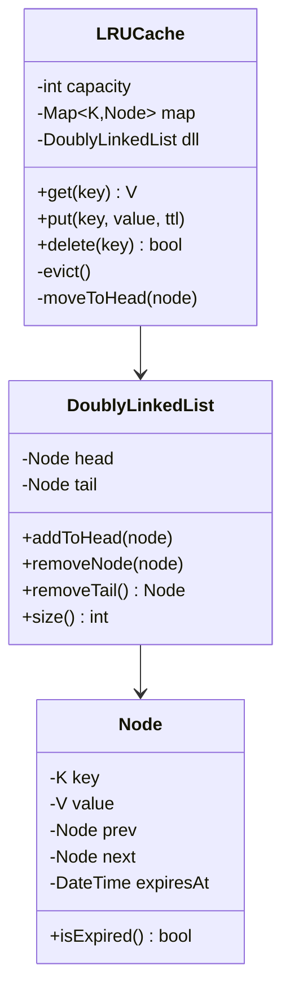
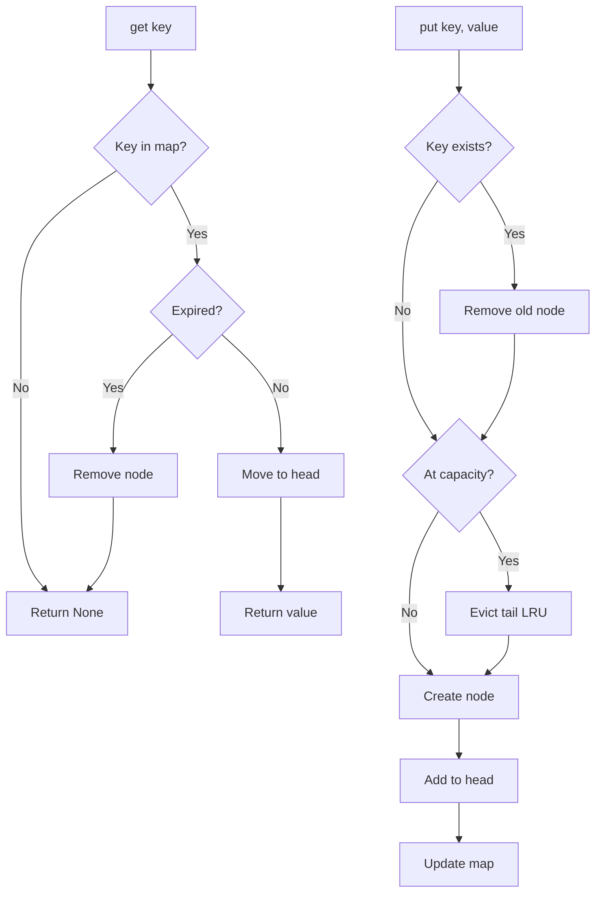

# LLD 12: In-Memory Cache (LRU)

> **Difficulty**: Medium
> **Key Concepts**: LRU eviction, doubly linked list, hash map, TTL

---

## 1. Requirements

- GET / PUT / DELETE key-value pairs
- LRU eviction when capacity is reached
- Optional TTL (time-to-live) per entry
- O(1) time for all operations
- Thread-safe operations

---

## 2. Class Diagram



---

## 3. Core Implementation

```python
import threading
from datetime import datetime, timedelta

class Node:
    def __init__(self, key: str, value: any, ttl_seconds: float = None):
        self.key = key
        self.value = value
        self.prev: Node | None = None
        self.next: Node | None = None
        self.expires_at = (datetime.now() + timedelta(seconds=ttl_seconds)
                           if ttl_seconds else None)

    def is_expired(self) -> bool:
        if self.expires_at is None:
            return False
        return datetime.now() > self.expires_at


class DoublyLinkedList:
    def __init__(self):
        self.head = Node("", "")  # sentinel head
        self.tail = Node("", "")  # sentinel tail
        self.head.next = self.tail
        self.tail.prev = self.head
        self._size = 0

    def add_to_head(self, node: Node):
        node.prev = self.head
        node.next = self.head.next
        self.head.next.prev = node
        self.head.next = node
        self._size += 1

    def remove_node(self, node: Node):
        node.prev.next = node.next
        node.next.prev = node.prev
        node.prev = None
        node.next = None
        self._size -= 1

    def remove_tail(self) -> Node | None:
        if self._size == 0:
            return None
        tail_node = self.tail.prev
        self.remove_node(tail_node)
        return tail_node

    def size(self) -> int:
        return self._size


class LRUCache:
    def __init__(self, capacity: int):
        if capacity <= 0:
            raise ValueError("Capacity must be positive")
        self.capacity = capacity
        self.map: dict[str, Node] = {}
        self.dll = DoublyLinkedList()
        self.lock = threading.Lock()

    def get(self, key: str) -> any:
        with self.lock:
            node = self.map.get(key)
            if not node:
                return None
            if node.is_expired():
                self._remove(node)
                return None
            # Move to head (most recently used)
            self.dll.remove_node(node)
            self.dll.add_to_head(node)
            return node.value

    def put(self, key: str, value: any, ttl_seconds: float = None):
        with self.lock:
            if key in self.map:
                # Update existing
                old_node = self.map[key]
                self.dll.remove_node(old_node)
                del self.map[key]

            if self.dll.size() >= self.capacity:
                self._evict()

            new_node = Node(key, value, ttl_seconds)
            self.dll.add_to_head(new_node)
            self.map[key] = new_node

    def delete(self, key: str) -> bool:
        with self.lock:
            node = self.map.get(key)
            if not node:
                return False
            self._remove(node)
            return True

    def _evict(self):
        tail = self.dll.remove_tail()
        if tail:
            del self.map[tail.key]

    def _remove(self, node: Node):
        self.dll.remove_node(node)
        del self.map[node.key]

    def size(self) -> int:
        return self.dll.size()
```

---

## 4. Operation Flow



---

## 5. Complexity Analysis

| Operation | Time | Space |
|-----------|------|-------|
| `get(key)` | O(1) | — |
| `put(key, value)` | O(1) | O(1) per entry |
| `delete(key)` | O(1) | — |
| Eviction | O(1) | — |

**Data structures**: HashMap (O(1) lookup) + Doubly Linked List (O(1) insert/remove).

---

## 6. Design Patterns Used

| Pattern | Where | Why |
|---------|-------|-----|
| **Composite DS** | HashMap + DLL | O(1) for both lookup and ordering |
| **Sentinel nodes** | head/tail in DLL | Simplify edge cases (empty list) |
| **Thread-safe** | Lock per operation | Safe concurrent access |

---

## 7. Edge Cases

- **TTL expired on access**: Lazy deletion — check on `get()`, remove if expired
- **Same key re-inserted**: Update value and reset to head
- **Capacity = 1**: Evict on every new insert
- **Concurrent get+put**: Lock ensures consistency
- **Cache warming**: Pre-load frequently accessed keys at startup

> **Next**: [13 — Rate Limiter](13-rate-limiter.md)
