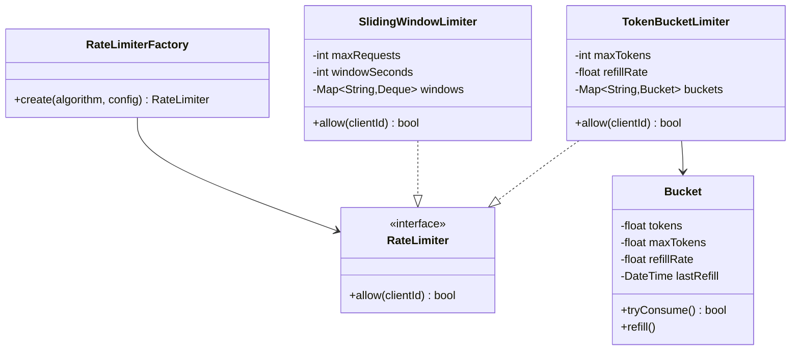
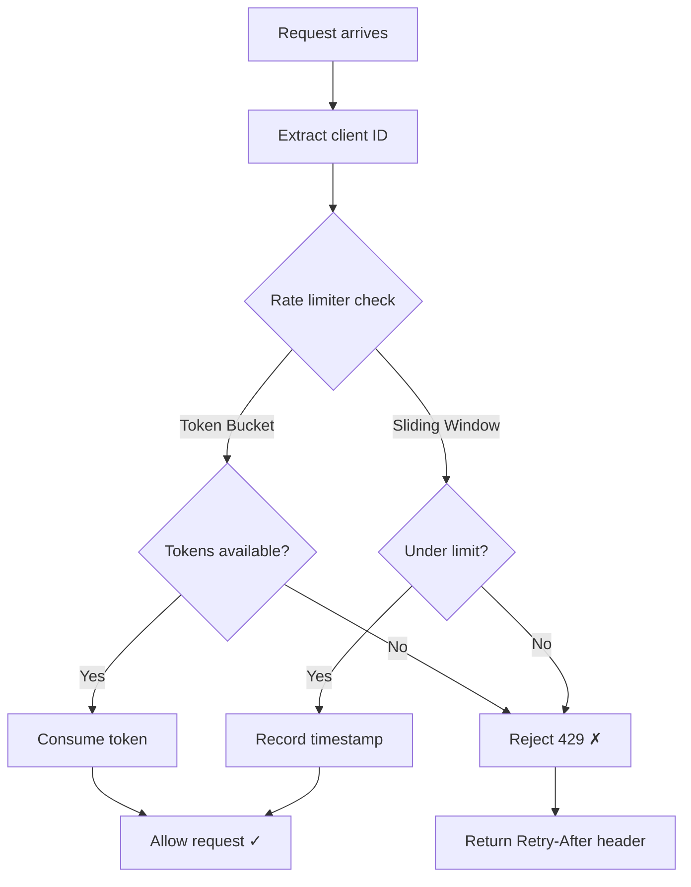

# LLD 13: Rate Limiter

> **Difficulty**: Medium
> **Key Concepts**: Token bucket, sliding window, decorator pattern

---

## 1. Requirements

- Limit requests per client (by IP, API key, or user ID)
- Configurable rate (e.g., 100 requests/minute)
- Multiple algorithm support (token bucket, sliding window)
- Thread-safe operations
- Return appropriate response when rate limited (429 Too Many Requests)

---

## 2. Class Diagram



---

## 3. Token Bucket Implementation

```python
import threading
import time
from collections import defaultdict

class Bucket:
    def __init__(self, max_tokens: int, refill_rate: float):
        self.max_tokens = max_tokens
        self.tokens = max_tokens
        self.refill_rate = refill_rate  # tokens per second
        self.last_refill = time.monotonic()
        self.lock = threading.Lock()

    def try_consume(self) -> bool:
        with self.lock:
            self._refill()
            if self.tokens >= 1:
                self.tokens -= 1
                return True
            return False

    def _refill(self):
        now = time.monotonic()
        elapsed = now - self.last_refill
        new_tokens = elapsed * self.refill_rate
        self.tokens = min(self.max_tokens, self.tokens + new_tokens)
        self.last_refill = now


class TokenBucketLimiter:
    def __init__(self, max_tokens: int = 10, refill_rate: float = 1.0):
        self.max_tokens = max_tokens
        self.refill_rate = refill_rate
        self.buckets: dict[str, Bucket] = {}
        self.lock = threading.Lock()

    def allow(self, client_id: str) -> bool:
        bucket = self._get_bucket(client_id)
        return bucket.try_consume()

    def _get_bucket(self, client_id: str) -> Bucket:
        with self.lock:
            if client_id not in self.buckets:
                self.buckets[client_id] = Bucket(self.max_tokens, self.refill_rate)
            return self.buckets[client_id]
```

---

## 4. Sliding Window Implementation

```python
from collections import deque

class SlidingWindowLimiter:
    def __init__(self, max_requests: int = 100, window_seconds: int = 60):
        self.max_requests = max_requests
        self.window_seconds = window_seconds
        self.windows: dict[str, deque] = {}
        self.lock = threading.Lock()

    def allow(self, client_id: str) -> bool:
        now = time.monotonic()
        with self.lock:
            if client_id not in self.windows:
                self.windows[client_id] = deque()

            window = self.windows[client_id]
            cutoff = now - self.window_seconds

            # Remove expired timestamps
            while window and window[0] <= cutoff:
                window.popleft()

            if len(window) < self.max_requests:
                window.append(now)
                return True
            return False
```

---

## 5. Rate Limiter Flow



---

## 6. Design Patterns Used

| Pattern | Where | Why |
|---------|-------|-----|
| **Strategy** | RateLimiter interface | Swap algorithms (token bucket, sliding window) |
| **Factory** | RateLimiterFactory | Create limiter by algorithm name |
| **Decorator** | Middleware wrapper | Apply rate limiting without modifying endpoints |

---

## 7. Algorithm Comparison

| Algorithm | Pros | Cons |
|-----------|------|------|
| **Token Bucket** | Allows bursts, smooth refill | Memory per bucket |
| **Sliding Window Log** | Precise, no boundary issue | Memory for timestamps |
| **Sliding Window Counter** | Low memory | Approximate at boundaries |
| **Fixed Window** | Simple | Burst at window boundaries |

---

## 8. Edge Cases

- **Client cleanup**: Periodically remove inactive client buckets
- **Distributed**: Use Redis for shared state across servers
- **Burst handling**: Token bucket naturally allows controlled bursts
- **Clock skew**: Use monotonic clock, not wall clock
- **Graceful degradation**: If Redis is down, allow requests (fail open)

> **Next**: [14 — Logger Framework](14-logger-framework.md)
