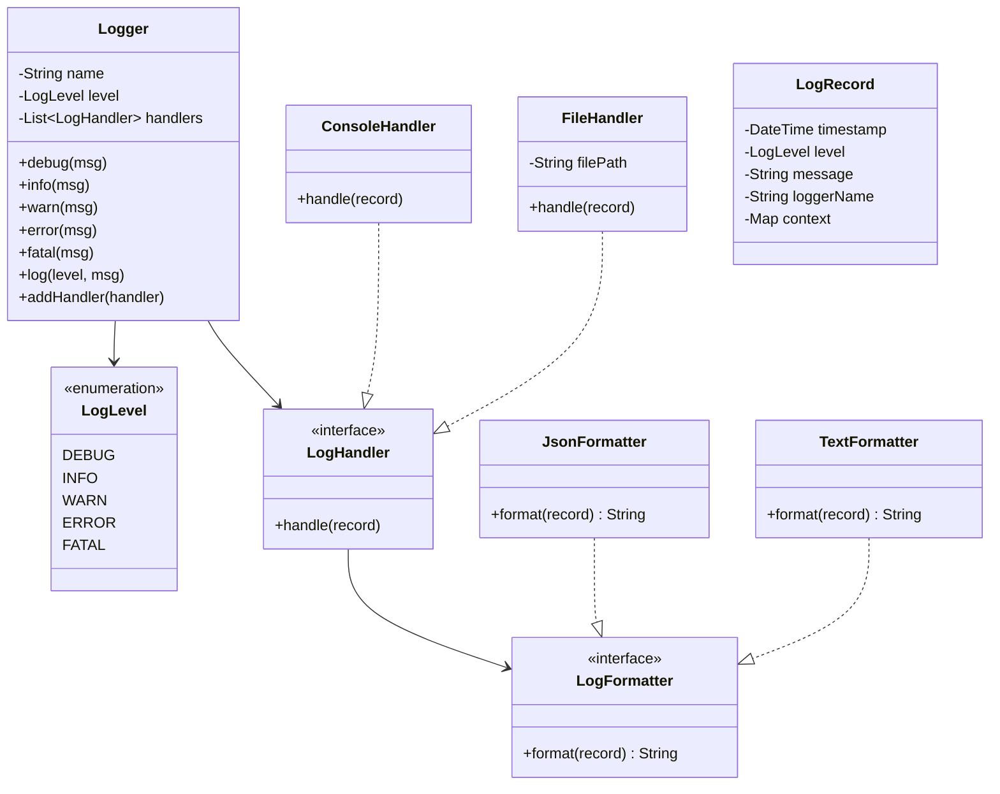

# LLD 14: Logger Framework

> **Difficulty**: Easy
> **Key Concepts**: Singleton, Chain of Responsibility, Strategy pattern

---

## 1. Requirements

- Log messages at different levels (DEBUG, INFO, WARN, ERROR, FATAL)
- Multiple output destinations (console, file, remote server)
- Configurable log level threshold (e.g., only log WARN and above)
- Structured log format (timestamp, level, message, context)
- Thread-safe logging
- Support multiple loggers with different configurations

---

## 2. Class Diagram



---

## 3. Core Implementation

```python
import threading
import json
from enum import IntEnum
from datetime import datetime
from abc import ABC, abstractmethod

class LogLevel(IntEnum):
    DEBUG = 10
    INFO = 20
    WARN = 30
    ERROR = 40
    FATAL = 50

class LogRecord:
    def __init__(self, level: LogLevel, message: str, logger_name: str,
                 context: dict = None):
        self.timestamp = datetime.now()
        self.level = level
        self.message = message
        self.logger_name = logger_name
        self.context = context or {}


class LogFormatter(ABC):
    @abstractmethod
    def format(self, record: LogRecord) -> str:
        pass

class TextFormatter(LogFormatter):
    def format(self, record: LogRecord) -> str:
        ts = record.timestamp.strftime("%Y-%m-%d %H:%M:%S.%f")[:-3]
        ctx = f" | {record.context}" if record.context else ""
        return f"[{ts}] [{record.level.name}] [{record.logger_name}] {record.message}{ctx}"

class JsonFormatter(LogFormatter):
    def format(self, record: LogRecord) -> str:
        data = {
            "timestamp": record.timestamp.isoformat(),
            "level": record.level.name,
            "logger": record.logger_name,
            "message": record.message,
            **record.context,
        }
        return json.dumps(data)


class LogHandler(ABC):
    def __init__(self, formatter: LogFormatter = None, level: LogLevel = LogLevel.DEBUG):
        self.formatter = formatter or TextFormatter()
        self.level = level

    @abstractmethod
    def emit(self, record: LogRecord):
        pass

    def handle(self, record: LogRecord):
        if record.level >= self.level:
            self.emit(record)

class ConsoleHandler(LogHandler):
    def emit(self, record: LogRecord):
        print(self.formatter.format(record))

class FileHandler(LogHandler):
    def __init__(self, file_path: str, formatter: LogFormatter = None,
                 level: LogLevel = LogLevel.DEBUG):
        super().__init__(formatter, level)
        self.file_path = file_path
        self.lock = threading.Lock()

    def emit(self, record: LogRecord):
        line = self.formatter.format(record) + "\n"
        with self.lock:
            with open(self.file_path, "a") as f:
                f.write(line)
```

---

## 4. Logger & Manager

```python
class Logger:
    def __init__(self, name: str, level: LogLevel = LogLevel.DEBUG):
        self.name = name
        self.level = level
        self.handlers: list[LogHandler] = []
        self.lock = threading.Lock()

    def add_handler(self, handler: LogHandler):
        self.handlers.append(handler)

    def log(self, level: LogLevel, message: str, **context):
        if level < self.level:
            return
        record = LogRecord(level, message, self.name, context)
        with self.lock:
            for handler in self.handlers:
                try:
                    handler.handle(record)
                except Exception as e:
                    print(f"Handler error: {e}")

    def debug(self, message: str, **ctx):
        self.log(LogLevel.DEBUG, message, **ctx)

    def info(self, message: str, **ctx):
        self.log(LogLevel.INFO, message, **ctx)

    def warn(self, message: str, **ctx):
        self.log(LogLevel.WARN, message, **ctx)

    def error(self, message: str, **ctx):
        self.log(LogLevel.ERROR, message, **ctx)

    def fatal(self, message: str, **ctx):
        self.log(LogLevel.FATAL, message, **ctx)


class LoggerManager:
    """Singleton factory for loggers."""
    _instance = None
    _loggers: dict[str, Logger] = {}
    _lock = threading.Lock()

    @classmethod
    def get_logger(cls, name: str, level: LogLevel = LogLevel.DEBUG) -> Logger:
        with cls._lock:
            if name not in cls._loggers:
                cls._loggers[name] = Logger(name, level)
            return cls._loggers[name]
```

---

## 5. Usage Flow

```mermaid
sequenceDiagram
    participant App as Application
    participant LM as LoggerManager
    participant L as Logger
    participant CH as ConsoleHandler
    participant FH as FileHandler

    App->>LM: get_logger("order-svc")
    LM-->>App: Logger instance
    App->>L: error("Payment failed", order_id="123")
    L->>L: Create LogRecord
    par Handlers
        L->>CH: handle(record)
        CH->>CH: format + print
    and
        L->>FH: handle(record)
        FH->>FH: format + write to file
    end
```



---

## 6. Design Patterns Used

| Pattern | Where | Why |
|---------|-------|-----|
| **Singleton** | LoggerManager | One registry for all loggers |
| **Chain of Responsibility** | Handler level filtering | Each handler decides if it handles the record |
| **Strategy** | LogFormatter | Swap text/JSON formatting |
| **Observer** | Logger → Handlers | Multiple outputs per logger |

---

## 7. Edge Cases

- **File rotation**: Extend FileHandler to rotate at size/time limits
- **Async logging**: Queue records, separate writer thread (for high throughput)
- **Buffered writes**: Batch file writes to reduce I/O
- **Sensitive data**: Mask PII in log records before formatting
- **Log aggregation**: Add RemoteHandler for shipping to ELK/Splunk

> **Next**: [15 — Notification Service](15-notification-service.md)
