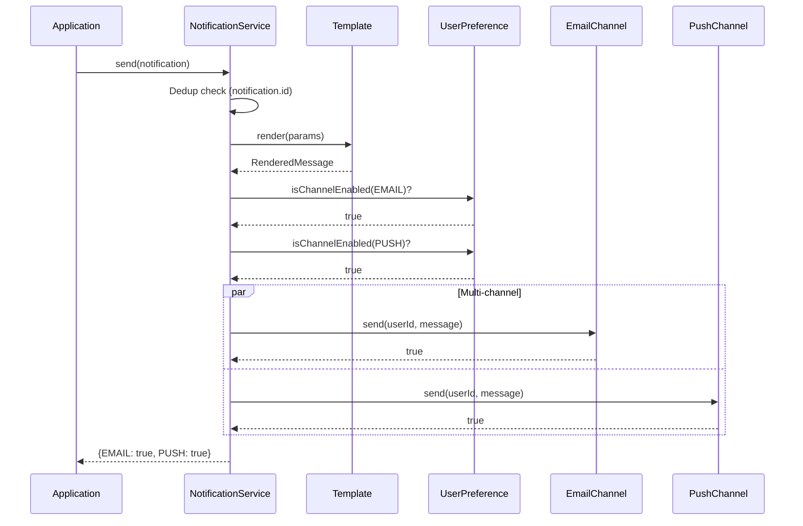

# LLD 15: Notification Service

> **Difficulty**: Medium
> **Key Concepts**: Observer pattern, template method, multi-channel delivery

---

## 1. Requirements

- Send notifications via multiple channels (Email, SMS, Push)
- Template-based messages with variable substitution
- Priority levels (critical, high, normal, low)
- User notification preferences (opt-in/out per channel)
- Retry failed notifications
- Deduplication (don't send same notification twice)
- Rate limiting per user

---

## 2. Class Diagram


---

## 3. Core Implementation

```python
import uuid
import threading
from enum import Enum
from datetime import datetime
from abc import ABC, abstractmethod

class ChannelType(Enum):
    EMAIL = "email"
    SMS = "sms"
    PUSH = "push"

class Priority(Enum):
    CRITICAL = 1
    HIGH = 2
    NORMAL = 3
    LOW = 4

class RenderedMessage:
    def __init__(self, subject: str, body: str):
        self.subject = subject
        self.body = body

class Template:
    def __init__(self, template_id: str, subject: str, body: str):
        self.template_id = template_id
        self.subject = subject
        self.body = body

    def render(self, params: dict) -> RenderedMessage:
        subject = self.subject
        body = self.body
        for key, value in params.items():
            subject = subject.replace(f"{{{{{key}}}}}", str(value))
            body = body.replace(f"{{{{{key}}}}}", str(value))
        return RenderedMessage(subject, body)


class Notification:
    def __init__(self, user_id: str, template_id: str, params: dict,
                 channels: list[ChannelType] = None, priority: Priority = Priority.NORMAL):
        self.id = str(uuid.uuid4())
        self.user_id = user_id
        self.template_id = template_id
        self.params = params
        self.channels = channels or [ChannelType.EMAIL]
        self.priority = priority
        self.created_at = datetime.now()


class UserPreference:
    def __init__(self, user_id: str):
        self.user_id = user_id
        self.channel_enabled: dict[ChannelType, bool] = {
            ChannelType.EMAIL: True,
            ChannelType.SMS: True,
            ChannelType.PUSH: True,
        }
        self.do_not_disturb = False

    def is_channel_enabled(self, channel_type: ChannelType) -> bool:
        if self.do_not_disturb:
            return False
        return self.channel_enabled.get(channel_type, False)
```

---

## 4. Channels & Service

```python
class NotificationChannel(ABC):
    @abstractmethod
    def send(self, user_id: str, message: RenderedMessage) -> bool:
        pass

    @abstractmethod
    def get_type(self) -> ChannelType:
        pass

class EmailChannel(NotificationChannel):
    def send(self, user_id: str, message: RenderedMessage) -> bool:
        print(f"[EMAIL] To: {user_id} | Subject: {message.subject} | Body: {message.body}")
        return True

    def get_type(self) -> ChannelType:
        return ChannelType.EMAIL

class SMSChannel(NotificationChannel):
    def send(self, user_id: str, message: RenderedMessage) -> bool:
        print(f"[SMS] To: {user_id} | {message.body}")
        return True

    def get_type(self) -> ChannelType:
        return ChannelType.SMS

class PushChannel(NotificationChannel):
    def send(self, user_id: str, message: RenderedMessage) -> bool:
        print(f"[PUSH] To: {user_id} | {message.subject}: {message.body}")
        return True

    def get_type(self) -> ChannelType:
        return ChannelType.PUSH


class NotificationService:
    MAX_RETRIES = 3

    def __init__(self):
        self.channels: dict[ChannelType, NotificationChannel] = {}
        self.templates: dict[str, Template] = {}
        self.preferences: dict[str, UserPreference] = {}
        self.sent_ids: set[str] = set()  # deduplication
        self.lock = threading.Lock()

    def register_channel(self, channel: NotificationChannel):
        self.channels[channel.get_type()] = channel

    def register_template(self, template: Template):
        self.templates[template.template_id] = template

    def set_preference(self, preference: UserPreference):
        self.preferences[preference.user_id] = preference

    def send(self, notification: Notification) -> dict[ChannelType, bool]:
        # Deduplication check
        with self.lock:
            if notification.id in self.sent_ids:
                return {}
            self.sent_ids.add(notification.id)

        # Get template and render
        template = self.templates.get(notification.template_id)
        if not template:
            raise ValueError(f"Template '{notification.template_id}' not found")
        message = template.render(notification.params)

        # Get user preferences
        prefs = self.preferences.get(notification.user_id, UserPreference(notification.user_id))

        # Send to each requested channel
        results = {}
        for channel_type in notification.channels:
            if not prefs.is_channel_enabled(channel_type):
                results[channel_type] = False
                continue

            channel = self.channels.get(channel_type)
            if not channel:
                results[channel_type] = False
                continue

            success = self._send_with_retry(channel, notification.user_id, message)
            results[channel_type] = success

        return results

    def _send_with_retry(self, channel: NotificationChannel, user_id: str,
                          message: RenderedMessage) -> bool:
        for attempt in range(self.MAX_RETRIES):
            try:
                if channel.send(user_id, message):
                    return True
            except Exception:
                pass
        return False
```

---

## 5. Notification Flow



---

## 6. Design Patterns Used

| Pattern | Where | Why |
|---------|-------|-----|
| **Strategy** | NotificationChannel | Swap email/SMS/push implementations |
| **Template Method** | Template.render() | Variable substitution in messages |
| **Observer** | Multi-channel dispatch | Notify through all enabled channels |
| **Retry** | _send_with_retry() | Handle transient delivery failures |

---

## 7. Edge Cases

- **User opted out**: Skip channel, log the skip
- **Template not found**: Raise error, don't send partial
- **All channels fail**: Log failure, alert on-call
- **Rate limit per user**: Max N notifications/hour per user
- **Batch sending**: Extend for bulk notifications (marketing campaigns)

> **Next**: [16 — Payment Processing](16-payment-processing.md)
