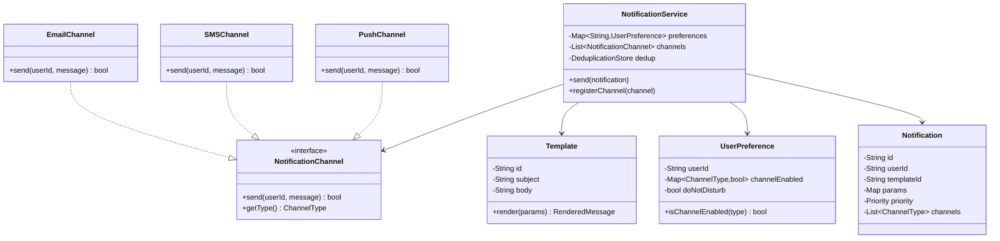
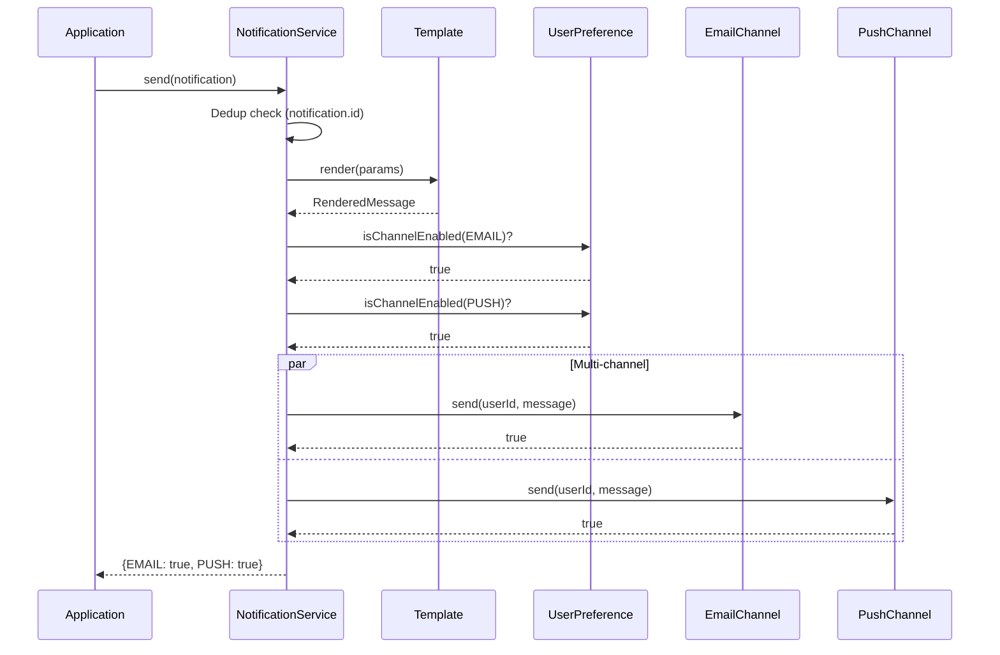

# LLD 15: Notification Service

> **Difficulty**: Medium
> **Key Concepts**: Observer pattern, template method, multi-channel delivery

---

## 1. Requirements

- Send notifications via multiple channels (Email, SMS, Push)
- Template-based messages with variable substitution
- Priority levels (critical, high, normal, low)
- User notification preferences (opt-in/out per channel)
- Retry failed notifications
- Deduplication (don't send same notification twice)
- Rate limiting per user

---

## 2. Class Diagram



---

## 3. Core Implementation

```java
public enum ChannelType { EMAIL, SMS, PUSH }

public enum Priority { CRITICAL, HIGH, NORMAL, LOW }

public class RenderedMessage {
    private final String subject;
    private final String body;
    public RenderedMessage(String subject, String body) {
        this.subject = subject; this.body = body;
    }
    public String getSubject() { return subject; }
    public String getBody() { return body; }
}

public class Template {
    private final String templateId;
    private final String subject;
    private final String body;

    public Template(String templateId, String subject, String body) {
        this.templateId = templateId; this.subject = subject; this.body = body;
    }

    public RenderedMessage render(Map<String, String> params) {
        String s = subject, b = body;
        for (Map.Entry<String, String> e : params.entrySet()) {
            String placeholder = "{{" + e.getKey() + "}}";
            s = s.replace(placeholder, e.getValue());
            b = b.replace(placeholder, e.getValue());
        }
        return new RenderedMessage(s, b);
    }
    public String getTemplateId() { return templateId; }
}

public class Notification {
    private final String id;
    private final String userId;
    private final String templateId;
    private final Map<String, String> params;
    private final List<ChannelType> channels;
    private final Priority priority;

    public Notification(String userId, String templateId, Map<String, String> params,
                        List<ChannelType> channels, Priority priority) {
        this.id = UUID.randomUUID().toString();
        this.userId = userId; this.templateId = templateId;
        this.params = params;
        this.channels = (channels != null) ? channels : List.of(ChannelType.EMAIL);
        this.priority = (priority != null) ? priority : Priority.NORMAL;
    }
    public String getId() { return id; }
    public String getUserId() { return userId; }
    public String getTemplateId() { return templateId; }
    public Map<String, String> getParams() { return params; }
    public List<ChannelType> getChannels() { return channels; }
}

public class UserPreference {
    private final String userId;
    private final Map<ChannelType, Boolean> channelEnabled = new EnumMap<>(ChannelType.class);
    private boolean doNotDisturb = false;

    public UserPreference(String userId) {
        this.userId = userId;
        for (ChannelType t : ChannelType.values()) channelEnabled.put(t, true);
    }

    public boolean isChannelEnabled(ChannelType type) {
        if (doNotDisturb) return false;
        return channelEnabled.getOrDefault(type, false);
    }
    public String getUserId() { return userId; }
    public void setDoNotDisturb(boolean v) { doNotDisturb = v; }
    public void setChannelEnabled(ChannelType t, boolean v) { channelEnabled.put(t, v); }
}
```

---

## 4. Channels & Service

```java
public interface NotificationChannel {
    boolean send(String userId, RenderedMessage message);
    ChannelType getType();
}

public class EmailChannel implements NotificationChannel {
    @Override
    public boolean send(String userId, RenderedMessage msg) {
        System.out.println("[EMAIL] To: " + userId + " | Subject: " + msg.getSubject()
            + " | Body: " + msg.getBody());
        return true;
    }
    @Override public ChannelType getType() { return ChannelType.EMAIL; }
}

public class SMSChannel implements NotificationChannel {
    @Override
    public boolean send(String userId, RenderedMessage msg) {
        System.out.println("[SMS] To: " + userId + " | " + msg.getBody());
        return true;
    }
    @Override public ChannelType getType() { return ChannelType.SMS; }
}

public class PushChannel implements NotificationChannel {
    @Override
    public boolean send(String userId, RenderedMessage msg) {
        System.out.println("[PUSH] To: " + userId + " | " + msg.getSubject() + ": " + msg.getBody());
        return true;
    }
    @Override public ChannelType getType() { return ChannelType.PUSH; }
}

public class NotificationService {
    private static final int MAX_RETRIES = 3;
    private final Map<ChannelType, NotificationChannel> channels = new EnumMap<>(ChannelType.class);
    private final Map<String, Template> templates = new HashMap<>();
    private final Map<String, UserPreference> preferences = new HashMap<>();
    private final Set<String> sentIds = new HashSet<>();
    private final Object lock = new Object();

    public void registerChannel(NotificationChannel channel) {
        channels.put(channel.getType(), channel);
    }
    public void registerTemplate(Template template) {
        templates.put(template.getTemplateId(), template);
    }
    public void setPreference(UserPreference pref) {
        preferences.put(pref.getUserId(), pref);
    }

    public Map<ChannelType, Boolean> send(Notification notification) {
        synchronized (lock) {
            if (sentIds.contains(notification.getId())) return Map.of();
            sentIds.add(notification.getId());
        }

        Template template = templates.get(notification.getTemplateId());
        if (template == null)
            throw new IllegalArgumentException("Template '" + notification.getTemplateId() + "' not found");
        RenderedMessage message = template.render(notification.getParams());

        UserPreference prefs = preferences.getOrDefault(
            notification.getUserId(), new UserPreference(notification.getUserId()));

        Map<ChannelType, Boolean> results = new EnumMap<>(ChannelType.class);
        for (ChannelType type : notification.getChannels()) {
            if (!prefs.isChannelEnabled(type)) { results.put(type, false); continue; }
            NotificationChannel channel = channels.get(type);
            if (channel == null) { results.put(type, false); continue; }
            results.put(type, sendWithRetry(channel, notification.getUserId(), message));
        }
        return results;
    }

    private boolean sendWithRetry(NotificationChannel channel, String userId,
                                  RenderedMessage message) {
        for (int i = 0; i < MAX_RETRIES; i++) {
            try { if (channel.send(userId, message)) return true; }
            catch (Exception ignored) {}
        }
        return false;
    }
}
```

---

## 5. Notification Flow



---

## 6. Design Patterns Used

| Pattern | Where | Why |
|---------|-------|-----|
| **Strategy** | NotificationChannel | Swap email/SMS/push implementations |
| **Template Method** | Template.render() | Variable substitution in messages |
| **Observer** | Multi-channel dispatch | Notify through all enabled channels |
| **Retry** | _send_with_retry() | Handle transient delivery failures |

---

## 7. Edge Cases

- **User opted out**: Skip channel, log the skip
- **Template not found**: Raise error, don't send partial
- **All channels fail**: Log failure, alert on-call
- **Rate limit per user**: Max N notifications/hour per user
- **Batch sending**: Extend for bulk notifications (marketing campaigns)

> **Next**: [16 — Payment Processing](16-payment-processing.md)
