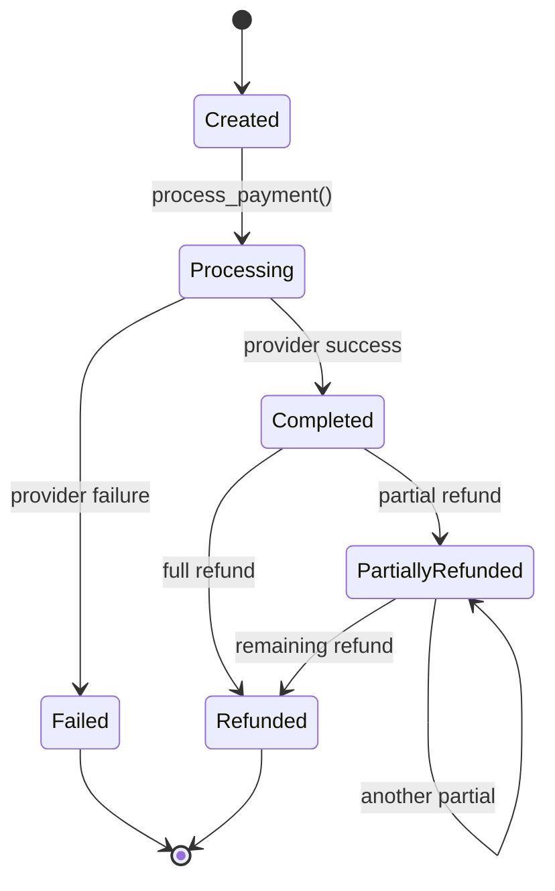

# LLD 16: Payment Processing

> **Difficulty**: Hard
> **Key Concepts**: State machine, idempotency, double-entry ledger, strategy pattern

---

## 1. Requirements

- Process payments via multiple providers (Stripe, PayPal, bank transfer)
- Idempotent payment operations (no duplicate charges)
- Payment state machine (created → processing → completed/failed)
- Refund support (full and partial)
- Double-entry ledger for accounting
- Webhook handling for async payment confirmations
- Currency support

---

## 2. Class Diagram


---

## 3. Core Implementation

```java
public enum PaymentStatus {
    CREATED, PROCESSING, COMPLETED, FAILED, REFUNDED, PARTIALLY_REFUNDED;

    private static final Map<PaymentStatus, Set<PaymentStatus>> VALID_TRANSITIONS = Map.of(
        CREATED, Set.of(PROCESSING),
        PROCESSING, Set.of(COMPLETED, FAILED),
        COMPLETED, Set.of(REFUNDED, PARTIALLY_REFUNDED),
        PARTIALLY_REFUNDED, Set.of(REFUNDED, PARTIALLY_REFUNDED),
        FAILED, Set.of(),
        REFUNDED, Set.of()
    );

    public boolean canTransitionTo(PaymentStatus next) {
        return VALID_TRANSITIONS.getOrDefault(this, Set.of()).contains(next);
    }
}

public class Money {
    private final int amountCents;
    private final String currency;

    public Money(int amountCents, String currency) {
        this.amountCents = amountCents; this.currency = currency;
    }
    public Money(int amountCents) { this(amountCents, "USD"); }

    public Money add(Money other) {
        assert currency.equals(other.currency);
        return new Money(amountCents + other.amountCents, currency);
    }
    public Money subtract(Money other) {
        assert currency.equals(other.currency);
        return new Money(amountCents - other.amountCents, currency);
    }
    public int getAmountCents() { return amountCents; }
    public String getCurrency() { return currency; }
    @Override public String toString() {
        return String.format("$%.2f %s", amountCents / 100.0, currency);
    }
}

public class ProviderResult {
    private final boolean success;
    private final String providerTxnId;
    private final String errorMessage;

    public ProviderResult(boolean success, String providerTxnId, String errorMessage) {
        this.success = success; this.providerTxnId = providerTxnId;
        this.errorMessage = errorMessage;
    }
    public boolean isSuccess() { return success; }
    public String getProviderTxnId() { return providerTxnId; }
}

public class Payment {
    private final String id;
    private final String idempotencyKey;
    private final Money amount;
    private final String userId;
    private final String providerName;
    private PaymentStatus status = PaymentStatus.CREATED;
    private String providerTxnId = "";
    private Money refundedAmount;
    private LocalDateTime updatedAt;

    public Payment(String idempotencyKey, Money amount, String userId, String providerName) {
        this.id = UUID.randomUUID().toString();
        this.idempotencyKey = idempotencyKey;
        this.amount = amount; this.userId = userId;
        this.providerName = providerName;
        this.refundedAmount = new Money(0, amount.getCurrency());
        this.updatedAt = LocalDateTime.now();
    }

    public void transitionTo(PaymentStatus newStatus) {
        if (!status.canTransitionTo(newStatus))
            throw new IllegalStateException("Invalid transition: " + status + " -> " + newStatus);
        status = newStatus;
        updatedAt = LocalDateTime.now();
    }

    public String getId() { return id; }
    public Money getAmount() { return amount; }
    public String getUserId() { return userId; }
    public String getProviderName() { return providerName; }
    public PaymentStatus getStatus() { return status; }
    public String getProviderTxnId() { return providerTxnId; }
    public void setProviderTxnId(String id) { providerTxnId = id; }
    public Money getRefundedAmount() { return refundedAmount; }
    public void setRefundedAmount(Money m) { refundedAmount = m; }
}
```

---

## 4. Payment Provider & Ledger

```java
public interface PaymentProvider {
    ProviderResult charge(Money amount, Map<String, String> metadata);
    ProviderResult refund(String providerTxnId, Money amount);
}

public class StripeProvider implements PaymentProvider {
    @Override
    public ProviderResult charge(Money amount, Map<String, String> metadata) {
        String txnId = "stripe_" + UUID.randomUUID().toString().substring(0, 12);
        System.out.println("[Stripe] Charged " + amount + " | txn: " + txnId);
        return new ProviderResult(true, txnId, "");
    }
    @Override
    public ProviderResult refund(String providerTxnId, Money amount) {
        String refundId = "stripe_ref_" + UUID.randomUUID().toString().substring(0, 12);
        System.out.println("[Stripe] Refunded " + amount + " for " + providerTxnId);
        return new ProviderResult(true, refundId, "");
    }
}

public class LedgerEntry {
    final String txnId, account, entryType;
    final int amountCents;
    final LocalDateTime timestamp;

    public LedgerEntry(String txnId, String account, int amountCents,
                       String entryType, LocalDateTime timestamp) {
        this.txnId = txnId; this.account = account;
        this.amountCents = amountCents; this.entryType = entryType;
        this.timestamp = timestamp;
    }
}

public class LedgerService {
    private final List<LedgerEntry> entries = new ArrayList<>();
    private final Object lock = new Object();

    public void recordPayment(Payment payment) {
        synchronized (lock) {
            entries.add(new LedgerEntry(payment.getId(), "user:" + payment.getUserId(),
                payment.getAmount().getAmountCents(), "debit", LocalDateTime.now()));
            entries.add(new LedgerEntry(payment.getId(), "merchant:revenue",
                payment.getAmount().getAmountCents(), "credit", LocalDateTime.now()));
        }
    }

    public void recordRefund(Payment payment, Money refundAmount) {
        synchronized (lock) {
            entries.add(new LedgerEntry(payment.getId(), "user:" + payment.getUserId(),
                refundAmount.getAmountCents(), "credit", LocalDateTime.now()));
            entries.add(new LedgerEntry(payment.getId(), "merchant:revenue",
                refundAmount.getAmountCents(), "debit", LocalDateTime.now()));
        }
    }
}
```

---

## 5. Payment Service

```java
public class PaymentService {
    private final Map<String, PaymentProvider> providers = new HashMap<>();
    private final Map<String, Payment> payments = new HashMap<>();
    private final Map<String, String> idempotencyMap = new HashMap<>(); // key -> paymentId
    private final LedgerService ledger = new LedgerService();
    private final Object lock = new Object();

    public void registerProvider(String name, PaymentProvider provider) {
        providers.put(name, provider);
    }

    public Payment createPayment(String idempotencyKey, Money amount,
                                 String userId, String providerName) {
        synchronized (lock) {
            if (idempotencyMap.containsKey(idempotencyKey))
                return payments.get(idempotencyMap.get(idempotencyKey));
            Payment payment = new Payment(idempotencyKey, amount, userId, providerName);
            payments.put(payment.getId(), payment);
            idempotencyMap.put(idempotencyKey, payment.getId());
            return payment;
        }
    }

    public Payment processPayment(String paymentId) {
        Payment payment = payments.get(paymentId);
        if (payment == null) throw new IllegalArgumentException("Payment not found");

        payment.transitionTo(PaymentStatus.PROCESSING);

        PaymentProvider provider = providers.get(payment.getProviderName());
        if (provider == null) {
            payment.transitionTo(PaymentStatus.FAILED);
            throw new IllegalArgumentException("Provider '" + payment.getProviderName() + "' not registered");
        }

        ProviderResult result = provider.charge(payment.getAmount(),
            Map.of("payment_id", payment.getId()));

        if (result.isSuccess()) {
            payment.setProviderTxnId(result.getProviderTxnId());
            payment.transitionTo(PaymentStatus.COMPLETED);
            ledger.recordPayment(payment);
        } else {
            payment.transitionTo(PaymentStatus.FAILED);
        }
        return payment;
    }

    public Payment refund(String paymentId, Money amount) {
        Payment payment = payments.get(paymentId);
        if (payment == null) throw new IllegalArgumentException("Payment not found");

        Money refundAmount = (amount != null) ? amount : payment.getAmount();
        Money maxRefundable = payment.getAmount().subtract(payment.getRefundedAmount());
        if (refundAmount.getAmountCents() > maxRefundable.getAmountCents())
            throw new IllegalArgumentException("Refund exceeds remaining amount");

        PaymentProvider provider = providers.get(payment.getProviderName());
        ProviderResult result = provider.refund(payment.getProviderTxnId(), refundAmount);

        if (result.isSuccess()) {
            payment.setRefundedAmount(payment.getRefundedAmount().add(refundAmount));
            if (payment.getRefundedAmount().getAmountCents() >= payment.getAmount().getAmountCents())
                payment.transitionTo(PaymentStatus.REFUNDED);
            else
                payment.transitionTo(PaymentStatus.PARTIALLY_REFUNDED);
            ledger.recordRefund(payment, refundAmount);
        }
        return payment;
    }
}
```

---

## 6. Payment State Machine



---

## 7. Design Patterns Used

| Pattern | Where | Why |
|---------|-------|-----|
| **State Machine** | PaymentStatus + VALID_TRANSITIONS | Enforce valid payment lifecycle |
| **Strategy** | PaymentProvider | Swap Stripe/PayPal/bank transfer |
| **Idempotency** | idempotency_map | Prevent duplicate charges |
| **Double-Entry** | LedgerService | Accounting correctness (debits = credits) |

---

## 8. Edge Cases

- **Duplicate request**: Return existing payment via idempotency key
- **Provider timeout**: Treat as unknown — query provider for status
- **Partial refund**: Track `refunded_amount`, validate against total
- **Currency mismatch**: Validate same currency on all operations
- **Webhook before response**: Handle out-of-order via status checks

---

> This completes the LLD section. Return to [LLD README](README.md) for the full list.
