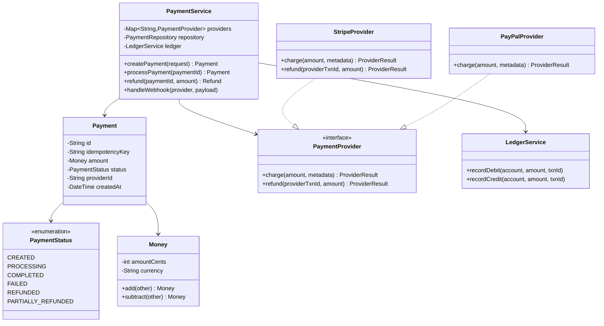
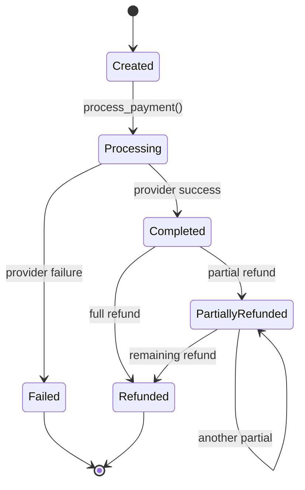

# LLD 16: Payment Processing

> **Difficulty**: Hard
> **Key Concepts**: State machine, idempotency, double-entry ledger, strategy pattern

---

## 1. Requirements

- Process payments via multiple providers (Stripe, PayPal, bank transfer)
- Idempotent payment operations (no duplicate charges)
- Payment state machine (created → processing → completed/failed)
- Refund support (full and partial)
- Double-entry ledger for accounting
- Webhook handling for async payment confirmations
- Currency support

---

## 2. Class Diagram



---

## 3. Core Implementation

```python
import uuid
import threading
from enum import Enum
from datetime import datetime
from abc import ABC, abstractmethod
from dataclasses import dataclass

class PaymentStatus(Enum):
    CREATED = "created"
    PROCESSING = "processing"
    COMPLETED = "completed"
    FAILED = "failed"
    REFUNDED = "refunded"
    PARTIALLY_REFUNDED = "partially_refunded"

# Valid state transitions
VALID_TRANSITIONS = {
    PaymentStatus.CREATED: {PaymentStatus.PROCESSING},
    PaymentStatus.PROCESSING: {PaymentStatus.COMPLETED, PaymentStatus.FAILED},
    PaymentStatus.COMPLETED: {PaymentStatus.REFUNDED, PaymentStatus.PARTIALLY_REFUNDED},
    PaymentStatus.PARTIALLY_REFUNDED: {PaymentStatus.REFUNDED, PaymentStatus.PARTIALLY_REFUNDED},
    PaymentStatus.FAILED: set(),
    PaymentStatus.REFUNDED: set(),
}

@dataclass
class Money:
    amount_cents: int
    currency: str = "USD"

    def add(self, other: "Money") -> "Money":
        assert self.currency == other.currency
        return Money(self.amount_cents + other.amount_cents, self.currency)

    def subtract(self, other: "Money") -> "Money":
        assert self.currency == other.currency
        return Money(self.amount_cents - other.amount_cents, self.currency)

    def __str__(self):
        return f"${self.amount_cents / 100:.2f} {self.currency}"

@dataclass
class ProviderResult:
    success: bool
    provider_txn_id: str = ""
    error_message: str = ""


class Payment:
    def __init__(self, idempotency_key: str, amount: Money, user_id: str,
                 provider_name: str):
        self.id = str(uuid.uuid4())
        self.idempotency_key = idempotency_key
        self.amount = amount
        self.user_id = user_id
        self.provider_name = provider_name
        self.status = PaymentStatus.CREATED
        self.provider_txn_id: str = ""
        self.refunded_amount = Money(0, amount.currency)
        self.created_at = datetime.now()
        self.updated_at = datetime.now()

    def transition_to(self, new_status: PaymentStatus):
        if new_status not in VALID_TRANSITIONS.get(self.status, set()):
            raise ValueError(
                f"Invalid transition: {self.status.value} -> {new_status.value}"
            )
        self.status = new_status
        self.updated_at = datetime.now()
```

---

## 4. Payment Provider & Ledger

```python
class PaymentProvider(ABC):
    @abstractmethod
    def charge(self, amount: Money, metadata: dict) -> ProviderResult:
        pass

    @abstractmethod
    def refund(self, provider_txn_id: str, amount: Money) -> ProviderResult:
        pass

class StripeProvider(PaymentProvider):
    def charge(self, amount: Money, metadata: dict) -> ProviderResult:
        # In production: call Stripe API
        txn_id = f"stripe_{uuid.uuid4().hex[:12]}"
        print(f"[Stripe] Charged {amount} | txn: {txn_id}")
        return ProviderResult(success=True, provider_txn_id=txn_id)

    def refund(self, provider_txn_id: str, amount: Money) -> ProviderResult:
        refund_id = f"stripe_ref_{uuid.uuid4().hex[:12]}"
        print(f"[Stripe] Refunded {amount} for {provider_txn_id}")
        return ProviderResult(success=True, provider_txn_id=refund_id)


@dataclass
class LedgerEntry:
    txn_id: str
    account: str
    amount_cents: int
    entry_type: str  # "debit" or "credit"
    timestamp: datetime

class LedgerService:
    def __init__(self):
        self.entries: list[LedgerEntry] = []
        self.lock = threading.Lock()

    def record_payment(self, payment: Payment):
        """Double-entry: debit user account, credit merchant account."""
        with self.lock:
            self.entries.append(LedgerEntry(
                payment.id, f"user:{payment.user_id}",
                payment.amount.amount_cents, "debit", datetime.now()
            ))
            self.entries.append(LedgerEntry(
                payment.id, "merchant:revenue",
                payment.amount.amount_cents, "credit", datetime.now()
            ))

    def record_refund(self, payment: Payment, refund_amount: Money):
        with self.lock:
            self.entries.append(LedgerEntry(
                payment.id, f"user:{payment.user_id}",
                refund_amount.amount_cents, "credit", datetime.now()
            ))
            self.entries.append(LedgerEntry(
                payment.id, "merchant:revenue",
                refund_amount.amount_cents, "debit", datetime.now()
            ))
```

---

## 5. Payment Service

```python
class PaymentService:
    def __init__(self):
        self.providers: dict[str, PaymentProvider] = {}
        self.payments: dict[str, Payment] = {}
        self.idempotency_map: dict[str, str] = {}  # key -> payment_id
        self.ledger = LedgerService()
        self.lock = threading.Lock()

    def register_provider(self, name: str, provider: PaymentProvider):
        self.providers[name] = provider

    def create_payment(self, idempotency_key: str, amount: Money,
                       user_id: str, provider_name: str = "stripe") -> Payment:
        with self.lock:
            # Idempotency: return existing payment if key already used
            if idempotency_key in self.idempotency_map:
                return self.payments[self.idempotency_map[idempotency_key]]

            payment = Payment(idempotency_key, amount, user_id, provider_name)
            self.payments[payment.id] = payment
            self.idempotency_map[idempotency_key] = payment.id
            return payment

    def process_payment(self, payment_id: str) -> Payment:
        payment = self.payments.get(payment_id)
        if not payment:
            raise ValueError("Payment not found")

        payment.transition_to(PaymentStatus.PROCESSING)

        provider = self.providers.get(payment.provider_name)
        if not provider:
            payment.transition_to(PaymentStatus.FAILED)
            raise ValueError(f"Provider '{payment.provider_name}' not registered")

        result = provider.charge(payment.amount, {"payment_id": payment.id})

        if result.success:
            payment.provider_txn_id = result.provider_txn_id
            payment.transition_to(PaymentStatus.COMPLETED)
            self.ledger.record_payment(payment)
        else:
            payment.transition_to(PaymentStatus.FAILED)

        return payment

    def refund(self, payment_id: str, amount: Money = None) -> Payment:
        payment = self.payments.get(payment_id)
        if not payment:
            raise ValueError("Payment not found")

        refund_amount = amount or payment.amount
        max_refundable = payment.amount.subtract(payment.refunded_amount)
        if refund_amount.amount_cents > max_refundable.amount_cents:
            raise ValueError("Refund exceeds remaining amount")

        provider = self.providers[payment.provider_name]
        result = provider.refund(payment.provider_txn_id, refund_amount)

        if result.success:
            payment.refunded_amount = payment.refunded_amount.add(refund_amount)
            if payment.refunded_amount.amount_cents >= payment.amount.amount_cents:
                payment.transition_to(PaymentStatus.REFUNDED)
            else:
                payment.transition_to(PaymentStatus.PARTIALLY_REFUNDED)
            self.ledger.record_refund(payment, refund_amount)

        return payment
```

---

## 6. Payment State Machine



---

## 7. Design Patterns Used

| Pattern | Where | Why |
|---------|-------|-----|
| **State Machine** | PaymentStatus + VALID_TRANSITIONS | Enforce valid payment lifecycle |
| **Strategy** | PaymentProvider | Swap Stripe/PayPal/bank transfer |
| **Idempotency** | idempotency_map | Prevent duplicate charges |
| **Double-Entry** | LedgerService | Accounting correctness (debits = credits) |

---

## 8. Edge Cases

- **Duplicate request**: Return existing payment via idempotency key
- **Provider timeout**: Treat as unknown — query provider for status
- **Partial refund**: Track `refunded_amount`, validate against total
- **Currency mismatch**: Validate same currency on all operations
- **Webhook before response**: Handle out-of-order via status checks

---

> This completes the LLD section. Return to [LLD README](README.md) for the full list.
