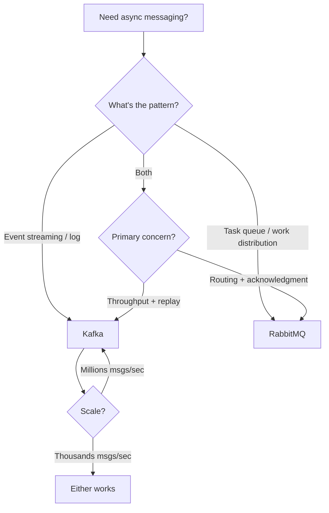
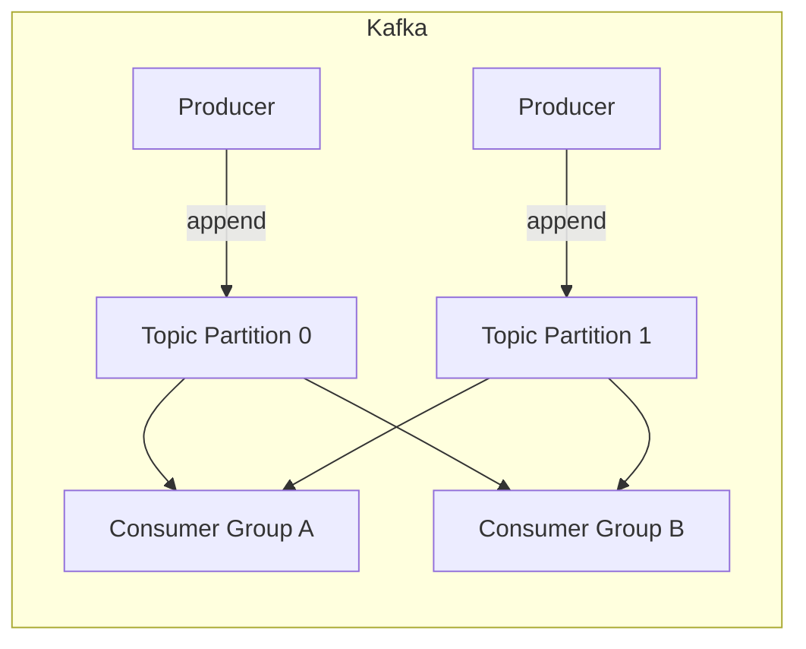
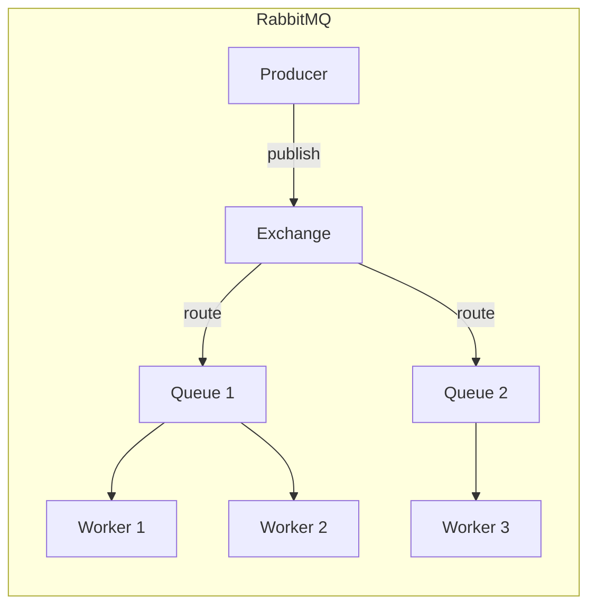
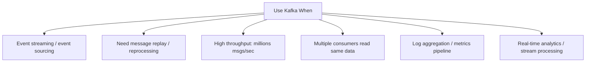
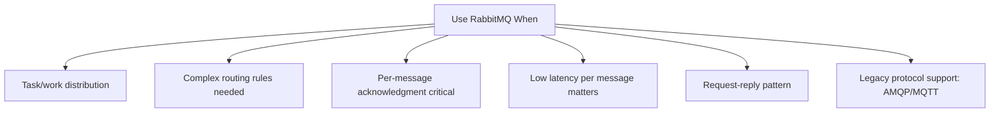

# Comparison 03: Kafka vs RabbitMQ

> Choosing the right message broker for your system.

---

## 1. Decision Framework

---

## 2. Core Architecture Comparison

---

## 3. Feature Comparison

| Feature | Kafka | RabbitMQ |
|---------|-------|----------|
| **Model** | Distributed log (append-only) | Message broker (queue) |
| **Message retention** | Configurable (days/weeks/forever) | Deleted after consumption |
| **Replay** | Yes (consumers seek to any offset) | No (once consumed, gone) |
| **Ordering** | Per partition guaranteed | Per queue (with single consumer) |
| **Throughput** | Millions msgs/sec | Thousands msgs/sec |
| **Latency** | ~5ms (batched) | ~1ms (per message) |
| **Routing** | Topic-based only | Flexible (direct, topic, fanout, headers) |
| **Consumer model** | Pull (consumers poll) | Push (broker pushes to consumers) |
| **Acknowledgment** | Offset commit (batch) | Per-message ack/nack |
| **Protocol** | Custom binary protocol | AMQP, MQTT, STOMP |
| **Scaling** | Add partitions + consumers | Add queues + consumers |
| **Clustering** | Built-in (ZooKeeper/KRaft) | Built-in (Erlang clustering) |

---

## 4. When to Use Kafka

**Real-world examples**:
- Activity tracking (LinkedIn, Netflix)
- Log aggregation (ELK pipeline)
- Event sourcing (order events, audit trail)
- Stream processing (Flink, Spark Streaming)
- Change Data Capture (Debezium → Kafka)

---

## 5. When to Use RabbitMQ

**Real-world examples**:
- Email sending queue
- Image processing pipeline
- Order processing with retry
- IoT message routing (MQTT)
- RPC over message queue

---

## 6. Head-to-Head Scenarios

| Scenario | Winner | Why |
|----------|--------|-----|
| **Audit log** | Kafka | Need retention + replay |
| **Email queue** | RabbitMQ | Task distribution, per-message ack |
| **Metrics pipeline** | Kafka | High throughput, multiple consumers |
| **Order processing** | RabbitMQ | Complex routing, retry, DLQ |
| **Event sourcing** | Kafka | Append-only log, replay capability |
| **Chat notifications** | RabbitMQ | Low latency, push model |
| **CDC pipeline** | Kafka | Debezium integration, log compaction |
| **Video transcoding jobs** | RabbitMQ | Work queue with priority |

---

## 7. Interview Tips

- **Default to Kafka** for event streaming, log aggregation, analytics pipelines
- **Default to RabbitMQ** for task queues, work distribution, complex routing
- **Key differentiator**: "Kafka retains messages; RabbitMQ deletes after consumption"
- **Both can coexist**: Use Kafka for events, RabbitMQ for task queues in the same system
- **Mention consumer groups** (Kafka) vs **competing consumers** (RabbitMQ) — they solve the same problem differently

> **Next**: [04 — SQL vs NoSQL Decision](04-sql-vs-nosql-decision.md)
