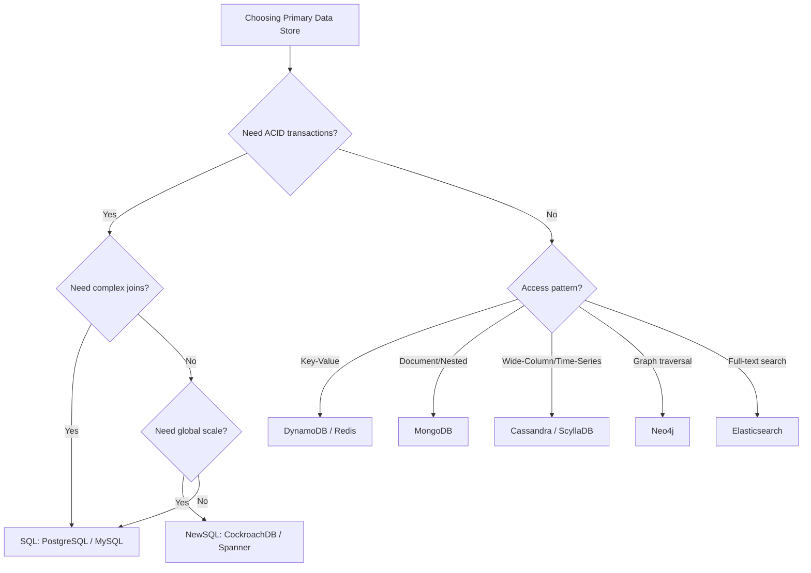
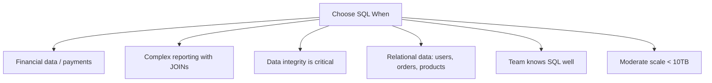
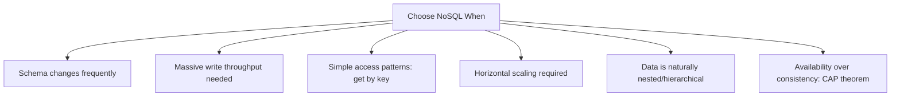
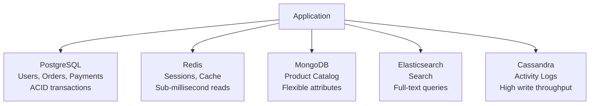

# Comparison 04: SQL vs NoSQL Decision

> The most frequently asked comparison in system design interviews.

---

## 1. Decision Framework

---

## 2. Core Comparison

| Dimension | SQL | NoSQL |
|-----------|-----|-------|
| **Schema** | Fixed schema, migrations required | Flexible/schemaless |
| **Scaling** | Vertical (+ read replicas) | Horizontal (sharding built-in) |
| **Consistency** | Strong (ACID) | Eventual (BASE), tunable |
| **Joins** | Native, efficient | Application-level or denormalized |
| **Transactions** | Multi-row, multi-table | Single-document (MongoDB), limited |
| **Query language** | SQL (standardized) | Varies per DB |
| **Best at** | Complex queries, relationships | Simple lookups, high write throughput |

---

## 3. When to Choose SQL

**Examples**: Banking, e-commerce orders, ERP, CRM, inventory management

### SQL Strengths

- **ACID guarantees**: No partial writes, consistent reads
- **Joins**: Efficient multi-table queries without data duplication
- **Mature tooling**: ORMs, migration tools, monitoring
- **PostgreSQL**: Handles JSON, full-text search, geospatial — often "good enough" for NoSQL use cases

---

## 4. When to Choose NoSQL

**Examples**: Product catalogs, user profiles, IoT sensor data, chat messages, session storage

### NoSQL Strengths

- **Horizontal scaling**: Add nodes, automatic sharding
- **Flexible schema**: No migrations for schema changes
- **High throughput**: Cassandra handles millions of writes/sec
- **Access pattern optimized**: Design table around queries, not relationships

---

## 5. The Hybrid Approach (Real World)

Most production systems use both:

---

## 6. Common Interview Scenarios

| System | Best Choice | Reasoning |
|--------|-------------|-----------|
| **URL Shortener** | DynamoDB / Redis | Simple KV lookup, massive scale |
| **E-commerce Orders** | PostgreSQL | ACID for payments, joins for reporting |
| **Chat Messages** | Cassandra | High write throughput, partition by chat_id |
| **Product Catalog** | MongoDB | Varying attributes per product category |
| **Social Graph** | Neo4j + PostgreSQL | Graph for relationships, SQL for user data |
| **Analytics** | ClickHouse | Columnar for aggregations on billions of rows |
| **Session Store** | Redis | Fast KV with TTL auto-expiry |
| **Logging** | Elasticsearch | Full-text search, time-based indexing |

---

## 7. Interview Tips

- **Start with PostgreSQL** as default — it handles more than people think
- **Switch to NoSQL** only when you articulate a specific limitation of SQL
- **Name the trade-off**: "I'm choosing Cassandra for write throughput, accepting eventual consistency and no joins"
- **Avoid**: "NoSQL is better because it scales" — SQL scales too, with read replicas and sharding
- **Polyglot**: Propose multiple databases for different access patterns in complex systems

> **Next**: [05 — Monolith vs Microservices](05-monolith-vs-microservices-decision.md)
