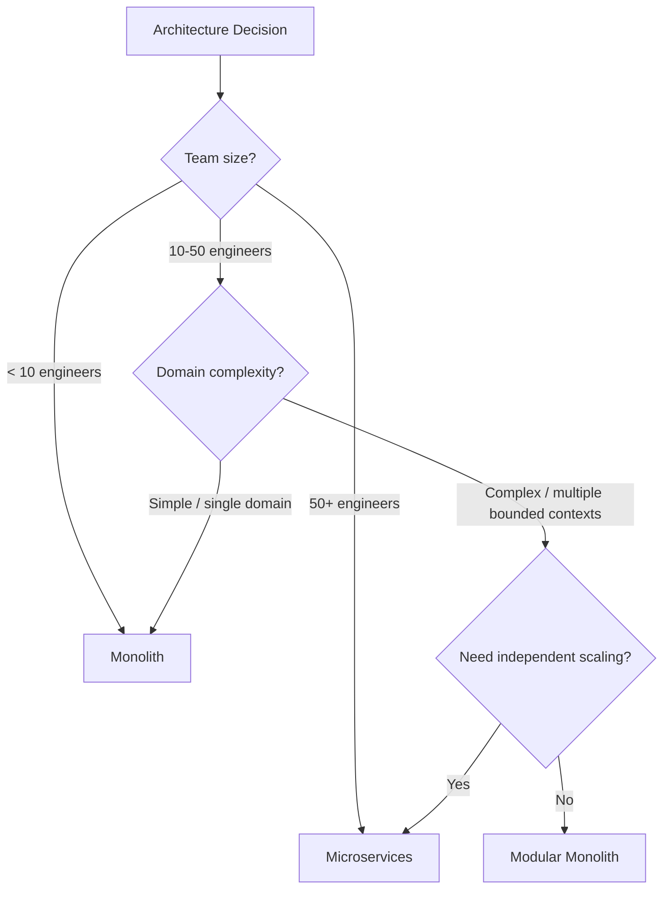
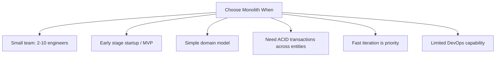
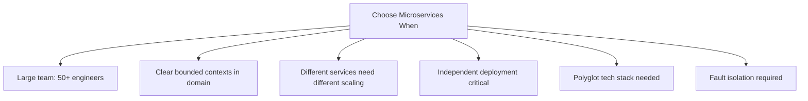
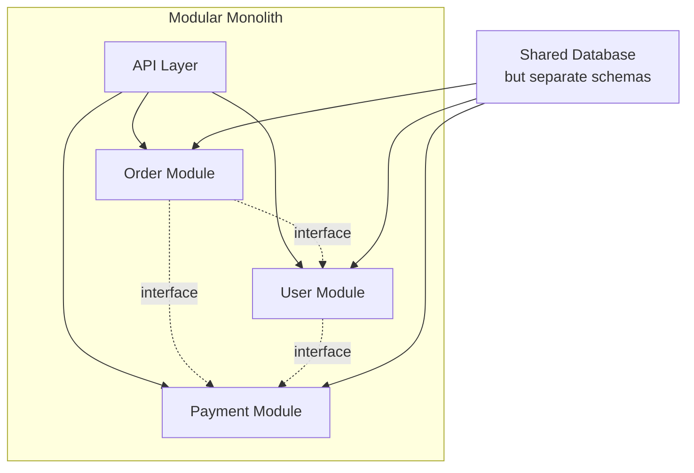

# Comparison 05: Monolith vs Microservices Decision

> One of the most debated architectural decisions in software engineering.

---

## 1. Decision Framework

---

## 2. Core Comparison

| Dimension | Monolith | Microservices |
|-----------|----------|---------------|
| **Deployment** | Single deployable unit | Independent per-service deploys |
| **Complexity** | Simple initially, grows over time | Complex from day one |
| **Scaling** | Scale entire application | Scale individual services |
| **Data** | Shared database | Database per service |
| **Communication** | In-process function calls | Network calls (HTTP, gRPC, Kafka) |
| **Team structure** | Single team or shared codebase | Team per service (Conway's Law) |
| **Latency** | Zero inter-service latency | Network latency between services |
| **Debugging** | Single stack trace | Distributed tracing required |
| **Consistency** | ACID transactions easy | Saga pattern / eventual consistency |
| **Development speed** | Fast initially, slows over time | Slow initially, scales with teams |

---

## 3. When to Choose Monolith

**Strengths**:
- Simple to develop, test, deploy
- No network latency between components
- Easy ACID transactions
- Single codebase to understand
- No infrastructure overhead (no service mesh, no container orchestration)

---

## 4. When to Choose Microservices

**Strengths**:
- Independent scaling (scale the hot service only)
- Independent deployment (deploy without coordinating)
- Fault isolation (one service crash doesn't take down everything)
- Technology freedom (Python for ML, Go for API, Java for payments)
- Organizational alignment (team owns their service end-to-end)

---

## 5. The Middle Ground: Modular Monolith

**Best of both worlds**:
- Single deployment unit (simple ops)
- Well-defined module boundaries (clean code)
- In-process communication (fast)
- Easy to extract into microservices later
- Shopify runs a modular monolith at massive scale

---

## 6. Migration Path

**The Strangler Fig pattern**:
1. New features as microservices
2. Route traffic via API gateway
3. Gradually extract existing modules
4. Retire monolith when empty

---

## 7. Cost of Microservices

| Concern | What You Need |
|---------|--------------|
| Service discovery | Consul, Kubernetes DNS |
| Load balancing | Envoy, nginx, ALB |
| API gateway | Kong, AWS API Gateway |
| Distributed tracing | Jaeger, Zipkin |
| Centralized logging | ELK, Loki |
| Container orchestration | Kubernetes, ECS |
| CI/CD per service | Multiple pipelines |
| Service mesh | Istio, Linkerd (optional) |
| Saga coordination | Temporal, custom |

---

## 8. Interview Tips

- **Default recommendation**: "Start with a modular monolith, extract services as needed"
- **Cite Conway's Law**: "Architecture mirrors team structure"
- **Name the cost**: "Microservices add network latency, distributed transactions, and operational complexity"
- **Don't be dogmatic**: "Neither is universally better — it depends on team size, domain, and scale"
- **Real examples**: "Amazon started monolith → extracted services. Netflix runs 1000+ microservices because they have 1000+ engineers"

> **Next**: [06 — Sync vs Async Communication](06-sync-vs-async.md)
