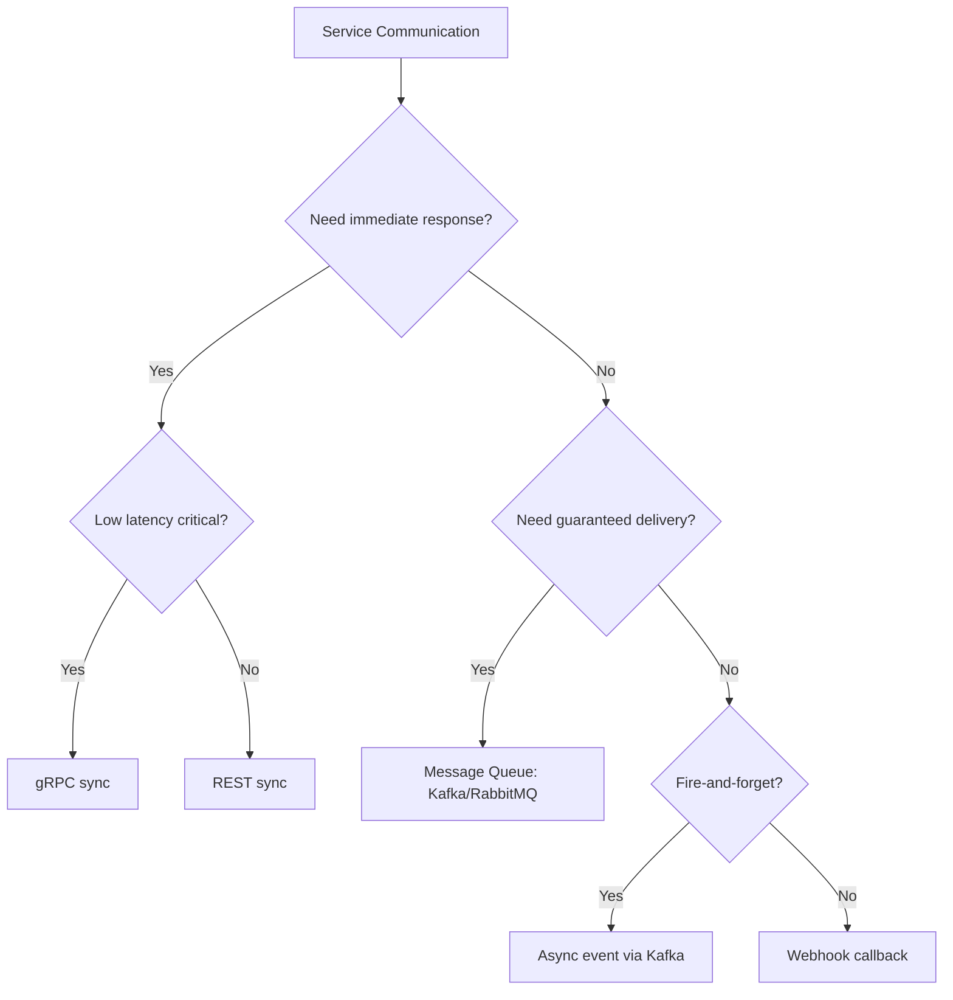
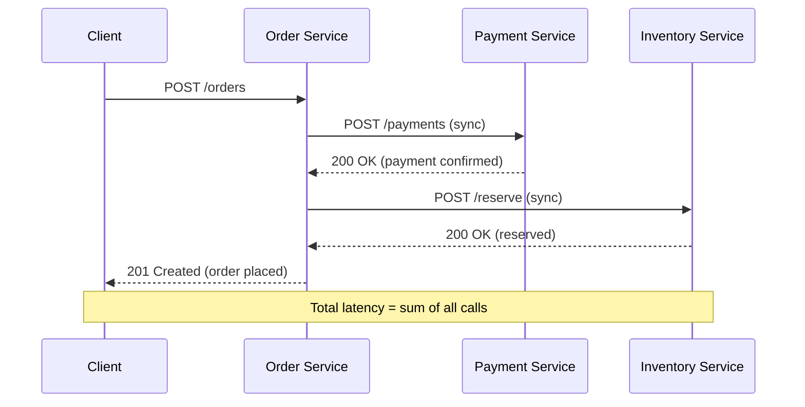
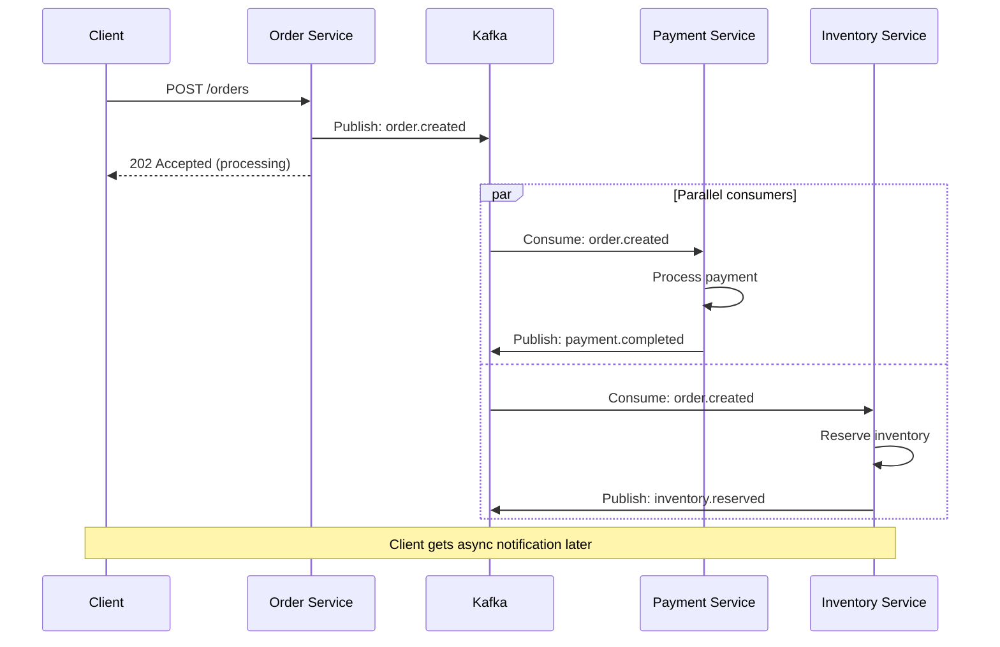
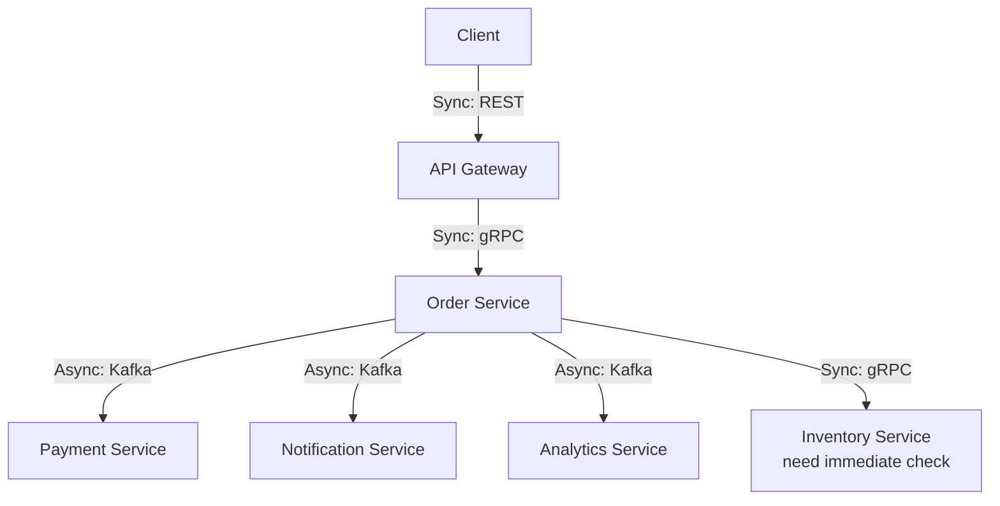
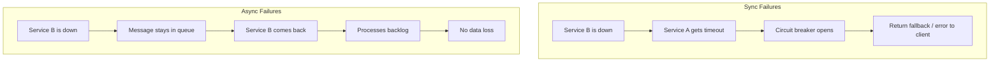

# Comparison 06: Sync vs Async Communication

> How services talk to each other determines system resilience and performance.

---

## 1. Decision Framework

---

## 2. Core Comparison

| Dimension | Synchronous | Asynchronous |
|-----------|-------------|--------------|
| **Pattern** | Request → Wait → Response | Send message → Continue working |
| **Coupling** | Tight (caller waits for callee) | Loose (decoupled via queue) |
| **Latency** | Immediate response required | Response can be delayed |
| **Failure handling** | Cascade failures (if callee is down) | Resilient (queue buffers messages) |
| **Throughput** | Limited by slowest service | High (parallel processing) |
| **Complexity** | Simple to reason about | Harder to debug, eventual consistency |
| **Examples** | REST, gRPC, GraphQL | Kafka, RabbitMQ, SQS, webhooks |

---

## 3. Synchronous Communication

**Pros**: Simple, easy to debug, immediate feedback
**Cons**: Cascading failures, high latency (serial calls), tight coupling

---

## 4. Asynchronous Communication

**Pros**: Resilient, decoupled, parallel processing, handles spikes
**Cons**: Eventual consistency, harder to debug, no immediate response

---

## 5. Hybrid Approach (Real World)

**Rule of thumb**:
- **Sync** for reads and operations that need immediate response
- **Async** for writes, side effects, and operations that can be eventually consistent

---

## 6. When to Use Each

| Scenario | Pattern | Why |
|----------|---------|-----|
| **User login** | Sync | Need immediate auth response |
| **Place order** | Sync (accept) + Async (process) | Accept fast, process in background |
| **Send email** | Async | User doesn't wait for email delivery |
| **Check inventory** | Sync | Need real-time availability |
| **Process payment** | Async (with confirmation) | Resilient, retryable |
| **Update analytics** | Async | Fire-and-forget, eventual is fine |
| **Real-time chat** | WebSocket (async push) | Bidirectional, low latency |
| **File upload** | Sync (accept) + Async (process) | Upload fast, transcode later |

---

## 7. Failure Handling

---

## 8. Interview Tips

- **Default**: Use sync for queries, async for commands/events
- **Name the pattern**: "I'll use event-driven async via Kafka for order processing"
- **Acknowledge trade-offs**: "Async gives resilience but introduces eventual consistency"
- **Mention DLQ**: "Failed async messages go to a dead-letter queue for investigation"
- **Hybrid is the answer**: Most systems use both — sync for critical path, async for side effects

> **Next**: [07 — REST vs gRPC vs GraphQL](07-rest-vs-grpc-vs-graphql.md)
