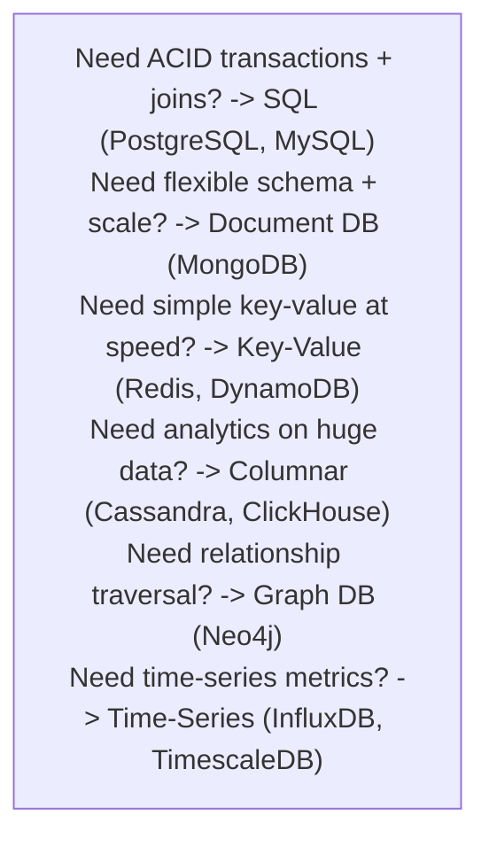
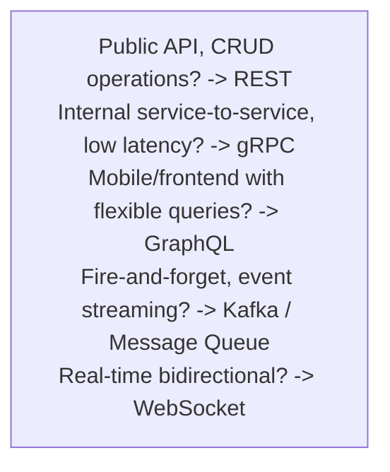
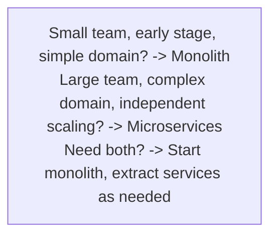

# Comparison and Decision Making

> In system design, choosing the right tool is as important as knowing how to use it. This section provides decision frameworks for the most common choices.

## Topics

| # | Comparison | When You Face This Decision |
|---|-----------|---------------------------|
| 01 | [How to Choose a Database](01-how-to-choose-db.md) | Every system design, always |
| 02 | [How to Choose a Cache](02-how-to-choose-cache.md) | When performance matters (almost always) |
| 03 | [Kafka vs RabbitMQ](03-kafka-vs-rabbitmq.md) | When you need async messaging |
| 04 | [SQL vs NoSQL Decision](04-sql-vs-nosql-decision.md) | When choosing primary data store |
| 05 | [Monolith vs Microservices](05-monolith-vs-microservices-decision.md) | When defining system architecture |
| 06 | [Sync vs Async Communication](06-sync-vs-async.md) | When services need to talk |
| 07 | [REST vs gRPC vs GraphQL](07-rest-vs-grpc-vs-graphql.md) | When designing APIs |

## Quick Decision Cheat Sheet

### Database Selection

### Communication Protocol

### Architecture Style

