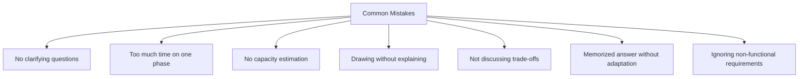

# Interview Prep 01: 45-Minute Interview Approach

> The most important skill in system design interviews isn't technical — it's time management and structure.

---

## 1. The Framework

```mermaid
gantt
    title 45-Minute System Design Interview
    dateFormat mm
    axisFormat %M min

    section Phase 1
    Requirements
    Clarification   :a1, 00, 5m

    section Phase 2
    Capacity Estimation            :a2, after a1, 5m

    section Phase 3
    API Design                     :a3, after a2, 5m

    section Phase 4
    High-Level Design              :a4, after a3, 10m
    Deep Dive (1-2 components)     :a5, after a4, 10m

    section Phase 5
    Scaling
    Bottlenecks          :a6, after a5, 7m

    section Phase 6
    Summary
    Questions            :a7, after a6, 3m
```

---

## 2. Phase Breakdown

### Phase 1: Requirements & Clarification (0–5 min)

**Goal**: Narrow the scope. Don't design everything.

- Ask 3-5 clarifying questions
- Define functional requirements (what the system does)
- Define non-functional requirements (scale, latency, availability)
- State assumptions explicitly: "I'll assume 10M DAU — does that sound right?"

**Red flag**: Jumping straight into drawing boxes without asking questions.

### Phase 2: Capacity Estimation (5–10 min)

**Goal**: Ground your design in numbers.

- Users: DAU, concurrent users
- Storage: How much data per day/year?
- Bandwidth: Read/write QPS
- Key ratio: Read-heavy (100:1) or write-heavy?

**Template**:
```
DAU: 10M
Reads/day: 100M (10 reads/user)
Writes/day: 1M (0.1 writes/user)
Read QPS: 100M / 86400 ≈ 1,200 QPS
Peak QPS: 1,200 × 3 ≈ 3,600 QPS
Storage/day: 1M × 1 KB = 1 GB/day
5-year storage: 1 GB × 365 × 5 = 1.8 TB
```

### Phase 3: API Design (10–15 min)

**Goal**: Define the contract between client and server.

- List 3-5 core APIs (the most important ones)
- Use REST convention: `POST /api/v1/resource`
- Include request/response bodies
- Mention authentication: "All endpoints require Bearer token"

### Phase 4: High-Level Design + Deep Dive (15–35 min)

**Goal**: Draw the architecture, then go deep on 1-2 components.

**High-Level (15–25 min)**:
- Draw major components: client, LB, API servers, DB, cache, queue
- Show data flow for the primary use case
- Choose database and justify

**Deep Dive (25–35 min)**:
- Pick the most interesting/complex component
- Interviewer may guide you: "Tell me more about how you'd handle X"
- Go into detail: data model, algorithms, failure handling

### Phase 5: Scaling & Bottlenecks (35–42 min)

**Goal**: Show you think about production realities.

- Identify bottlenecks: "The DB is the bottleneck at 100K writes/sec"
- Propose solutions: caching, sharding, read replicas, CDN
- Discuss trade-offs: "Caching improves latency but introduces staleness"

### Phase 6: Summary & Questions (42–45 min)

**Goal**: Leave a strong impression.

- Recap: "To summarize, I designed X with Y architecture..."
- Mention what you'd add with more time
- Ask the interviewer if they'd like you to dive deeper into anything

---

## 3. Common Mistakes



---

## 4. Scoring Rubric (What Interviewers Look For)

| Criteria | Weight | What They Observe |
|----------|--------|-------------------|
| **Problem exploration** | 20% | Clarifying questions, scoping |
| **High-level design** | 30% | Architecture, component choices |
| **Deep dive** | 25% | Detailed design of key component |
| **Trade-offs** | 15% | Awareness of alternatives, pros/cons |
| **Communication** | 10% | Structured thinking, articulation |

---

## 5. Quick Reference Card

```
✓ Ask before you design
✓ Numbers before architecture
✓ Broad before deep
✓ Trade-offs with every decision
✓ Think out loud
✗ Don't memorize — understand patterns
✗ Don't go silent — narrate your thinking
✗ Don't over-engineer — start simple, scale later
```

> **Next**: [02 — Clarifying Questions](02-clarifying-questions.md)
