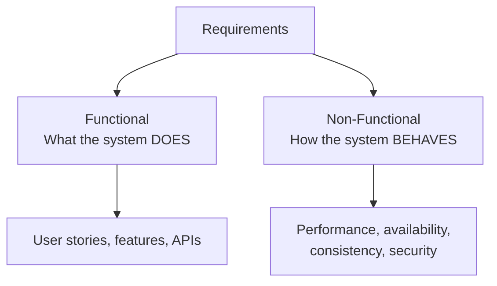
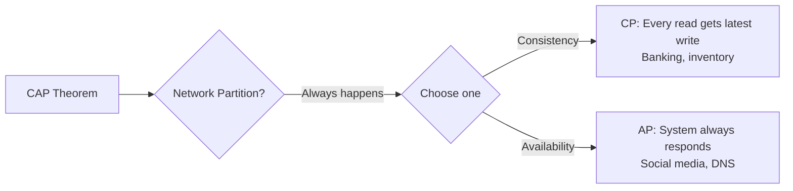
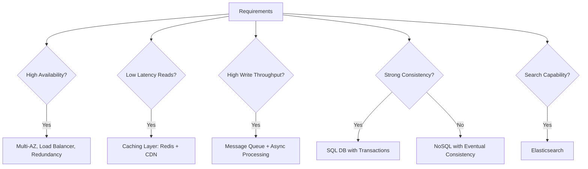

# Interview Prep 03: Requirement Gathering

> Separating functional from non-functional requirements is the foundation of every system design.

---

## 1. Two Types of Requirements



---

## 2. Functional Requirements (FR)

**Definition**: What the system must do — the features.

### How to Identify FRs

1. Think about the **core user actions** (create, read, update, delete)
2. Think about **different user types** (reader, writer, admin)
3. Think about the **primary use case** the interviewer cares about

### Example: Twitter

| Functional Requirement | Priority |
|------------------------|----------|
| Post a tweet (text, images) | Must-have |
| Follow / unfollow users | Must-have |
| View home timeline (feed) | Must-have |
| Search tweets | Should-have |
| Like / retweet | Should-have |
| Direct messages | Nice-to-have |
| Trending topics | Nice-to-have |

### How to Scope in Interview

- **Must-have**: Core features you'll design in detail
- **Should-have**: Mention in architecture but don't deep-dive
- **Nice-to-have**: Acknowledge, skip: "I'd add DMs in a follow-up"

---

## 3. Non-Functional Requirements (NFR)

**Definition**: How the system must perform — the quality attributes.

### The Key NFRs

| NFR | Question to Ask | Typical Target |
|-----|----------------|----------------|
| **Availability** | "What's the uptime target?" | 99.9% (8.7h downtime/year) |
| **Latency** | "What's acceptable response time?" | < 200ms for reads |
| **Throughput** | "How many requests per second?" | Derived from DAU |
| **Consistency** | "Is eventual consistency OK?" | Depends on domain |
| **Durability** | "Can we lose data?" | Never for payments |
| **Scalability** | "Growth expectations?" | 10x in 2 years |
| **Security** | "Any compliance needs?" | PCI, GDPR, HIPAA |

### Consistency vs Availability Trade-off



---

## 4. Requirements Template

Use this template for every system design problem:

```
FUNCTIONAL REQUIREMENTS:
1. [Core action 1] — e.g., "Users can create short URLs"
2. [Core action 2] — e.g., "Users can redirect via short URL"
3. [Core action 3] — e.g., "Users can view analytics"

NON-FUNCTIONAL REQUIREMENTS:
- Availability: 99.99%
- Read latency: < 50ms (redirect must be fast)
- Write latency: < 500ms (URL creation can be slower)
- Scale: 100M URLs created/day, 10B redirects/day
- Consistency: Eventual is OK (analytics can lag)
- Durability: URLs must never be lost

OUT OF SCOPE (for this discussion):
- Admin dashboard
- Custom domains
- API rate limiting (mention, but don't design)
```

---

## 5. Mapping Requirements to Architecture



---

## 6. Common Mistakes

| Mistake | Impact | Fix |
|---------|--------|-----|
| Skipping NFRs entirely | Design has no performance targets | Always list 3-4 NFRs |
| Designing everything | Run out of time | Scope to 3-4 FRs |
| Not stating assumptions | Interviewer doesn't know your context | "I'll assume X — sound right?" |
| Mixing FR and NFR | Unclear thinking | Separate them explicitly |
| Ignoring trade-offs between NFRs | Miss key design decisions | "I'll prioritize availability over consistency" |

---

## 7. Practice Exercise

For each system below, write 3 FRs and 3 NFRs in 2 minutes:

1. **WhatsApp**: Messaging, groups, read receipts / low latency, E2E encryption, 99.99% uptime
2. **Uber**: Request ride, match driver, track location / real-time GPS, < 30s matching, high availability
3. **Netflix**: Browse catalog, stream video, recommendations / < 2s start time, 99.99% uptime, adaptive bitrate

> **Next**: [04 — Envelope Calculations](04-envelope-calculations.md)
