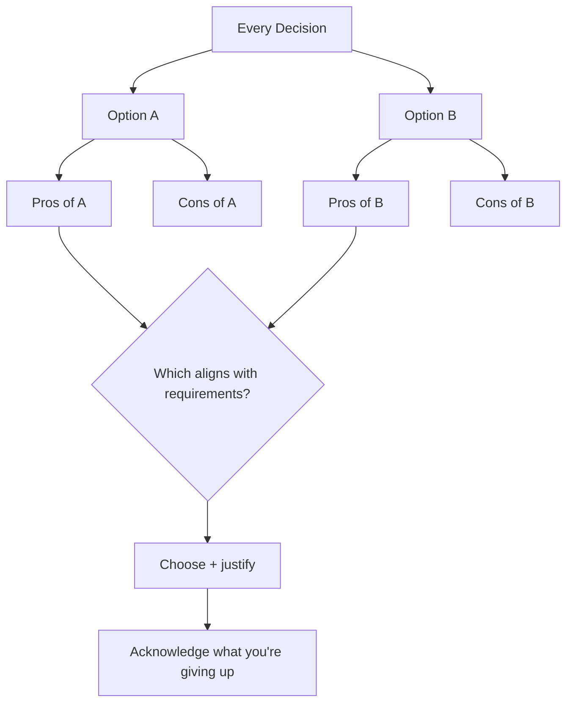
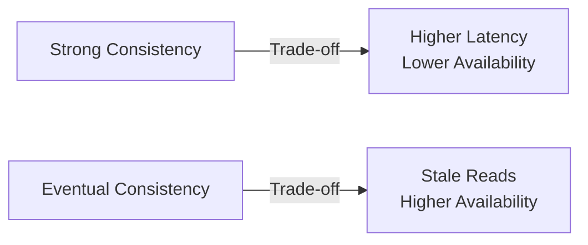
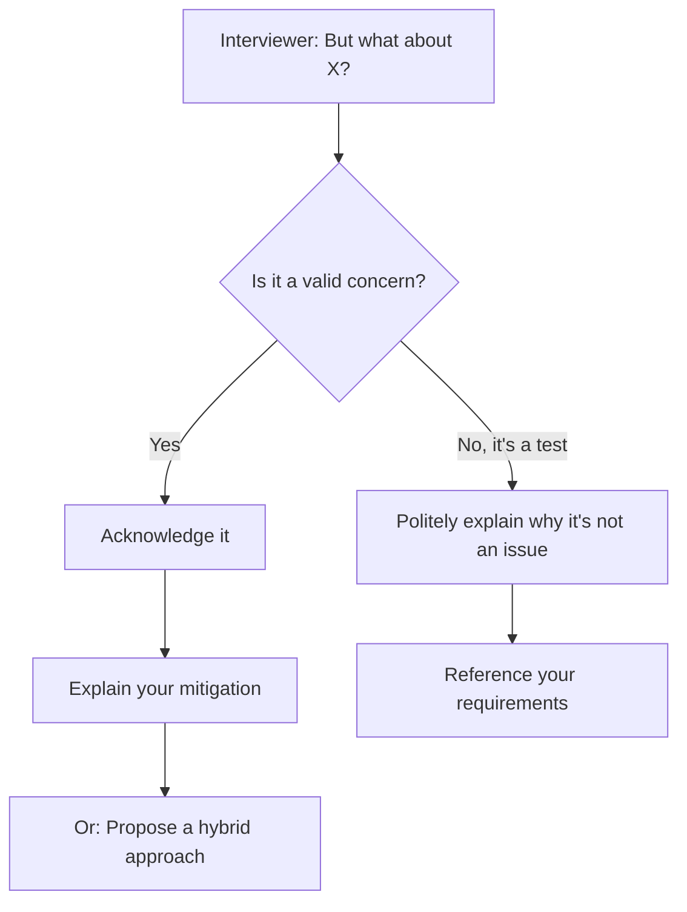

# Interview Prep 06: Defending Trade-offs

> Every design decision has a cost. The best candidates name the trade-off before the interviewer asks.

---

## 1. The Trade-off Framework



---

## 2. The STAR Format for Trade-offs

When defending a decision, use this structure:

```
SITUATION: "We need to handle 100K writes/sec"
TRADE-OFF: "I'm choosing Cassandra over PostgreSQL"
ADVANTAGE: "Cassandra handles high write throughput with linear scaling"
RISK:      "We lose JOIN support and strong consistency"
MITIGATION:"We'll denormalize data and use eventual consistency, which is acceptable for activity feeds"
```

---

## 3. Common Trade-offs in System Design

### Consistency vs Availability



| Choose Consistency | Choose Availability |
|--------------------|---------------------|
| Banking / payments | Social media feeds |
| Inventory counts | User profiles |
| Booking systems | Analytics dashboards |
| Leader election | DNS resolution |

### Latency vs Throughput

| Optimize Latency | Optimize Throughput |
|------------------|---------------------|
| Real-time chat | Batch processing |
| Trading systems | Log aggregation |
| Gaming | Data pipelines |
| Search autocomplete | Report generation |

### SQL vs NoSQL

| Choose SQL | Choose NoSQL |
|------------|--------------|
| Need JOINs + ACID | Need horizontal scale |
| Complex queries | Simple key-value access |
| Moderate scale | Massive write throughput |
| Team knows SQL | Schema changes frequently |

---

## 4. How to Defend in an Interview

### Step 1: State the Decision

> "I'm choosing Redis for caching with a cache-aside pattern."

### Step 2: Name the Benefit

> "This gives us sub-millisecond reads and reduces DB load by 90%."

### Step 3: Acknowledge the Cost

> "The trade-off is data staleness — cached data could be up to 5 minutes old."

### Step 4: Explain Why It's Acceptable

> "For a social feed, slight staleness is acceptable. Users won't notice a 5-minute delay on someone else's post."

### Step 5: Mention the Alternative

> "If we needed real-time consistency, I'd use write-through caching instead, but that adds write latency."

---

## 5. Trade-off Matrix for Common Decisions

| Decision | Option A | Option B | Key Trade-off |
|----------|----------|----------|---------------|
| Database | SQL | NoSQL | Consistency vs Scale |
| Caching | Cache-aside | Write-through | Staleness vs Write latency |
| Communication | Sync (REST) | Async (Kafka) | Simplicity vs Resilience |
| Architecture | Monolith | Microservices | Simplicity vs Independent scaling |
| ID generation | Auto-increment | UUID/Snowflake | Simplicity vs Distributed support |
| Data model | Normalized | Denormalized | Storage vs Read performance |
| Replication | Single-leader | Multi-leader | Consistency vs Write availability |
| Load balancing | Round-robin | Consistent hashing | Simplicity vs Cache affinity |

---

## 6. Handling Pushback

When the interviewer challenges your decision:



**Example responses**:

- **"What if the cache goes down?"** → "Redis Cluster with replicas. If all cache fails, we fall back to DB with degraded performance — graceful degradation."
- **"What about consistency?"** → "For this use case, eventual consistency is acceptable. If it weren't, I'd switch to synchronous replication."
- **"Can this scale to 10x?"** → "Yes, with horizontal sharding. I'd partition by user_id. The current design already supports this."

---

## 7. Anti-Patterns

| Don't Say | Say Instead |
|-----------|-------------|
| "This is the best approach" | "For our requirements, this is the best fit because..." |
| "NoSQL is better than SQL" | "Given our write-heavy access pattern, NoSQL fits better here" |
| "It just works" | "The key advantage is X, and the trade-off is Y" |
| "I don't know" (when challenged) | "That's a good point. One way to mitigate is..." |

---

## 8. Interview Tips

- **Proactively state trade-offs** — don't wait to be asked
- **Use "because"** — every decision needs a reason
- **Reference your requirements** — "Given our 99.99% availability target..."
- **Offer alternatives** — "If we needed X instead, I'd choose Y"
- **No decision is wrong** — but every decision needs justification

> **Next**: [07 — Communication](07-communication.md)
