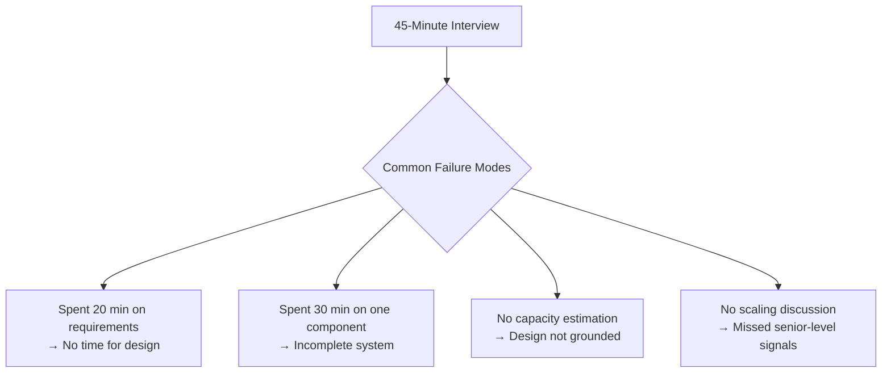
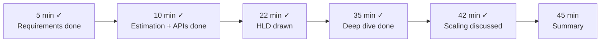
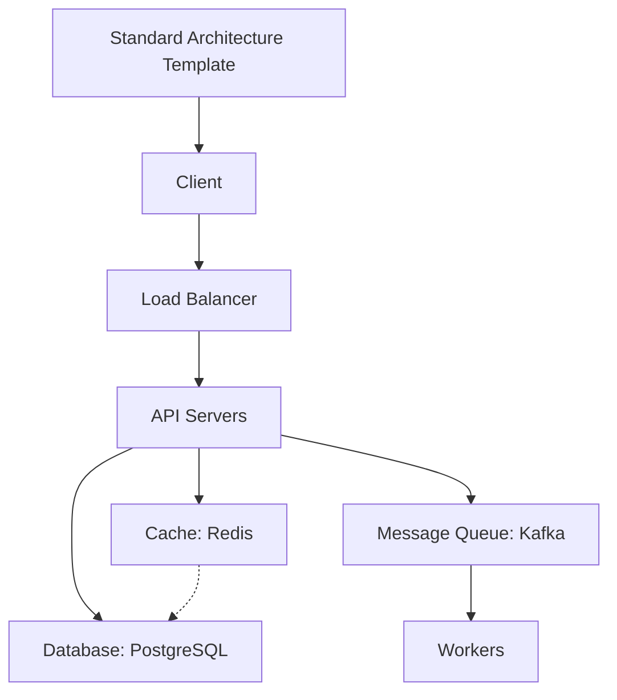
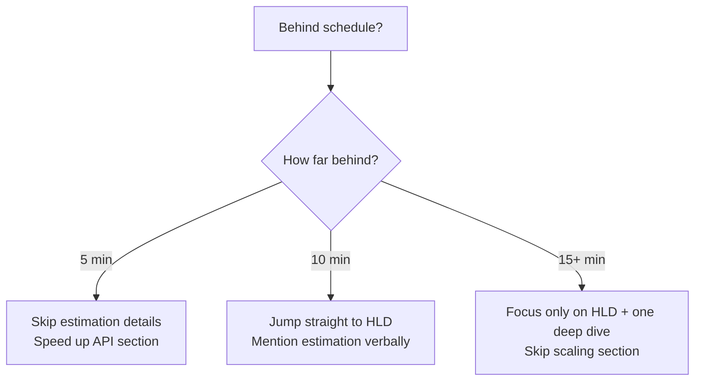

# Interview Prep 08: Time Management

> 45 minutes is shorter than you think. Knowing when to go deep and when to move on is a skill.

---

## 1. The Time Trap



---

## 2. Ideal Time Allocation

| Phase | Time | % of Interview | Key Deliverable |
|-------|------|----------------|-----------------|
| **Requirements** | 3-5 min | 10% | 3-4 FRs, 3-4 NFRs, scope |
| **Estimation** | 2-3 min | 5% | QPS, storage, bandwidth |
| **API Design** | 3-5 min | 10% | 3-5 core endpoints |
| **High-Level Design** | 10-12 min | 25% | Architecture diagram, data flow |
| **Deep Dive** | 10-12 min | 25% | 1-2 complex components in detail |
| **Scaling & Trade-offs** | 5-7 min | 15% | Bottlenecks, solutions, trade-offs |
| **Summary** | 2-3 min | 5% | Recap, what you'd add |

---

## 3. Pacing Strategies

### The Checkpoint Method

Set mental checkpoints at key times:



### The 80/20 Rule

- Spend 80% of your time on the 20% that matters most
- The interviewer cares most about: **HLD + Deep Dive + Trade-offs**
- Requirements and estimation are necessary but should be quick

### When to Move On

| Signal | Action |
|--------|--------|
| You've been on one topic for 10+ min | Wrap up, transition |
| Interviewer seems disengaged | Ask: "Should I go deeper or move on?" |
| You're stuck on a detail | Say: "I'll note this and come back if time permits" |
| You haven't drawn anything by 15 min | Start drawing immediately |
| No scaling discussion by 35 min | Jump to scaling now |

---

## 4. Time Savers

### Pre-Built Templates

Have these ready in your head:



Draw this skeleton in 30 seconds, then customize per problem.

### Quick Estimation Formulas

```
QPS = DAU × actions / 86,400
Storage = records/day × size × 365 × years
Servers = peak QPS / 500 × 2
```

### Standard Scaling Answers

- **Read-heavy**: Cache + read replicas + CDN
- **Write-heavy**: Message queue + sharding + async processing
- **Both**: All of the above + CQRS

---

## 5. Recovery Strategies

### Running Behind



### Got Redirected by Interviewer

- Don't fight it — they're testing something specific
- Quickly address their question
- Then say: "Let me get back to the overall architecture"

### Made a Design Mistake

- "Actually, I realize X won't work because of Y. Let me adjust..."
- This is POSITIVE — it shows self-correction ability
- Don't try to defend a bad decision

---

## 6. Phase-by-Phase Cheat Sheet

### Minutes 0-5: Requirements

```
"Let me start by understanding the scope..."
Ask 4-5 questions → State 3-4 FRs → State 3-4 NFRs
"I'll focus on [core feature] and defer [secondary features]"
```

### Minutes 5-10: Estimation + API

```
"Let me do a quick estimation..."
QPS, storage, bandwidth (3 numbers)
"Here are the core APIs..."
3-5 endpoints with methods + bodies
```

### Minutes 10-25: High-Level Design

```
"Let me draw the high-level architecture..."
Draw standard template → customize
Show data flow for main use case
Choose + justify database
```

### Minutes 25-35: Deep Dive

```
"Let me go deeper into [most complex component]..."
Data model / schema
Algorithm / approach
Failure handling
```

### Minutes 35-42: Scaling

```
"Let's discuss how this scales..."
Identify bottleneck
Propose solution (cache, shard, replicate)
State trade-off
```

### Minutes 42-45: Summary

```
"To summarize..."
Recap architecture in 3 sentences
Mention what you'd add with more time
"Any area you'd like me to dive deeper into?"
```

---

## 7. Practice Drill

Set a timer and practice these time targets with any system design problem:

| Checkpoint | Time | If You're Here, You're On Track |
|------------|------|--------------------------------|
| Requirements done | 5:00 | Scope is clear, assumptions stated |
| Estimation done | 8:00 | Key numbers on the board |
| APIs listed | 10:00 | 3-5 endpoints written |
| HLD drawn | 22:00 | Architecture diagram complete |
| Deep dive done | 35:00 | 1-2 components explained in detail |
| Scaling discussed | 42:00 | Bottlenecks + solutions covered |
| Summary | 45:00 | Clean recap, strong finish |

---

> This completes the Interview Prep section. Return to [Interview Prep README](README.md) for the full list.
